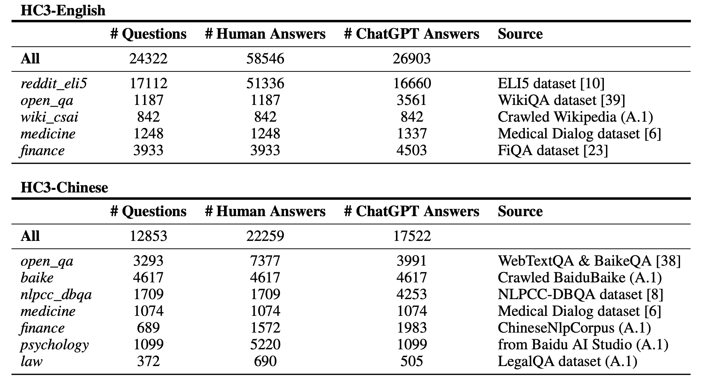

# 1. 中文

1. zhihu_rlhf_3k
    - https://huggingface.co/datasets/liyucheng/zhihu_rlhf_3k
   
2. Hello-SimpleAI/HC3-Chinese
   - Human ChatGPT Comparison Corpus (HC3) / 人类-ChatGPT 问答对比语料集
   - 数据下载：
     - Huggingface: https://huggingface.co/datasets/Hello-SimpleAI/HC3-Chinese
     - Modelscope: https://www.modelscope.cn/datasets/simpleai/HC3-Chinese
   - Paper
     - How Close is ChatGPT to Human Experts? Comparison Corpus, Evaluation, and Detection
     - https://arxiv.org/abs/2301.07597
   - Github (1.2k stars): https://github.com/Hello-SimpleAI/chatgpt-comparison-detection
   - 
   - 检测器：检测数据是否ChatGPT生成

# 2. 英文

# 3. 中英
1. llamafactory/DPO-En-Zh-20k
    - https://huggingface.co/datasets/llamafactory/DPO-En-Zh-20k
    - 79.9MB, 19,997 rows
      - This dataset is composed by
      - 4,000 examples of argilla/distilabel-capybara-dpo-7k-binarized with chosen score>=4.
      - 3,000 examples of argilla/distilabel-intel-orca-dpo-pairs with chosen score>=8.
      - 3,000 examples of argilla/ultrafeedback-binarized-preferences-cleaned with chosen score>=4.
      - 10,000 examples of wenbopan/Chinese-dpo-pairs.

- OpenAssistant Conversations Dataset (OASST1)
- Anthropic HH-RLHF
- GPT-4-LLM
- webgpt_comparisions

# 参考
[1] Ziya-LLaMA-7B-Reward, https://huggingface.co/IDEA-CCNL/Ziya-LLaMA-7B-Reward