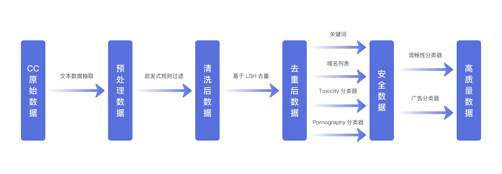
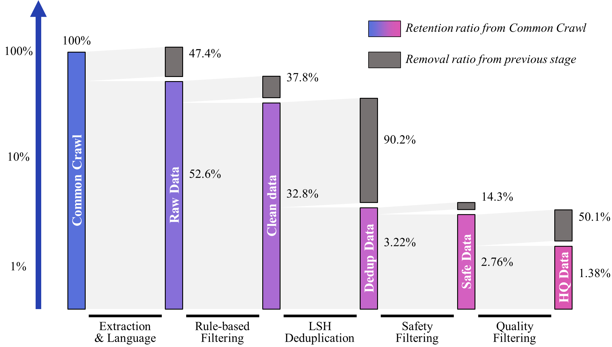
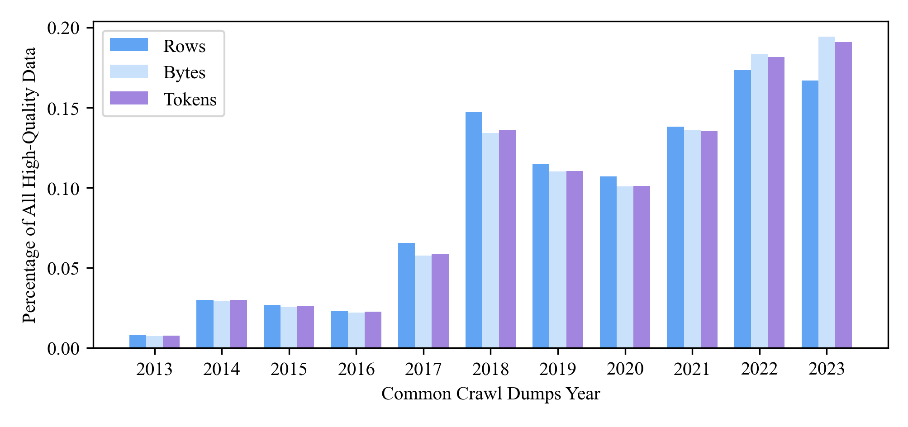
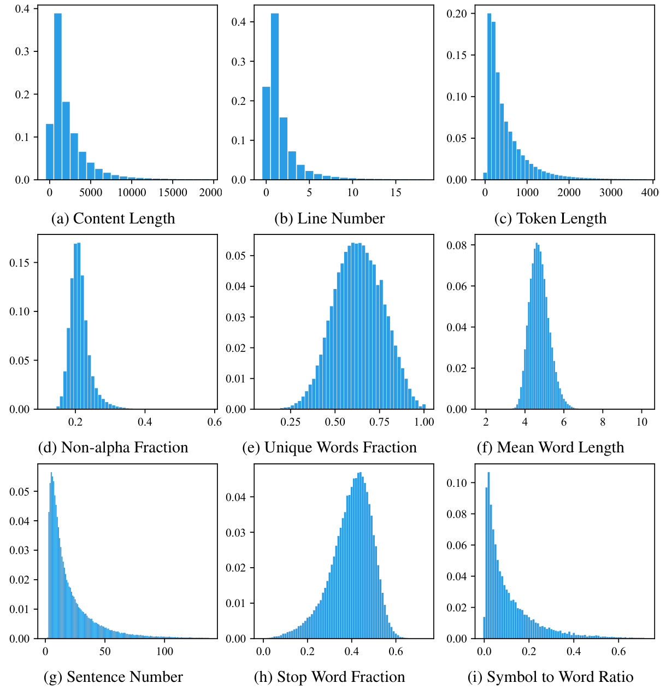

 - 下载地址：https://opendatalab.com/OpenDataLab/WanJuanCC/tree/main
 - 下载SDK：https://opendatalab.com/OpenDataLab/WanJuanCC/cli/main
 - Github:
 - 数据量：100B token
 - 介绍：英文，从CommonCrawl清洗而来



- Extract text from the WARC format data of Common Crawl to obtain "Raw data".
- Filter the raw data through heuristic rules to generate "Clean data".
- Process the clean data using an LSH-based deduplication method to get "Dedup data".
- Filter the dedup data using a filtering method based on keyword and domain lists, as well as a harmful content classifier and obscene content classifier based on Bert, to produce "Safe data".
- Further filter the safe data using a Bert-based ad classifier and fluency classifier to get "High-Quality data".

每一步清洗流程后剩下的数据



数据样例

```json
{
    "id": "Bk3aTI85qrqB0ZWjQ26l",
    "content": "This year I have been overwhelmed by moving house. The planning and organising has dominated my life: packing and unpacking boxes, trying to keep the family fed and watered, being there 100% for my children to settle in. My life - my aims and goals - have taken second place to the family chaos.\nYesterday, for the first time in ages, I sat down and thought: I want to write my book. I want to get this back into my time schedule. I want to make this space for me, for expressing myself, for being creative.\nSo what happens as of 3.15pm tomorrow? School holidays. Am I really likely to get a moment's peace?\nNow I'm planning: take the laptop on holiday. Work out how to blog from mobile (have to confess this is highly unlikely to work!) Consider booking children into holiday camps for entire 5 weeks. (Would Grannie like them?) Insist on a couple of hours a day, uninterrupted, simply to write.\nOr ... accept the reality. Enjoy the children while they are still prepared to tolerate me. Plan for a solid routine when term starts in September.\nWhich do you think will win?",
    "title": "Withenay Wanders: July 2009",
    "language": "en",
    "date": "2018-06-18T18:54:52Z",
    "token_num": 244,
    "cbytes_num": 1073,
    "line_num": 6,
    "char_num": 1073,
    "toxic_score": 0.001661,
    "porn_score": 0.003416,
    "fluency_score": 0.998535,
    "not_ad_score": 0.981934
}
```





