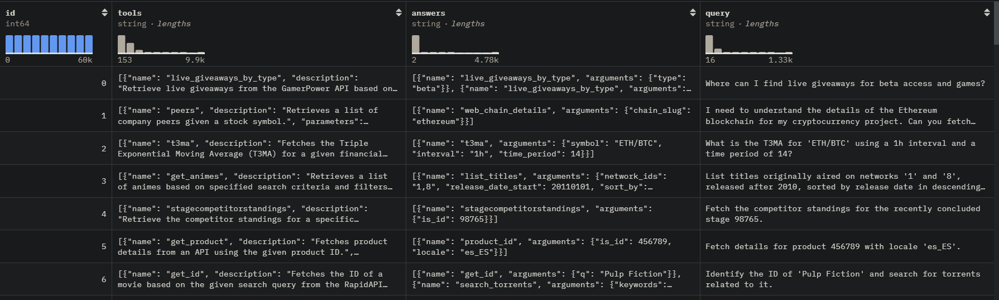
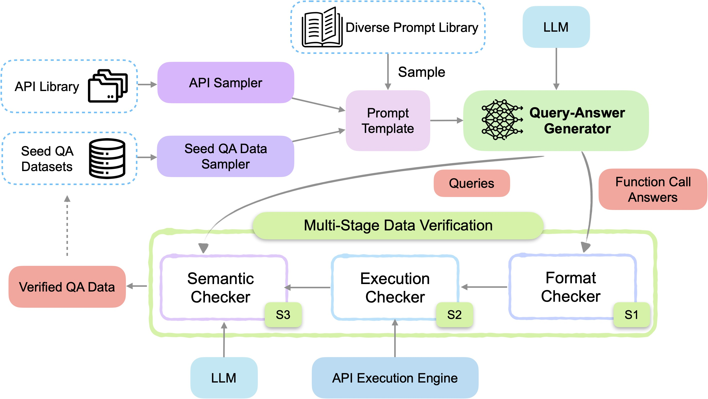
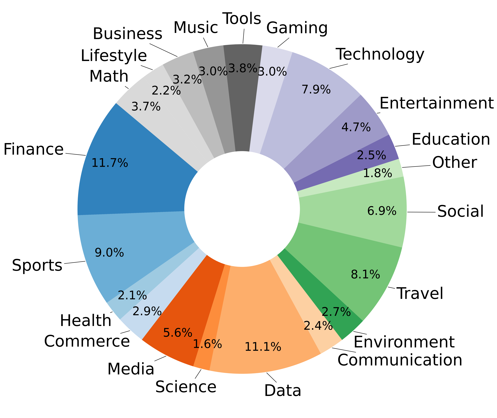

# 1. Salesforce/xlam-function-calling-60k

简介：
- 下载路径：https://huggingface.co/datasets/Salesforce/xlam-function-calling-60k
- 60k数据
- 检查流程：format checking, actual function executions, and semantic verification
- The datasets were generated by DeepSeek-V2-Chat and Mixtral-8x22B-Inst. 
- 论文：APIGen: Automated Pipeline for Generating Verifiable and Diverse Function-Calling Datasets},
  - 2024

