# 1. 简介

首先需要调研现有的方案，思路为：

- 公开的预训练数据配比
- 公开的 SFT 配比方案
- 探测 LLAMA3 配比的潜在方法

# 2. LLAMA 和 Qwen 技术报告

## 2.1 Qwen

预训练数据增强

Qwen2 的预训练数据分为 启发式方法过滤 和 Qwen 模型过滤。虽然实现细节未阐明，但根据其他工作，启发式方法可能类似 C4 数据的过滤方法。Qwen 模型过滤则可能是由 GPT 对模型进行 1-5 的质量分数打标，随后对 Qwen 的一个小版本（如 0.5B）进行微调，使其只输出 1-5 的分数 token。

数据扩充

Qwen2 包含了代码、数学、多模态数据，也包括多语数据。最关心的 数据分布 依然是含糊的，目标是让数据分布与人类相似的学习一致。通过实验，对不同来源和领域划分方法进行混合。

数据规模

Qwen1.5 使用了 3T 数据，而 Qwen2 扩充至 7T 数据。团队还尝试继续放宽数据质量筛选阈值，扩充到 12T 数据。然而，在打榜精度上，7T 和 12T 的训练并无显著差异。

长上下文训练

Qwen2 的长上下文训练分为几个阶段：

- 4k 上下文训练
- 32k 上下文训练

使用 RoPE 位置编码，将频率从 1 万增加到 100 万（频率越高，能容纳的上下文越长）

此外，Qwen2 还使用了 YARN 和 Dual Chunk Attention 机制，支持 131k 上下文（实践上，是对长上下文进行Chunk切分，随后在chunk内与chunk间进行相对位置信息的捕捉）。

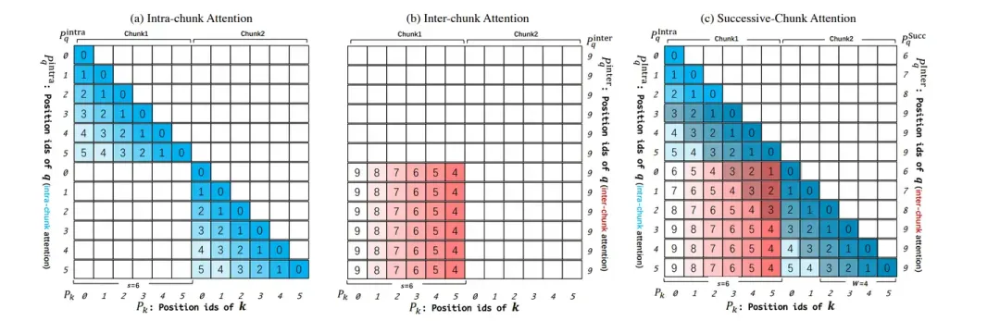

后训练

核心是使用了大量非人工合成数据，值得关注的趋势是：

1. 人机协作数据打标：使用 InsTag 模型生成标签，人工改进表述。依据标签多样性、语义性、复杂度、意图完整性评估筛选出具有代表性的数据；借助一些LLM数据演进生成的工作，例如Self-Evolution，进行数据合成；最后也包括人工标注。
2. 自动数据合成：例如，使用 Rejection Sampling 进行数学任务推导，或者通过 Execution Feedback 对代码任务进行执行筛选。随后是SFT常见的Data Repurposing，为各种任务，借助LLM基于某些源数据，来构造任务数据。对于Qwen它还做了安全审查，当然这里我可能并不需要。

## 2.2 LLAMA3.1
数据清洗与质量过滤

LLAMA3.1 对数据进行了清洗和过滤，包括：
- 排除不安全的网站 URL
- HTML 数据抽取（发现在预训练数据里包含markdown是有害的）
- 去重（URL、MinHash for Docs、ccNet for Lines会删除导航栏cookie警告以及一些高质量数据）
- 启发式过滤（n-gram 去重、脏词过滤、KL 散度过滤等）

数据质量过滤：fasttext判断docs与Wikipedia的相关，distilRoberta分类器由LLAMA2打质量标签训练去预测质量分数。distilRoberta分类器还被训练去判断代码和数学推理的数据。

相较于前代版本，有了更多的多模态数据，唯独中文的不多。

数据配比

基于知识分类和Scaling Law实验来测试配比的合理性。

知识分类：分类器划分预训练数据为领域知识数据，例如按着 艺术、娱乐...分类

Scaling Law实验确定数据配比：基于同一个数据配比，训练若干个不同的小模型（从40M到16B），观察其scaling曲线。（我猜是人工设置的配比候选），最终结构：50%通用、25%数学以及推理、17%代码、8%多语。最终通用是什么样子也不清楚


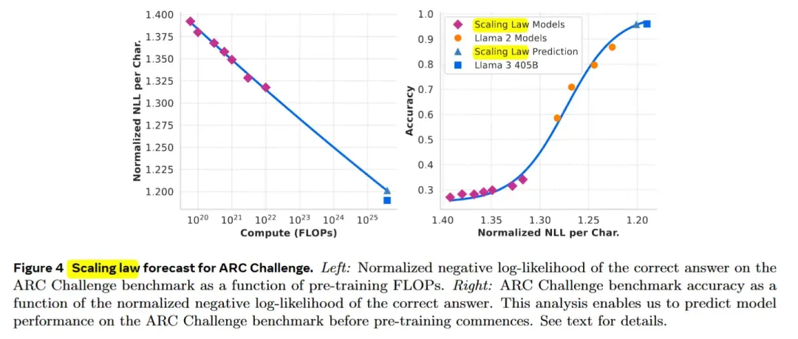

左图为浮点计算量与Loss的scaling law曲线，右图是loss与accuracy之间的曲线。有趣的一点是，loss与acc的关系，不是一个线性的

长上下文数据与退火训练

长上下文数据：基于两个标准来判断是否应该增加一个上下文长度：1) 在短上下文下性能恢复 2) 已经可以完美解决某长度下的 大海捞针。所以现在的长上下文，基本是照着大海捞针任务设计的，对于真正其他的长上下文需求，考虑的并不充分。

退火数据：基于高质量代码和 数学数据在预训练尾部做退火（可以提升GSM8k 24%，Math 6.4%）。

一个重要的发现是，退火训练可以评判小规模领域数据的价值。70%数据由原始配比方案获得，30%由需要测试的目标数据获得，在40B Tokens的退火训练中，将一个训练到50%的8B模型，学习率从开始降低至0，随后进行测评或者观察Loss。基于退火法测试小数据集比基于Scaling law实验更有效。

SFT 数据配比

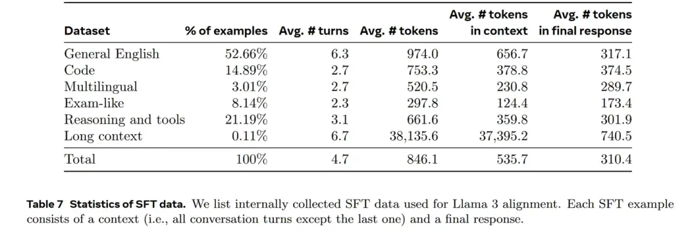

LLAMA 和 Qwen 的 SFT 数据处理技术非常相似，包括：

- Rejection Sampling：对于一个问题使用最新 checkpoints 生成多个输出，保留最终答案可行的输出。
- 数据清洗：避免过度使用表情、感叹、Sorry、道歉，这个很有启发，现在的LLM一般跟他意见不符，都是直接道歉
- 话题分类：（微调LLAMA 8B来作话题分类器，分桶这些数据到比较粗粒度和细粒度的簇，例如粗粒度的数学推理和细粒度的三角几何）
- 质量打分：同时使用Reward模型（将分数分布在上四分位的数据视为高质量）和LLAMA模型信号来得到质量分数（通用数据有三个维度，精准度，指令遵循，语调与表达；代码数据两个维度，代码Bug识别和用户意图），这两个模型有很大分歧，以or关系结合二者可以达到很高的召回率。
- 难度打分：基本想法是优先处理对模型而言更复杂的数据，使用InsTag（Qwen也用到了）对数据打意图标签，意图越多复杂性越高，以及LLAMA的评分（与质量打分一致的方法）
- 语义去重：Roberta Embedding聚类，每个簇内的数据以质量和难度的乘积进行排序，保留阈值以上的。
- 合成数据：2.7M SFT是合成的
- 代码合成数据：1M规模，如果直接用LLAMA3 405B生成的数据是没有帮助的，通过Execution Feedback（也就是执行一遍，并得到执行结果，将这个错误和反馈结合进行训练，使得模型可以汲取教训）。具体为编程问题描述生成-->问题解决（让LLAMA3跑一遍，生成带有解释的解决方案最好）-->正确性分析（如果是错误的解决方案会伤害SFT，所以需要鉴别是否代码是正确的，包括 用编译器和代码分析工具Linter来作语法检查，以及通过LLM生成单元测试情况）-->错误反馈和迭代自我矫正（当前面出错后，把原始问题、错误的解法、反馈 告诉LLM来进行修复，当单元测试出错时，模型可以选择修复解决方法或者是单元测试，约20%是通过反馈矫正来变为正确的）-->迭代式微调（微调、生成数据、再微调，螺旋提升）
- 编程语言翻译的数据合成：Python C++和其他PHP Type Script等语言进行翻译，只要通过单元测试和语法检测的翻译保留。
- 反向翻译的数据合成：考虑到执行反馈的信息量对于评价质量来说是不够的，因此基于代码进行对话生成，补充代码解释、生成、文档、Debug数据。随后用这些数据让LLM进行代码生成，用原始代码作为基准，让LLM进行生成代码质量的评估。
- 长上下文数据合成：QA:将预训练里面的超长文档切分成8k的块，生成QA pair。Summarization：对8k的上下文进行总结后，再对总结进行总结，得到QA数据。Long Context Code Reasoning：找到python最常import引用的代码函数，删除其中的一个关键文件，提示模型去识别哪些文件依赖于这个丢失的文件，并生成丢失文件的代码。如果SFT模型在长语境表现良好，DPO只使用短文本，不会伤害模型的长上下文能力。
- 工具使用数据合成：包括搜索引擎（Brave Search）、Python解释器、数学计算引擎（Wolfram Alpha API）

前代版本：LLAMA2共使用2T数据

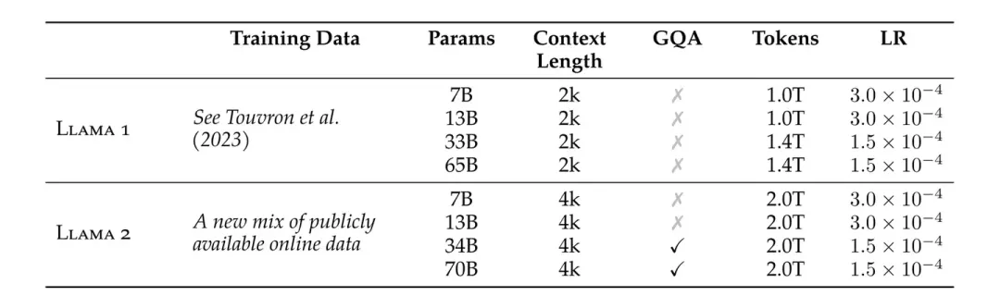

语言分布：

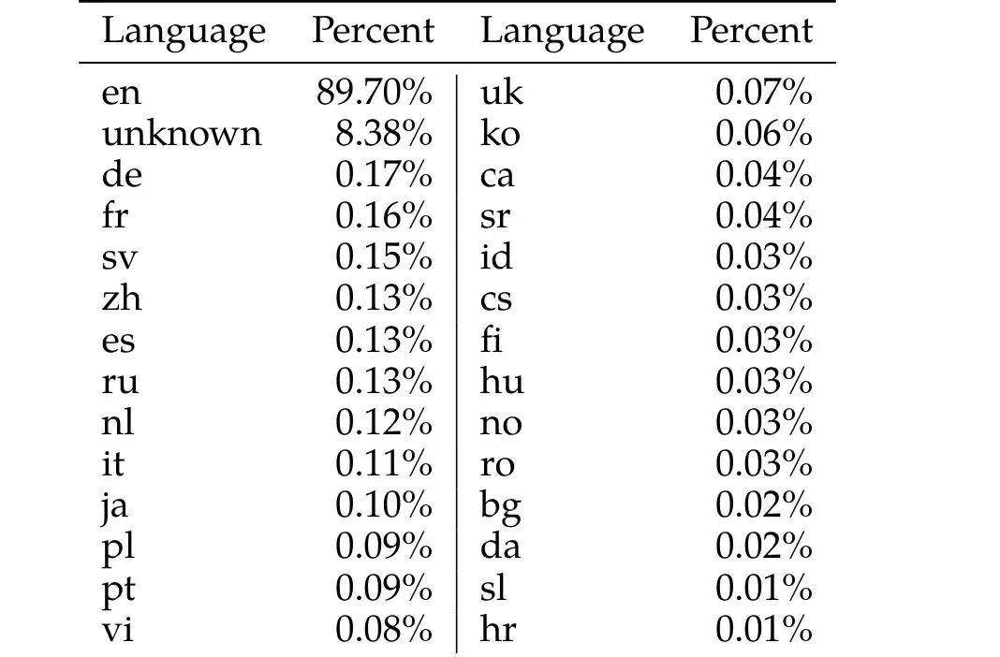

LAMA3使用了15T数据，并未给出更详细的信息

只有LLAMA1介绍了数据配比：

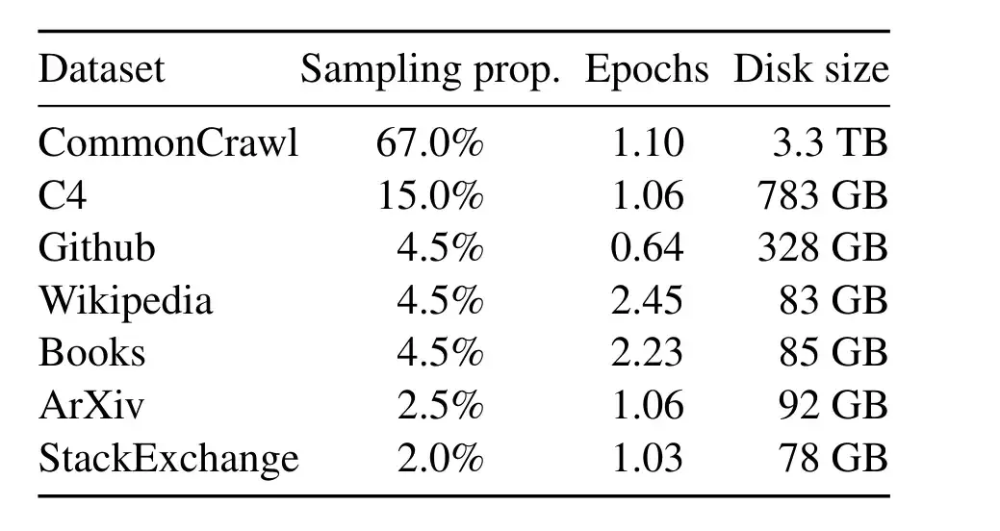

但SFT方案没有给出

# 3. 现有公开的模型方案
## 3.1 小模型 - MiniCPM
预训练数据配比：


预训练退火阶段SFT数据配比：

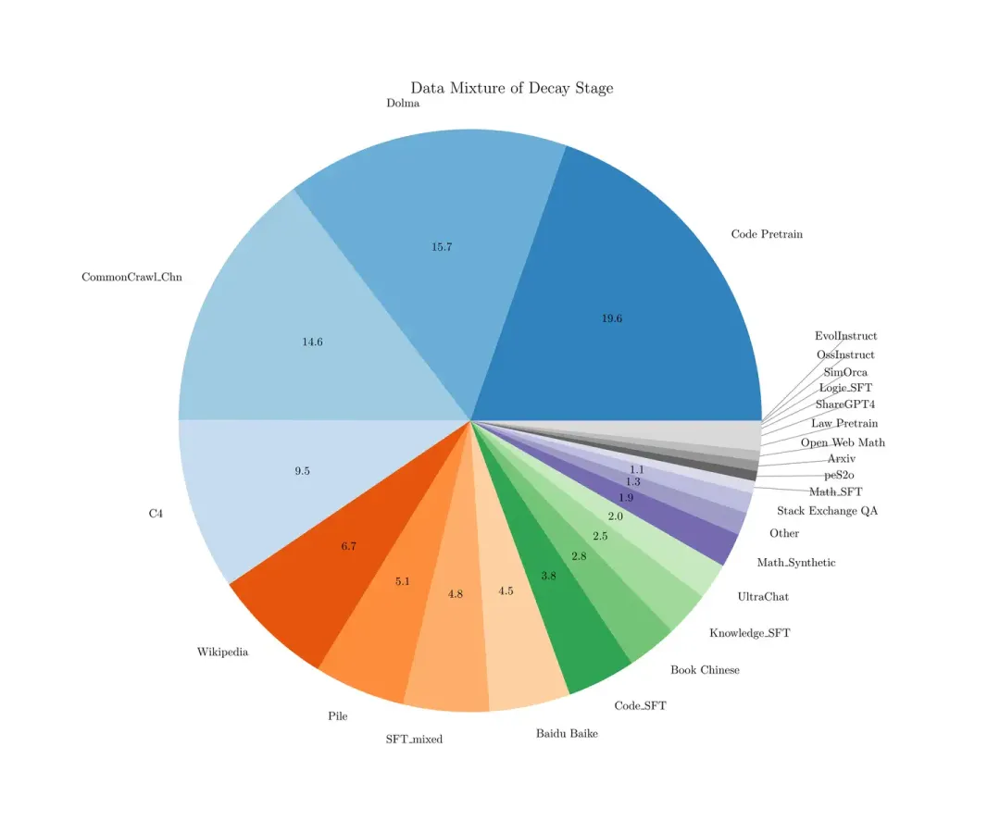

SFT阶段：

使用了和退火阶段类似的SFT数据（不同的是将预训练数据、高质量的无标注数据例如wiki去除，只留高质量有标标注数据，即sft数据）

## 3.2 小模型 - Microsoft/Phi-3-mini-4k-instruct
未给出更多详细的数据信息。

## 3.3. 大模型 - PALM2
除了部分中文的语言配比外，更多的数据信息未公开。


PALM1 版本

PALM1 版本给出了具体的代码和语言配比。

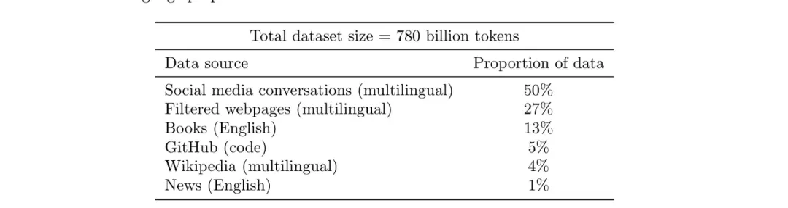

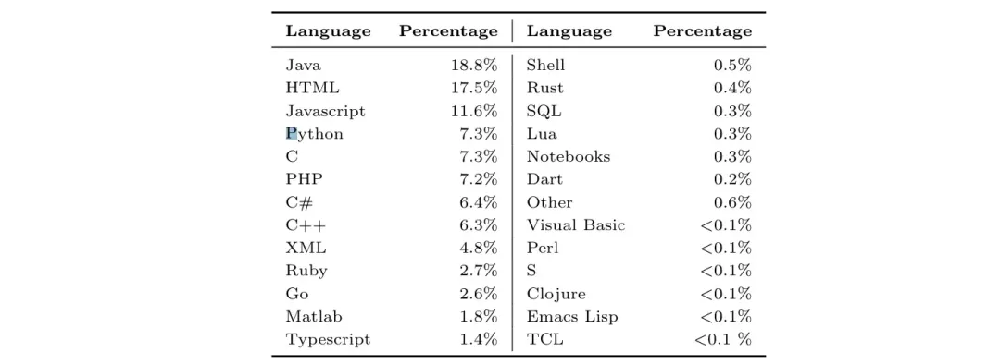

PALM1具体的代码配比

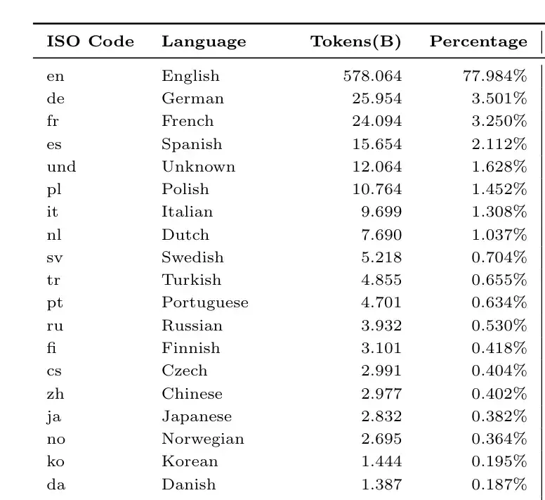

PALM1语言配比

缺少具体的Finetune方案，只介绍了PALM-Code版本用了60%-python（ExtraPythonData）和30%多代码语言（预训练中相同的源）与10%自然语言，共计7.75B

## 3.4 大模型 - Qwen
Qwen1 只透露了数据源，未给出具体的配比。Qwen2 也未公开数据配比。

## 3.5 大模型 - Baichuan
Baichuan2 的数据配比按领域划分，但未公开 SFT 配比信息。

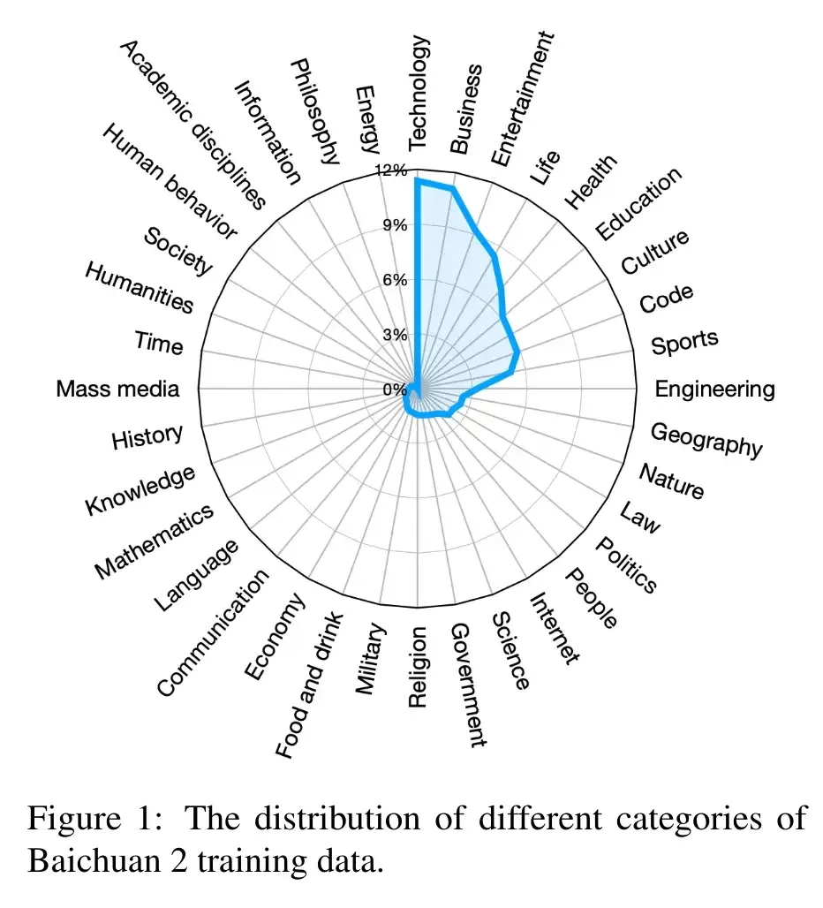

成熟的工作在后期对数据配比的讨论越来越少，逐渐变成了商业机密。

# 4. 探索性工作
现在一般折腾做SFT模型的工作，都是找一堆看着质量还可以的数据源，随后一股脑全扔进去，也不考虑配比啥的

## 4.1 1. Chinese-LLAMA
Chinese-LLAMA 在 LLAMA 的基础上进行了中文微调，包含以下数据源：

```text
0_english_LongQLoRA-SFT-39k.jsonl：506.50MB
0_english_Open-Platypus_25k.jsonl：31.91MB
1_0_firefly_chinese_common_task_1649k.jsonl：1.18GB
1_chengyu_0.1k.jsonl：56.06KB
1_coig_human_value_multi_choice_0.1k.jsonl：69.24KB
1_coig_pc_core_sample_3k.jsonl：3.94MB
1_poem_0.05k.jsonl：18.69KB
1_trad-multi-choice_0.1k.jsonl：35.81KB
1_translate_classical_chinese_0.7k.jsonl：473.36KB
1_xhs_1.5k.jsonl：2.44MB
1_zhihu_expansion_0.17k.jsonl：408.97KB
1_zhihu_score9_2.5k.jsonl：6.66MB
2_sharegpt_common_zh_76k.jsonl：482.59MB
2_sharegpt_computer_zh_20k.jsonl：81.02MB
2_sharegpt_continue_zh_1.9k.jsonl：18.88MB
3_logi-qa_0.4k.jsonl：482.07KB
3_ruozhiba_ruozhiba2_0.22k.jsonl：205.56KB
sft_zh_with_all.jsonl：1.98GB
```

链接:https://modelscope.cn/datasets/baicai003/Llama3-Chinese-dataset/files

# 4.2 Rhea-72b-v0.5 (Huggingface Leaderboard SFT 榜单第一)

SFT 数据

Rhea 的 SFT 数据包含 datasets_enconv_4m，分为两部分。注意，如果在 Huggingface 上找不到相关数据集，可能是私有数据。

基座模型使用 bacusai/Smaug-72B-v0.1

链接：(https://huggingface.co/davidkim205/Rhea-72b-v0.5

数据来源
```text
stack-exchange-preferences
SlimOrca
alpaca-gpt4
SHP
HC3
databricks-dolly-15k
orca-dpo-pairs
us-stockname
OpenHermes2.5-dpo-binarized-alpha
distilabel-math-preference-dpo
Neural-DPO
truthy-dpo-v0.1
distilabel-capybara-dpo-7k-binarized
us-sentiment
contextual-dpo-v0.1
```

随机挑选的 SFT 数据集：

```text
bigbench
glue_mnli
glue_qqp
xnli
codexglue_code2text_go
trivia_qa
medmcqa
hendrycks_ethics
super_glue_record
glue_qnli
anli_r3
swag
squad_v2
nq_open
drop
glue_sst2
blimp
paws-x
unscramble
anli_r2
babi
math_qa
social_i_qa
piqa
arithmetic
anli_r1
prost
sciq
mc_taco
medqa
super_glue_boolq
hendrycks_math
lambada
toxigen-data
glue_cola
pubmed_qa
logiqa
mutual
headqa
bbh
super_glue_wic
openbookqa
glue_mrpc
web_questions
qasper
super_glue_multirc
story_cloze
super_glue_rte
glue_rte
race
xwinograd
asdiv
xstory_cloze
crows_pairs_multilingual
belebele
glue_wnli
super_glue_wsc
coqa
super_glue_copa
super_glue_cb
winograd_wsc
mgsm
scrolls_contract_nli
```

## 4.3. abacusai/Smaug-72B-v0.1 (Huggingface SFT 榜单第 3 名)
基于 Qwen-72B 和 moreh/MoMo-72B-lora-1.8.7-DPO 进行的微调。

链接：https://huggingface.co/abacusai/Smaug-72B-v0.1

核心在于 DPO 新方法，SFT 数据未过多提及。

## 4.4 ibivibiv/alpaca-dragon-72b-v1 与 ibivibiv/strix-rufipes-70b (Huggingface SFT 榜单第 4 名)
未公开 SFT 数据。

## 4.5 saltlux/luxia-21.4b-alignment-v1.2 (Huggingface SFT 榜单第 5 名)
SFT 数据可以在 Huggingface 上找到，具体为：

alpaca-gpt4-data 52k
Open-Orca/SlimOrca 518k
in-house generated data utilizing Metamath 395k

## 4.6 fblgit/UNA-ThePitbull-21.4B-v2
代码微调模型，SFT 数据使用了 Replete-AI/code_bagel_hermes-2.5，共 2.83M。

## 4.7 Ziya
国产 SFT 模型，未开源 SFT 数据。

## 4.8 链家 BELLE
中文 SFT 模型，参考 Stanford Alpaca 生成的 1M+0.5M 中文数据，中文之光，相较于 Ziya 不开源要好得多。

具体为：

https://github.com/LianjiaTech/BELLE/blob/main/data/1.5M/zh_seed_tasks.json BelleGroup/train_0.5M_CN 519k
BelleGroup/train_1M_CN 917k

10M 版本的还并未完善。

链接：

https://github.com/LianjiaTech/BELLE

链家收集的其他 SFT 数据源：

中文：

https://github.com/LianjiaTech/BELLE/blob/main/data/awesome_open_instruct_data_for_chinese.md

具体为：

```text
(JosephusCheung/GuanacoDataset) | 534K
(COIG) | 191K
(Firefly) | 1.1M
(HC3-Chinese) | 13K
(alpaca_gpt4_zh) | 52K
(pCLUE) | 1.2M
(CSL) | 396K
(MOSS) | 0.6M
(Safety-Prompts) | 100K
(oa_leet10k) | 10K
(RefGPT-Fact-zh) | 50K
```

英文：
https://github.com/LianjiaTech/BELLE/blob/main/data/awesome_open_instruct_data_for_english.md

具体为：

```text
(InstructWild) | 52K
(HC3) | 24K
(prosocial-dialog) | 58K
(ChatAlpaca) | 20K
(gpt4all) | 437K
(gpt4all-j) | 800K
(Anthropic/hh-rlhf) | 170K
(LaMini-instruction) | 2.58M
(oa_leet10k) | 10K
(dolly-v2) | 15K
(sharegpt) | 90K
(stanford_alpaca) | 52K
(UltraChat) | 1.57M
(RefGPT-Fact) | 50K
(OIG-small-chip2) | 44M
(OpenAssistant/oasst1) | 88K
```

## 4.9 Firefly
链接：https://github.com/yangjianxin1/Firefly

Firefly 是中文综合数据开源模型，很多数据是交叉引用其他模型数据。SFT 数据部分为：

```text
YeungNLP/firefly-train-1.1M：115万条数据，包含23种中文NLP任务数据。
YeungNLP/moss-003-sft-data：671k条中英文多轮对话数据。
YeungNLP/ultrachat：772k条英文多轮对话数据。
WizardLM_evol_instruct_V2_143k：通过Evol-Instruct方法生成的英文指令数据，包含143k条。
YeungNLP/school_math_0.25M：25万条数学运算指令数据。
shareAI/CodeChat：包含逻辑推理、代码问答等相关语料。
shareAI/ShareGPT-Chinese-English-90k：中英文平行双语数据集，包含复杂场景下的用户提问。
```

## 4.10 Dolly
Dolly 是一个开源指令跟踪记录数据集，由 Databricks 员工生成，涉及多种任务行为。具体数据：

databricks/databricks-dolly-15k：15k 条数据。
其他榜单上的模型大多没有开源 SFT 数据来源。

# 5. 开源开放的 LLM
研究社区已经形成了一些真正开放的 LLMs，例如 Pythia、Amber、OLMo、Map-Neo。

## 5.1 Map-Neo

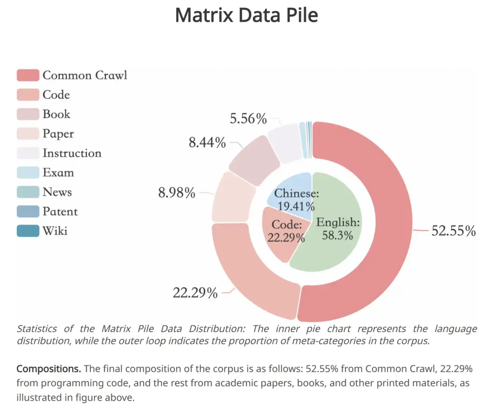

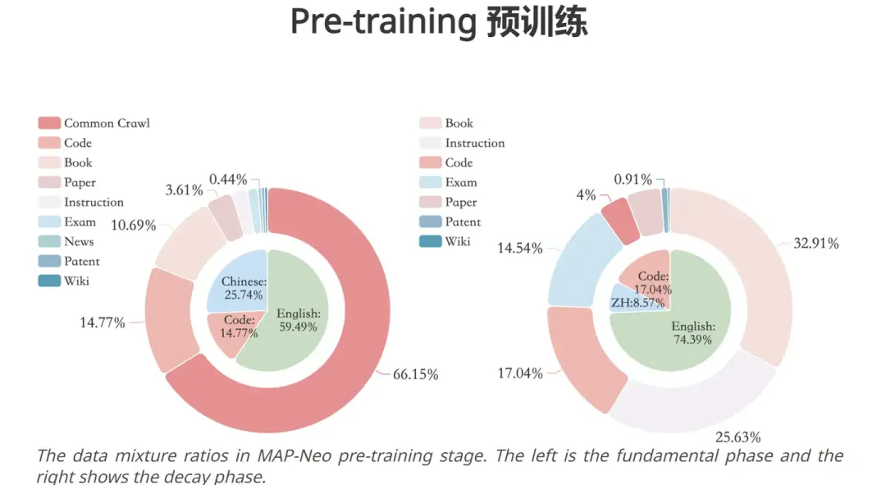

Map-Neo 通过不同的数据源进行了划分。最终语料库的构成如下：

- 52.55% 来自 Common Crawl
- 22.29% 来自编程代码
- 其余来自学术论文、书籍和其他印刷材料。
继续训练的数据配比为：

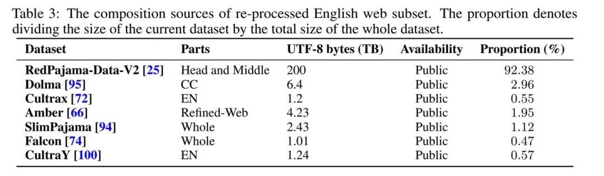

Map-Neo 还提供了从头爬取数据的配比

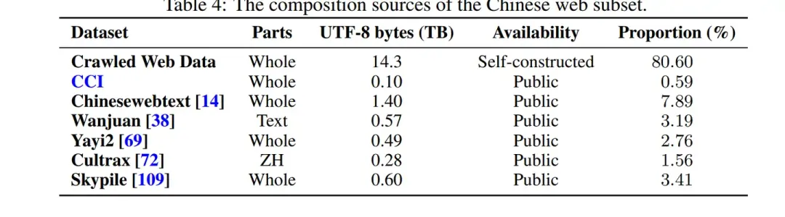

这里仍然没有对数据配比进行系统性的调研，解释清楚为什么RedPajama要占92.38%。一些数据过滤、去重的Pipeline与Qwen和LLAMA也非常相似，就不展开叙述了。下图为各个处理组件过滤后，剩余的数据量。

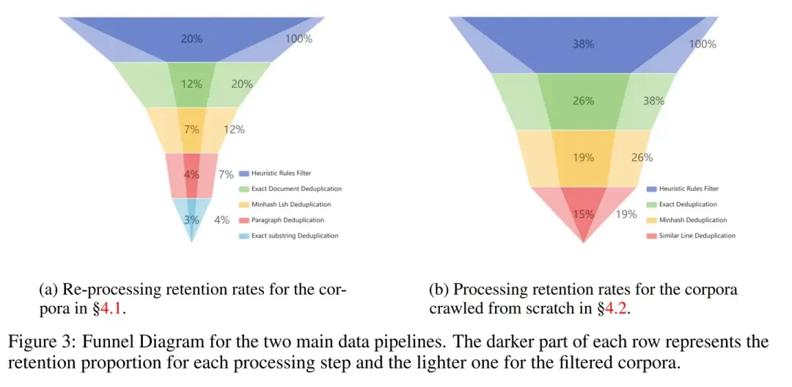

我总觉着按着数据源划分有些没道理，因为从Common Crawl和Wiki各拿出100条数据，有时他们之间是没有明确可区分边界的。我认为可以首先利用InsTag、LLAMA分类器、聚类、质量分类这样的工作给数据进行有边界的划分，随后再进行配比的研究才是有意义的。）

## 5.2 Pythia
Pythia 是 EleutherAI 的工作，探究了 16 个 LLM 模型（70M 到 12B）在相同数据训练下的表现。训练数据是 Pile，未探究数据相关的工作。

链接：https://github.com/EleutherAI

FineWeb 是另一个高度消融的工作，探索了数据选择对模型表现的影响。

# 6. 研究性工作：DoReMi
Google DeepMind的工作，先不使用任何下游任务知识的情况下，训练一个小的代理模型（280M），得到数据配比。随后利用该数据配比，训练真正的大模型（8B）。

评估指标是在Pile/GLaM数据的困惑度，以及下游任务精度。

动机介绍

Pile数据集包含24%的网络数据，9%维基百科，4%Github等。（这个百分比，是按照Tokens数统计划分的）目前还不清楚每个领域是如何影响LM的预训练效果以及下游任务表现。

Pile是人工选择的配比，PaLM和GLaM(2021年的工作)是依赖下游任务来选择数据配比的。

DoReMi的目标是寻找一个数据配比，在不知道下游任务的情况下，在所有下游上表现都很好。

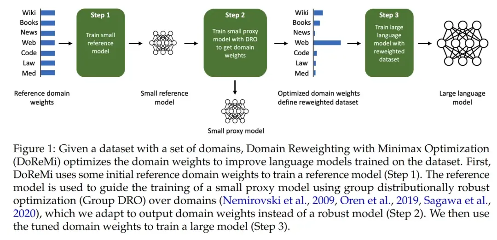

提出excess loss超额损失的概念，代表 参考模型（以平均混比方式训练）和 混比模型（以特定混比数据训练）的loss差额。优化目标为最小化 在所有domain中最坏情况下的exceess loss。（这里的domain代表各个数据源）（这里的最坏情况，worst-case loss over domain，代表在各个domain上，与均值配比模型的NLL负对数似然loss比起来，哪个domain中新配比下的模型会有更高的loss）

使用基于在线学习的方式进行训练，在每个domain上的动态更新数据混比。根据每个domain部分的loss情况，来选择重新调整数据配比，使其优化超额损失。对超额损失大的domain的一个Batch，计算各个数据项的超额损失求和\lambda，e^(n\lambda)*原domain配比作为新domain配比。随后更新基线模型和代理模型权重。

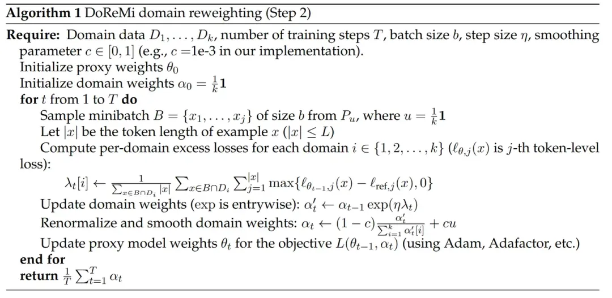

（直觉来理解一下超额损失， 平均混比模型，可以一定程度上代表一个基线，意味着只要增加某个domain的数据，大概率可以达到这个基线，如果配比模型在某个domain表现差了，可能意味着这一部分的数据缺少了。这个假前提假设是越多的数据，在本domain表现越好。有一个问题是，为什么要更新基线模型，而不是直接训练好之后去用？怕直接用过强的模型没法做到监督作用吗？）

最后推荐一个数据选择工作的综述：A Survey on Data Selection for Language Models

链接：https://arxiv.org/abs/2402.16827

里面也包含了一些数据混比的描述。

# 参考

[1] LLM预训练与SFT数据配比调研，https://mp.weixin.qq.com/s/-J-5oHB4T4taQd0vCHhYUA