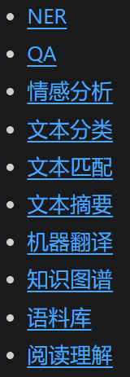
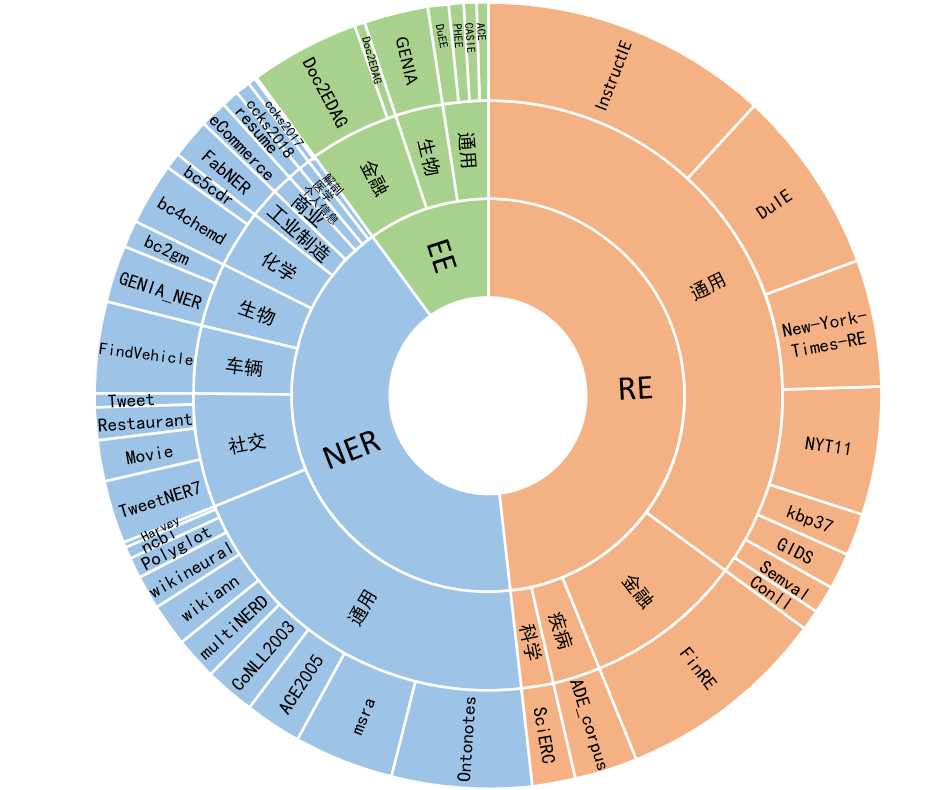

# 1. 专项数据
## 1.1. 总结类任务

1. ADGEN

    ADGEN 数据集任务为根据输入（content）生成一段广告词（summary）。
    
    数据集包含：train.json, dev.json
    
    ```json
    {
        "content": "类型#上衣*版型#宽松*版型#显瘦*图案#线条*衣样式#衬衫*衣袖型#泡泡袖*衣款式#抽绳",
        "summary": "这件衬衫的款式非常的宽松，利落的线条可以很好的隐藏身材上的小缺点，穿在身上有着很好的显瘦效果。领口装饰了一个可爱的抽绳，漂亮的绳结展现出了十足的个性，配合时尚的泡泡袖型，尽显女性甜美可爱的气息。"
    }
    ```
    
    从 [Google Drive](https://drive.google.com/file/d/13_vf0xRTQsyneRKdD1bZIr93vBGOczrk/view?usp=sharing) 或者 
    [Tsinghua Cloud](https://cloud.tsinghua.edu.cn/f/b3f119a008264b1cabd1/?dl=1) 下载处理好的 ADGEN 数据集，将解压后的 `AdvertiseGen` 目录放到本目录下。


# 2. NLP类任务

## 2.1 全品类
1. CLUEDatasetSearch
    - https://github.com/CLUEbenchmark/CLUEDatasetSearch
    - 3.5k stars
    - 

## 2.2 信息抽取

1. 雅意信息抽取数据集
    - 论文 2023.12.24
       - YAYI-UIE: A Chat-Enhanced Instruction Tuning Framework for Universal Information Extraction
       - https://arxiv.org/abs/2312.15548
    - Github (162 star): https://github.com/wenge-research/YAYI-UIE
    - 模型下载地址：https://modelscope.cn/models/wenge-research/yayi-uie/
    - 数据下载地址：https://modelscope.cn/datasets/wenge-research/yayi_uie_sft_data/summary
    - 百万级语料中文54%，英文46%；其中其中数据集包括12个领域包括金融，社会，生物，商业，工业制造，化学，车辆，科学，疾病医疗，个人生活，安全和通用。覆盖数百个使用场景
      - NER：中文覆盖28个实体类型包括人物，地缘政治，组织，身体部位，药物等，英文覆盖130个实体类型包括Animal, Weapon, Conference, Book等。
      - RE：中文覆盖232种关系包括买资，增持，重组，国籍，别名，亲属，入股，转让，导致，发生地点，制造商等，英文覆盖236种关系包括founded by，state or province of headquarters，employee of，occupation，creator等。
      - EE：中文覆盖84种事件类型,包括中标，高管变动，产品行为-发布，公司上市等，和203种论元，英文覆盖45种事件类型，包括Born, Demonstrate, Meet, End Organization, Divorce等，和62种论元。
    - 
    - 

2. IEPILE:大规模基于Schema的信息抽取语料库
   - 论文题目：IEPile: Unearthing Large-Scale Schema-Based Information Extraction Corpus
   - 本文作者：桂鸿浩（浙江大学、蚂蚁集团）、袁琳（蚂蚁集团）、叶宏彬（浙江大学）、张宁豫（浙江大学、浙江大学-蚂蚁集团联合实验室）、孙梦姝（蚂蚁集团、浙江大学-蚂蚁集团联合实验室）、梁磊（蚂蚁集团、浙江大学-蚂蚁集团联合实验室）、陈华钧（浙江大学、浙江大学-蚂蚁集团联合实验室）
   - 发表会议：ACL2024
   - 论文链接：https://arxiv.org/abs/2402.14710
   - 代码链接：https://github.com/zjunlp/IEPile
   - Modelscope下载路径：https://modelscope.cn/datasets/ZJUNLP/IEPile
   - 模型下载：https://modelscope.cn/models/ZJUNLP/OneKE
   - 一个全面的双语（英语和汉语）IE指令语料库——IEPile，它包含大约0.32B个字符
   - 实验表明，IEPile提高了LLMs的信息提取性能，特别是在零样本泛化方面有显著提升
   - 本语料库主要涉及中英双语的材料，并集中于命名实体识别（NER）、关系抽取（RE）和事件抽取（EE）三大类信息抽取任务。我们总共收集了15个英文NER数据集，3个中文NER数据集，8个英文RE数据集，2个中文RE数据集，以及3个英文EE数据集和2个中文EE数据集。为保证数据质量和格式的统一，我们对数据进行了规范化处理，包括格式统一、实例去重、筛除低质量数据。
   - 三条启发式规则以排除质量较低且无意义的数据：1）非字母字符占比超过80%；2）文本长度小于5个字符且不含任何标签；3）停用词如'the'、'to'、'of'等占比超过80%。我们认为以上所述的清洗措施将对模型的训练产生积极影响，并提高其性能