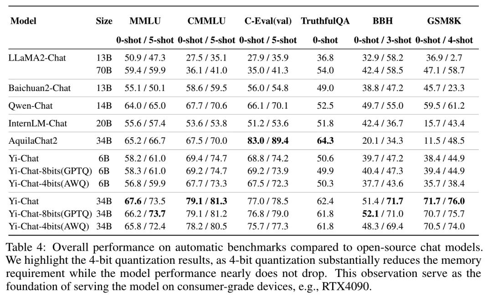
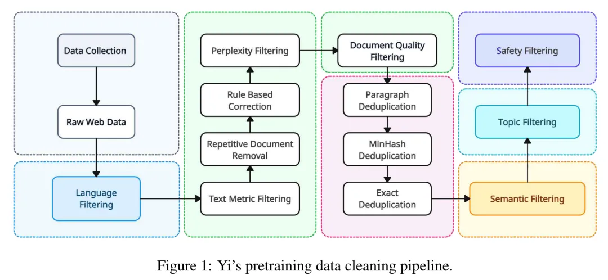
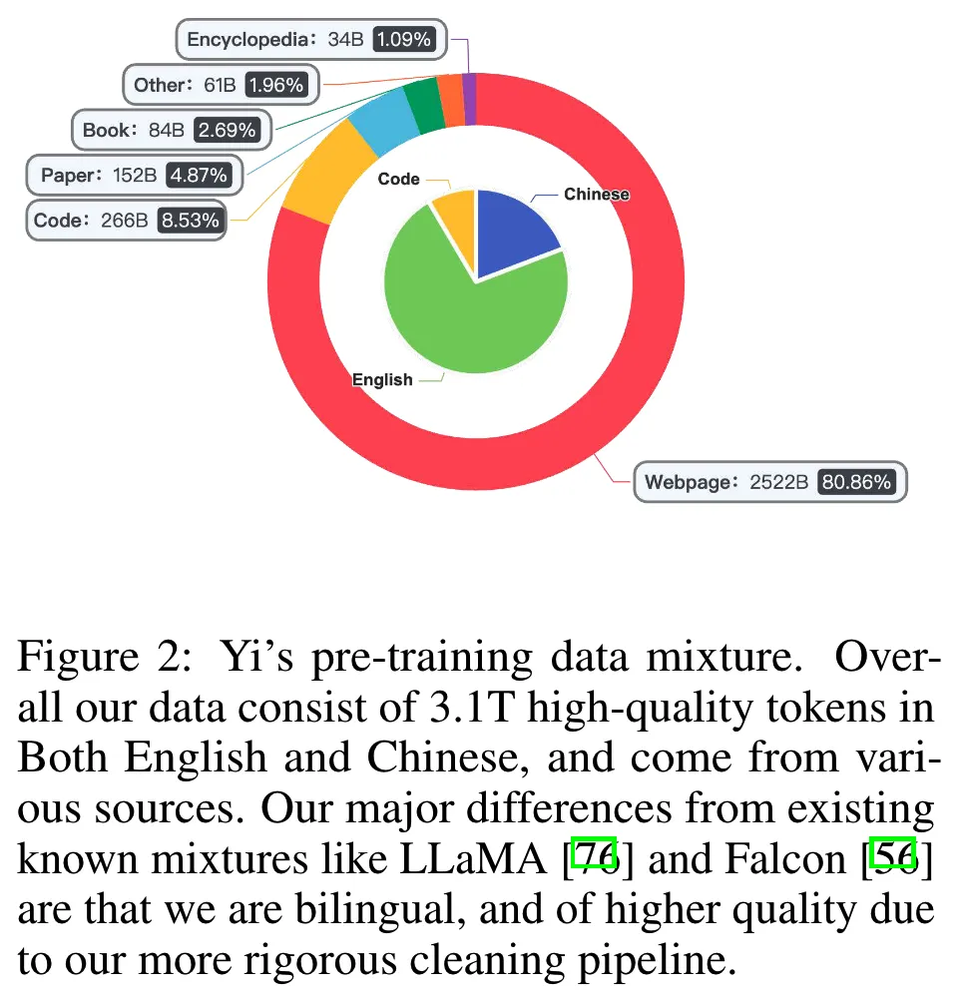
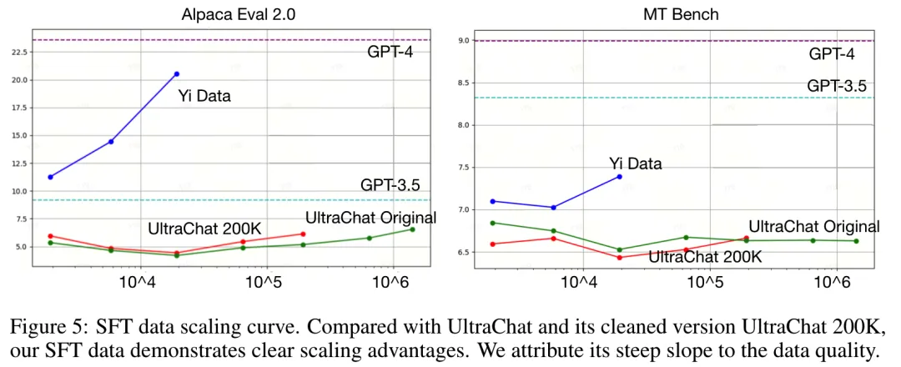
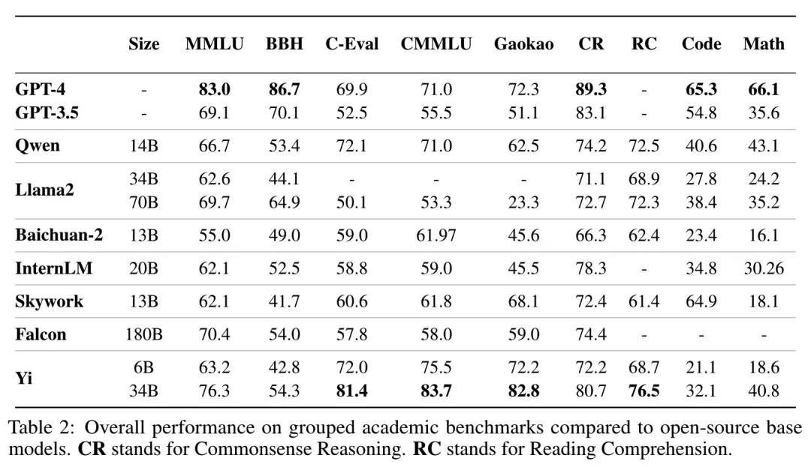
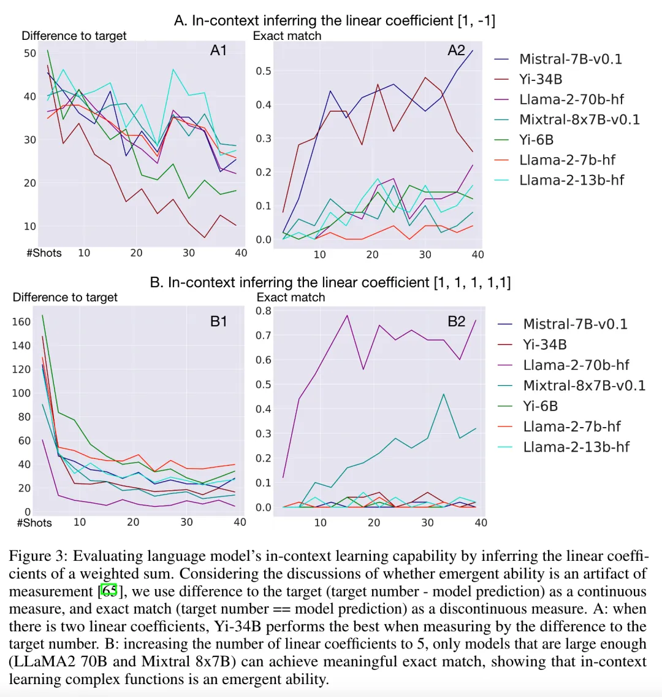
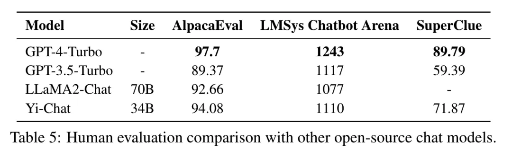
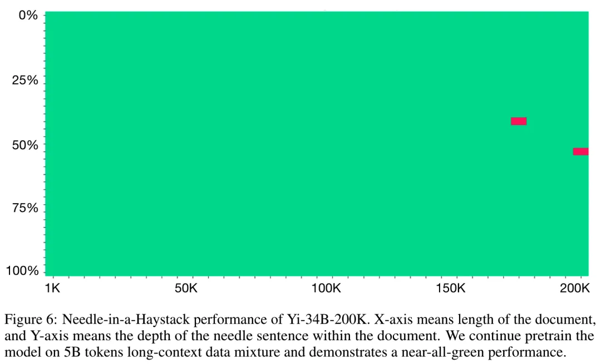
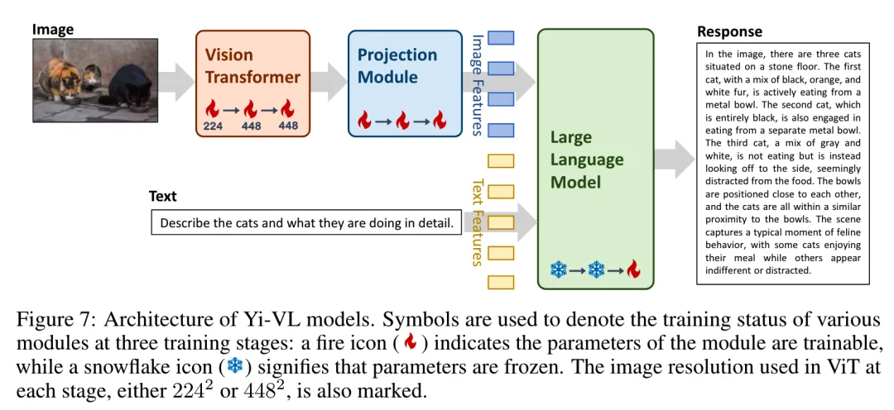
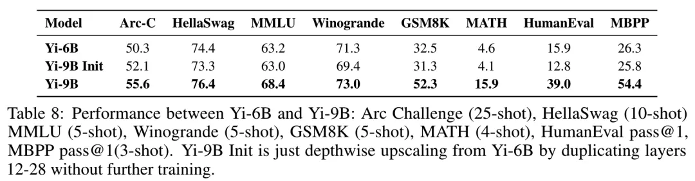

# 1. 介绍
## 1.1 总体优化点

- Yi-34B模型int4量化之后，相比float16损失<1%，可以跑在RTX4090上（24G显存）
- 模型结构不需要太多变化，LLAMA2标准结构已经足够训出很好的效果
- 3.1T的预训练数据远比scaling law建议的1T大，但是效果更好，并且模型还没饱和，继续增大数据量还能提升
- 微调数据质量很重要，由算法人员直接标注，只要<10k的数据量就足够了
- 4k长度的基础预训练模型已经具备长文本能力，只需用长文本数据继续预训练，更新百步就有很好效果
- 总之，数据要精心设计，数据质量要高，数据量要大



## 1.2 结构

结构上，基于标准LLAMA2模型，做了一些变化

- 注意力机制：LLAMA2只在70B用了GQA，Yi全系列都用了GQA，具体参数如下表
- 位置编码：RoPE，参考RoPE ABF（《Effective long-context scaling of foundation models》），base扩大到10M，用于支持长上下文。
- 激活函数：使用SwiGLU，参考《GLU Variants Improve Transformer》
- 并且把activation size从4h降为8/3h，这里的说法是补偿了GQA带来的参数下降

## 1.3 tokenizer

- 用BPE，词表大小为64000，这个大小平衡了计算效率和表达能力；
- 其中数字全是单个的digit，让模型能更好地理解数字数据；
- 对于OOV的词，会降级用unicode编码 ；
- 保留全角标点符号，不转为半角；

另外，优先考虑英语的LLM在tokenizer会使用虚拟前缀（文本开头的空格）来泛化句子不同位置相同的单词。Yi不这么做，因为即使是在英语语境中，这种假设并不总是成立，比如对于以引号开头的句子，而且在中文语境中，这么做没有明显效果。

# 2. 数据
## 2.1 预训练数据

预训练输出处理流程



1. 语料获取 & 语言分类  

   从网络爬虫开始，爬取中英文这两种语言的网站，对网站内容进行解析。

   并参考CCNeT（《CCNet: Extracting High Quality Monolingual Datasets from Web Crawl Data》）的做法，进行语言识别。

2. 规则过滤器 Heuristic Rule Filters

   目的是快速过滤掉明显的低质量数据。基于这些规则来过滤掉：

   - URL、域名、单词黑名单和乱码文本；
   - 文档长度、特殊符号的比例，以及短行、连续行或不完整行的比例；
   - 重复的单词模式、n-gram或段落，参考《Scaling Language Models: Methods, Analysis & Insights from Training Gopher》的做法，阈值则是来参考《CulturaX: A Cleaned, Enormous, and Multilingual Dataset for Large Language Models in 167 Languages》；
   - 数据脱敏：识别并匿名化个人信息（Personal Identifiable Information，PII），如电子邮件地址和电话号码。

3. 可训练过滤器 Learned Filters
   
   对于不好用规则处理的，就用模型来学习模式，并进行清洗。共有4个scorer：

   - Perplexity Scorer：参照《CCNet: Extracting High Quality Monolingual Datasets from Web Crawl Data》，用kenlm库，把高于平均perplexity的内容丢弃；
   - Quality Scorer：识别如维基百科这样的高质量内容，丢弃低质量内容；
   - Document Coherence Scorer：用于发现句子、段落零散不连贯的文本，要么分割，要么直接丢弃；
   - Safety Scorer：识别并删除暴力、色情、涉政内容

4. 基于聚类的过滤 Cluster-based Filters

   用聚类的方法，把所有文档进行分类。一方面用于给数据混合策略做参考，一方面如果整个类别的质量太差，就直接抛弃类别内的所有数据。

5. 去重
   
   参考《The RefinedWeb Dataset for Falcon LLM: Outperforming Curated Corpora with Web Data, and Web Data Only》，做文档级的minhash去重，以及子文档级的完全匹配去重。

最终获得的数据分布如下



10T数据删选完只有3T

## 2.2 微调数据

对于微调数据，一句话：Quality is All You Need。

一共只有<10k条SFT数据，每条数据都通过人工多次打磨，这比大数量但质量一般的数据的效果好。

这思路和《Gemini: A family of highly capable multimodal models.》、《Llama 2: Open Foundation and Fine-Tuned Chat Models》、《Lima: Less is more for alignment》一致，而和FLAN（《Scaling instruction-finetuned language models》）以及UltraChat（《Enhancing chat language models by scaling high-quality instructional conversations》）这样更关注数据量的做法不同。

具体做法上有：

- 对于prompt distribution selection：参考《Wizardlm: Empowering large language models to follow complex instructions》，开发复合指令，并通过指令进化，逐步增加指令的复杂度。这种做法显著减少了SFT数据量。
- 对于CoT data formatting：参考《Take a step back: Evoking reasoning via abstraction in large language models》，采用了“Step-Back”的模式。即通过抽象化处理，让模型学习在深入探讨原始、具体的问题之前，制定更高层次的解决方案。
- 对于response formatting：使用从《Lima: Less is more for alignment》扩展的默认样式。总体而言，response的结构为introduction-body-conclusion的格式，“where the body is usually a list of bullet point”。
- 在缓解幻觉问题上，思路是确保response中的知识不由模型内部产生，对应的做法是把会导致模型进行记忆的response删掉。（但是这个具体标准是什么，有没有了解的朋友说下看法？）
- 在缓解生成重复的问题上，则是直接把response中包含重复的部分都重写了。（核心还是洗数据，一条条打磨）
- 数据多样性很重要，因此参考《#instag: Instruction tagging for analyzing supervised fine-tuning of large language models》建立了一个打标系统，并设计一个注重多样性的采样算法，平衡了各个领域数据的分布。
- 为了找到最佳的数据配比，参考《How abilities in large language models are affected by supervised fine-tuning data composition》，使用近似网络搜索（approximate grid search），对每个领域以{1, 1/2, 1/4, 1/8, 1/16, 1/32, 1/64}的比例进行实验和人工测评，找到最佳的组合方式。
- 除了内容，数据格式对效果也有很大影响。参OPENAI的ChatML格式（https://github.com/openai/openai-python/blob/e389823ba013a24b4c32ce38fa0bd87e6bccae94/chatml.md），这种结构化的格式使模型能够区分各种信息类型，如system prompt、user input和bot response。

SFT数据质量能极大影响模型的效果，随着数据量的增加，高质量数据能带来更多提升，如下图



# 3. 训练

## 3.1.infra

从数据处理到模型训练都需要大集群大算力的支持。Yi构建了支持全栈数据处理、预训练、微调和服务的基础设施。包括：

(1) 自动管理和监控计算资源的能力；(2) 通过优化并行策略、内核效率和长上下文支持提高训练速度；(3) 统一微调框架，支持异构分布式训练后端，例如在DPO中同时使用Megatron和DeepSpeed进行多个模型的训练；(4) 通过各种LLM服务加速技术（如量化、continuous batching 和 paged attention）降低部署成本。

总之这部分工作还是很多的，比如由于经常有硬件坏，坏的硬件会被自动从资源池移除；任务失败时，会自动跟踪重启。给算法人员考法UI等。

## 3.2.预训练

训了4k基础模型。（暂时没有给出更多细节）

## 3.3.微调

超参如下

```text
AdamW：beta=[0.9,0.999]，epsilon = 1e-8
seq_len = 4096
batch size = 64
constant lr = 1e-5，weight decay = 0.1
gradient clip = 1.0
max step = 300
```

参考《Neftune: Noisy embeddings improve instruction finetuning》，对于6B模型 noise scale = 5，对于34B模型 noise scale = 45

# 4.模型评测
## 4.1.基模型评测

1. 基础能力评测

   对其他开源模型，保持和公开的设置相同做法获取结果。Yi使用贪婪解码，没有进行任何后处理，结果如下表
   
   
   
   在数学和代码能力上，和GPT3.5、GPT4还存在一些差距，而这些能力是可以通过继续预训练和微调来持续提升的。Yi最初的设计并没有针对这些能力，因此没有在预训练数据中包含特别多相关数据，后续会有计划增加这部分能力的提升。
   
   而和其他开源模型相比，在代码和数学以外的任务，Yi基本上做到了跟大一倍模型的效果相近，甚至更好的水平。

2. 观察

   - 模型规模带来的增益：尽管Yi-34B和Yi-6B使用了相同的预训练语料，但Yi-34B的性能相比Yi-6B有了质的提升。更大的模型尺寸在代码和数学基准测试上带来了明显的增益。
   - 数据质量：高质量预训练数据的小型模型，如Yi-34B或Qwen-14B，通常表现优于尺寸更大但（可能）数据质量较低的模型，例如Falcon-180B。
   - GPT-4与开源LLM之间的差距：开源LLM在多种基准测试上的性能仍然落后于GPT-4和GPT-3.5。然而，具有代表性的双语LLM，例如Qwen-14B和Yi-34B，可以在包括C-Eval、CMMLU和Gaokao在内的中文知识相关基准测试上匹配甚至超过GPT-4的性能。然而，在BBH、代码（HumanEval）和数学（MATH）等推理相关基准测试上，仍然存在巨大的差距。

3. In-Context Learning能力的测试

   Yi进一步研究了in-context learning的能力，即根据少数展示的输入-输出示例，推断underlying function的能力。
   
   考虑的任务是推断加权和的线性系数。具体来说，定义 y = w1x1 + w2x2 + ... + wnxn。
   
   少量示例展示是 x1, x2, ..., xn, y，要求模型预测给定一组新输入 x 的 y。
   
   这就要求模型隐式地推断出 w1, w2, ..., wn。
   
   评测上，使用（a）模型预测的 y 与真实值 y∗ 之间的绝对差，即 |y − y∗| 作为连续度量，以及使用（b）精确匹配 y == y∗ 作为不连续度量。
   
   模型在算术上的效果正常，因此可以认为这样的测试不受算术能力的影响，而能直接看模型是否具备根据给定的实例进行underlying function推理的能力。
   
   实验发现，当问题比较简单时（系数是[1,-1]），Yi-34B和LLAMA-70B效果比较好（看下图）。
   
   当问题更复杂点（系数是[1，1，1，1，1]），只有LLAMA-70B和Mistral 8*7B这样的大模型表现出了涌现的能力。   

   

## 4.2.Chat模型评测

1. 自动评测

   评测的任务和base模型相同，分别采用zero-shot和few-shot，效果依然不错，具体结果如下
   
   

   报告强调，如Goodhart’s principle所说，当一个指标变成目标，就不再是一个好指标。因此这里的测试只是为了确认微调没有使得模型的知识能力下降，而不会专门去针对任务做优化。
   
   结果上，Yi-34B-Chat数学能力不错，而Yi-6B-Chat并没有展现出强大的数学能力。推测较小的模型可能需要更多的数据在SFT阶段激活其相应的能力。

2. 人工评测

   

   报告中认为，4k的base模型已经具备了长文本（200k）的能力。只要用少量数据，进行继续预训练来释放这个能力，再用轻量级的SFT来调整格式，就能获得足够好的长文本能力。

   长文本的继续预训练中，依然使用完整的attention，而不是线性attention或者sparse attention。
   
   继续预训练的数据，混合了（1）原始预训练数据（2）length-upsampled long-context data长文本数据，长文本数据主要来自书籍（3）多文档问答的人造数据。
   
   多文档问答数据的应答中，在最终答案之前会对和答案相关的段落进行复述（recitation），以此来提升模型长文本关联的能力。
   
   这部分的数据工作主要参考《Data engineering for scaling language models to 128k context》和《Paraphrasing the original text makes high accuracy long-context qa》。
   
   最终用了5B token的长文本数据，batch size=4M（token），只更新了100个step（这里没明白100步是怎么来，不应该是5B/4M=1250？有没有明白的朋友指点一下）。

   这个做法与《Data engineering for scaling language models to 128k context》一致，这样轻量级的微调已经足够在“大海捞针”任务做得很好。
   
   而微调的数据，也混合了短的SFT数据，以及长的文本问答数据。
   
   这些文本问答数据都是人工用模型造出来的。
   
   具体的做法是，随机抽一些文档，然后从中随机选择一个或者多个段落，让一个训练好的模型根据这些段落造出问题和答案。
   
   一个重要的细节是复述和改写：在给出答案之前，我们要求模型复述或改写原文段落。这种数据格式鼓励模型的检索行为，从而抑制其虚构行为：面对一个问题，模型更倾向于使用输入中的信息来构建答案，而不是使用其内部知识，后者可能与问题相关但不准确。
   
   使用以上所述的轻量级训练，已经可以在“大海捞针”任务做得很好，几乎能够做到全绿。

   

## 5.2.多模态

ViT部分由CLIP ViT-H/14 model初始化，后面的transformer由Yi-Chat初始化



3步训练：

（1）使用224^2的图像来训练ViT和projection模块的参数。这一训练利用了包含1亿个图像-文本对的数据集，这些数据来自LAION-400M。主要目标是增强ViT在架构中的知识获取能力，并实现ViT与LLM之间更好的对齐。

（2）将ViT的图像分辨率提升到448^2，目的是进一步推动模型识别复杂视觉细节的能力。在这个阶段使用的数据集包括从LAION-400M中提取的2000万个图像-文本对。此外，还融入了来自不同来源的大约480万个图像-文本对，例如CLLaVA、LLaVAR、Flickr、VQAv2、RefCOCO、Visual7w等。

（3）整个模型的参数一起训练。主要目标是提高模型在多模态聊天交互方面的熟练度，从而赋予它能够无缝融合和解释视觉与语言输入的能力。为此，训练数据集涵盖了多种来源，总共大约有100万张图像-文本对，包括GQA、VizWiz VQA、TextCaps、OCR-VQA、Visual Genome、ShareGPT4V等等。为了确保数据平衡，对任何单一来源的最大数据量设定了上限，将其限制在不超过50,000对。

使用128张A100，6B训了3天，34B训10天。

## 6.3.Depth Upscaling 深度扩展

目标是把32层的6B扩展到48层的9B模型。

参考《Scaling large language models with simple yet effective depth up-scaling》，通过复制中间的12-28层共16层，把层数扩展为48层。

实验表明，要确定复制哪些层，可以通过测量输入和每层输出的cosine similarity来衡量。

这种方法使得模型能在不额外训练的情况下，和原模型性能最接近，损失最少。



这说明复制的这些层并不会很大地改变原模型的激活值。

除了层数增加，Depth Upscaling还要做继续预训练，才能提升效果。

继续预训练使用约800B token，训练过程分为两个阶段。

其中约70%的数据是最近收集并精心挑选的。在最后阶段增强了代码的比例以提高代码性能。

训练保持constant lr = 3e-5，并在模型损失达到平台期时，从4M token开始逐渐增加batch size大小。

这种增加batch size的方法，以及保持所有其他参数与Yi-6B基础模型配置一致，继续预训练很重要。

# 参考

[1] Yi技术报告-划重点看细节， https://mp.weixin.qq.com/s/T4oAvLkgCarN3dXErDsPKA
