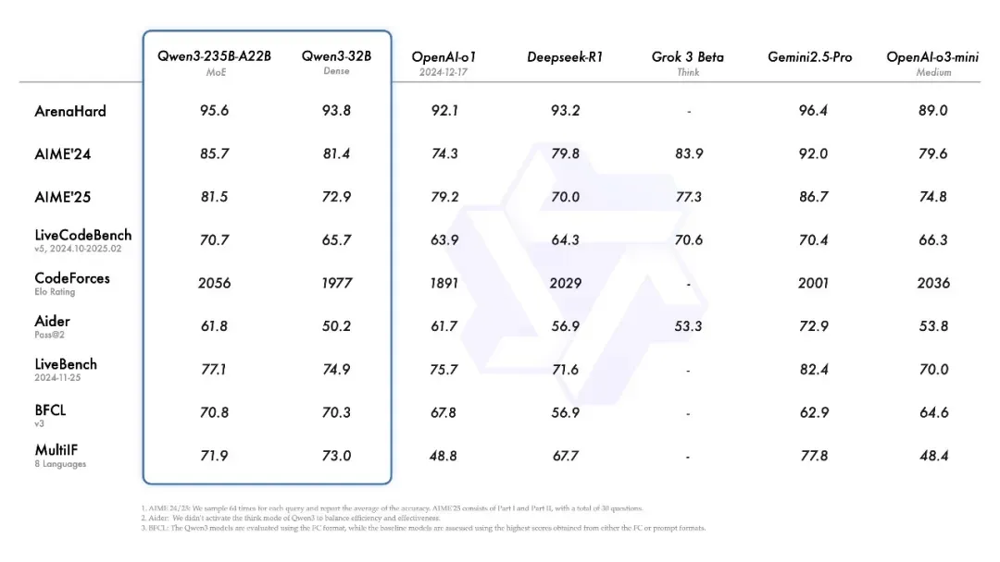
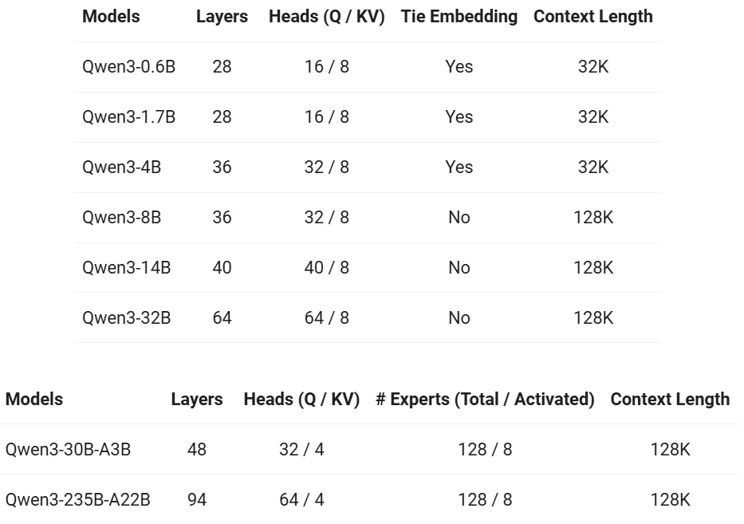

通义千问Qwen团队正式开源推出 Qwen3，这是 Qwen 系列大型语言模型的最新成员。最新的Qwen3系列模型具备双模推理能力（深入思考/快速响应）、支持119种语言及方言，并强化了Agent功能与代码执行能力，全面满足复杂问题处理与全球化应用需求。

其中，旗舰模型 Qwen3-235B-A22B 在代码、数学、通用能力等基准测试中，与 DeepSeek-R1、o1、o3-mini、Grok-3 和 Gemini-2.5-Pro 等顶级模型相比，表现出极具竞争力的结果。此外，小型 MoE 模型 Qwen3-30B-A3B 的激活参数数量是 QwQ-32B 的 10%，表现更胜一筹，甚至像 Qwen3-4B 这样的小模型也能匹敌 Qwen2.5-72B-Instruct 的性能。

本次Qwen3开源了两个 MoE 模型的权重：Qwen3-235B-A22B，一个拥有 2350 多亿总参数和 220 多亿激活参数的大模型，以及Qwen3-30B-A3B，一个拥有约 300 亿总参数和 30 亿激活参数的小型 MoE 模型。此外，六个 Dense 模型也已开源，包括 Qwen3-32B、Qwen3-14B、Qwen3-8B、Qwen3-4B、Qwen3-1.7B 和 Qwen3-0.6B，均在 Apache 2.0 许可下开源。

Github：

https://github.com/QwenLM/Qwen3

Blog：

https://qwenlm.github.io/zh/blog/qwen3/

模型合集：

https://www.modelscope.cn/collections/Qwen3-9743180bdc6b48

创空间体验：

https://www.modelscope.cn/studios/Qwen/qwen3-chat-demo

HuggingFace 地址：https://huggingface.co/collections/Qwen/qwen3-67dd247413f0e2e4f653967f

Modelscope 地址：https://modelscope.cn/collections/Qwen3-9743180bdc6b48

GitHub 地址：https://github.com/QwenLM/Qwen3

博客地址：https://qwenlm.github.io/blog/qwen3/

试用地址：https://chat.qwen.ai/

MoE 模型：Qwen3-235B-A22B 和 Qwen3-30B-A3B；其中 235B 和 30B 分别是总参数量，22B 和 3B 分别是激活参数量。

密集模型：Qwen3-32B、Qwen3-14B、Qwen3-8B、Qwen3-4B、Qwen3-1.7B 和 Qwen3-0.6B。

在预训练方面，Qwen3 的数据集相比 Qwen2.5 有了显著扩展。Qwen2.5 是在 18 万亿个 token 上进行预训练的，而 Qwen3 使用的数据量几乎是其两倍，达到了约 36 万亿个 token，涵盖了 119 种语言和方言。

为了构建庞大的数据集，开发团队不仅从网络上收集数据，还从 PDF 文档中提取信息。他们使用 Qwen2.5-VL 从这些文档中提取文本，并用 Qwen2.5 改进提取内容的质量。

另外，为了增加数学和代码数据的数量，开发团队利用 Qwen2.5-Math 和 Qwen2.5-Coder 这两个数学和代码领域的专家模型合成数据，合成了包括教科书、问答对以及代码片段等多种形式的数据。

具体而言，预训练过程分为了以下三个阶段：

在第一阶段（S1），模型在超过 30 万亿个 token 上进行了预训练，上下文长度为 4K token。这一阶段为模型提供了基本的语言技能和通用知识。

在第二阶段（S2），通过增加知识密集型数据（如 STEM、编程和推理任务）的比例来改进数据集，随后模型又在额外的 5 万亿个 token 上进行了预训练。

在最后阶段，使用高质量的长上下文数据将上下文长度扩展到 32K token，确保模型能够有效地处理更长的输入。

得益于模型架构的改进、训练数据的增加以及更有效的训练方法，Qwen3 Dense 基础模型的整体性能与参数更多的 Qwen2.5 基础模型相当，例如 Qwen3-1.7B/4B/8B/14B/32B-Base 分别与 Qwen2.5-3B/7B/14B/32B/72B-Base 表现相当。

特别是在 STEM、编码和推理等领域，Qwen3 Dense 基础模型的表现甚至超过了更大规模的 Qwen2.5 模型。可以看到，Qwen3 MoE 基础模型在仅使用 10% 激活参数的情况下达到了与 Qwen2.5 Dense 基础模型相似的性能，由此带来了训练和推理成本的显著节省。

为了开发能够同时具备思考推理和快速响应能力的混合模型，开发团队实施了一个四阶段的训练流程，包括：（1）长思维链冷启动，（2）长思维链强化学习，（3）思维模式融合，以及（4）通用强化学习。

在第一阶段，使用多样的的长思维链数据对模型进行了微调，涵盖了数学、代码、逻辑推理和 STEM 问题等多种任务和领域。这一过程旨在为模型配备基本的推理能力。

第二阶段的重点是大规模强化学习，利用基于规则的奖励来增强模型的探索和钻研能力。

在第三阶段，在一份包括长思维链数据和常用的指令微调数据的组合数据上对模型进行微调，将非思考模式整合到思考模型中，确保了推理和快速响应能力的无缝结合。

在第四阶段，在包括指令遵循、格式遵循和 Agent 能力等在内的 20 多个通用领域的任务上应用了强化学习，进一步增强模型的通用能力并纠正不良行为。

# 参考

[1] Qwen3开源发布：Think Deeper, Act Faster！社区推理、部署、微调、MCP调用实战教程来啦！https://mp.weixin.qq.com/s/nfSfGjDBmzvgnk2AzMxFrQ
[2] 猛击OpenAI o1、DeepSeek-R1！刚刚，阿里Qwen3登顶全球开源模型王座，深夜爆火, https://mp.weixin.qq.com/s/gvWJMfy2ah4IHqyO-tP8MA