# 1. 资源

- deepseek-ai/DeepSeek-V2-Chat · Hugging Face
- DeepSeek-V2/deepseek-v2-tech-report.pdf at main · deepseek-ai/DeepSeek-V2 (github.com)

# 2. 简介

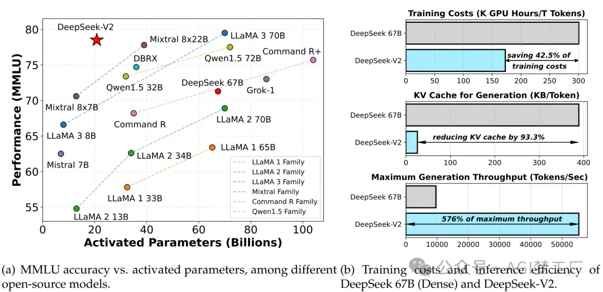

DeepSeek-V2 包含236B参数，每个Token激活2.1B参数，支持长达 128K 的上下文长度。与DeepSeek 67B相比，DeepSeek-V2 在性能上取得了显著提升，节省了42.5%的训练成本，减少了93.3%的KV缓存，并将最大生成吞吐量提高到了5.76倍。

这真的是真开源啊！根据内部消息，深度求索将该 DeepSeek-V2 模型已完全上线至平台服务用户，DeepSeek-V2 API也是物美价廉。并且秉持着最开放的开源精神，深度求索将这次的DeepSeek-V2模型和论文也将完全开源，免费商用。

# 3. 模型

1. 模型架构

    

2. 模型定义

    ```text
    DeepseekForCausalLM(
      (model): DeepseekModel(
        (embed_tokens): Embedding(102400, 5120)
        (layers): ModuleList(
          (0): DeepseekDecoderLayer(
            (self_attn): DeepseekAttention(
              (q_a_proj): Linear(in_features=5120, out_features=1536, bias=False)
              (q_a_layernorm): DeepseekRMSNorm()
              (q_b_proj): Linear(in_features=1536, out_features=24576, bias=False)
              (kv_a_proj_with_mqa): Linear(in_features=5120, out_features=576, bias=False)
              (kv_a_layernorm): DeepseekRMSNorm()
              (kv_b_proj): Linear(in_features=5120, out_features=32768, bias=False)
              (o_proj): Linear(in_features=163840, out_features=5120, bias=False)
              (rotary_emb): DeepseekYarnRotaryEmbedding()
            )
            (mlp): DeepseekMLP(
              (gate_proj): Linear(in_features=5120, out_features=12288, bias=False)
              (up_proj): Linear(in_features=5120, out_features=12288, bias=False)
              (down_proj): Linear(in_features=12288, out_features=5120, bias=False)
              (act_fn): SiLU()
            )
            (input_layernorm): DeepseekRMSNorm()
            (post_attention_layernorm): DeepseekRMSNorm()
          )
          (1-59): 59 x DeepseekDecoderLayer(
            (self_attn): DeepseekAttention(
              (q_a_proj): Linear(in_features=5120, out_features=1536, bias=False)
              (q_a_layernorm): DeepseekRMSNorm()
              (q_b_proj): Linear(in_features=1536, out_features=24576, bias=False)
              (kv_a_proj_with_mqa): Linear(in_features=5120, out_features=576, bias=False)
              (kv_a_layernorm): DeepseekRMSNorm()
              (kv_b_proj): Linear(in_features=5120, out_features=32768, bias=False)
              (o_proj): Linear(in_features=163840, out_features=5120, bias=False)
              (rotary_emb): DeepseekYarnRotaryEmbedding()
            )
            (mlp): DeepseekMoE(
              (experts): ModuleList(
                (0-159): 160 x DeepseekMLP(
                  (gate_proj): Linear(in_features=5120, out_features=1536, bias=False)
                  (up_proj): Linear(in_features=5120, out_features=1536, bias=False)
                  (down_proj): Linear(in_features=1536, out_features=5120, bias=False)
                  (act_fn): SiLU()
                )
              )
              (gate): MoEGate()
              (shared_experts): DeepseekMLP(
                (gate_proj): Linear(in_features=5120, out_features=3072, bias=False)
                (up_proj): Linear(in_features=5120, out_features=3072, bias=False)
                (down_proj): Linear(in_features=3072, out_features=5120, bias=False)
                (act_fn): SiLU()
              )
            )
            (input_layernorm): DeepseekRMSNorm()
            (post_attention_layernorm): DeepseekRMSNorm()
          )
        )
        (norm): DeepseekRMSNorm()
      )
      (lm_head): Linear(in_features=5120, out_features=102400, bias=False)
    )
    ```

3. MLA（Multi-head Latent Attention）

    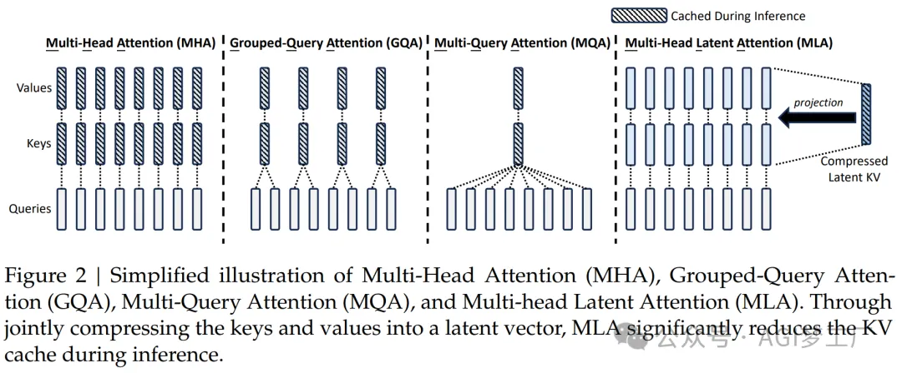

    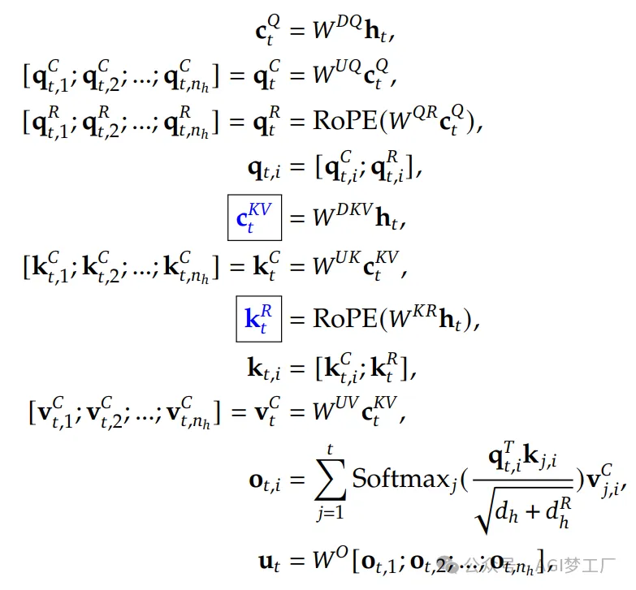

4. 低秩KV联合压缩（Low-Rank Key-Value Joint Compression）

   MLA的核心是通过低秩联合压缩来减少Key和Value的维度，同时也Query进行低秩的压缩，这导致计算量大幅度降低，并且在推理时，只需要缓存Ct(KV)（潜在向量的维度极小），这极大地减少了所需要的KV缓存。

   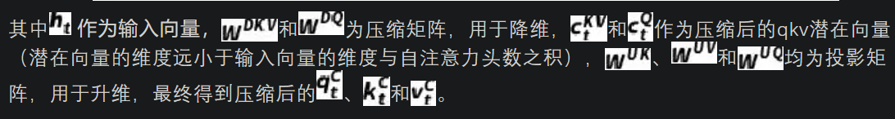

   

5. 解耦RoPE位置编码（Decoupled Rotary Position Embedding）

   为了解决MLA中RoPE与低秩KV联合压缩导致不兼容的问题，提出了解耦RoPE的策略。

   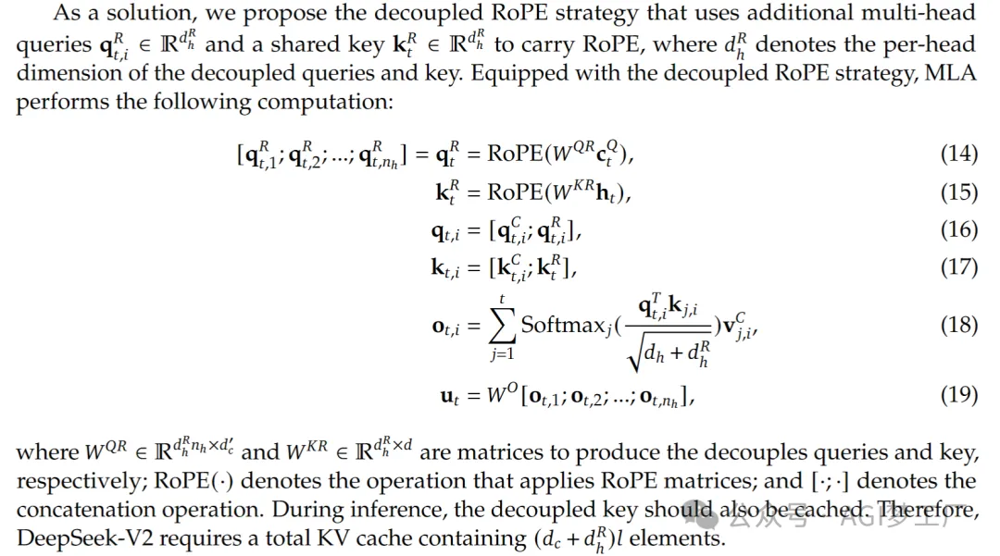

   标准的多头注意力MHA

   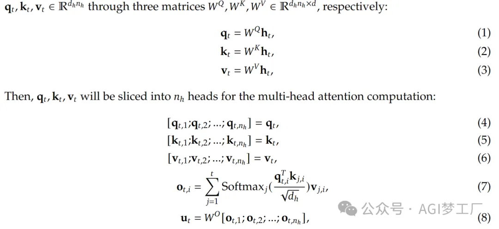

6. MLA与MHA、GQA和MQA进行KV Cache的对比

   根据下面的表格，MLA 只需要少量的 KV 缓存，相当于只有 2.25 组的 GQA，但却能获得比 MHA 更强的性能。

   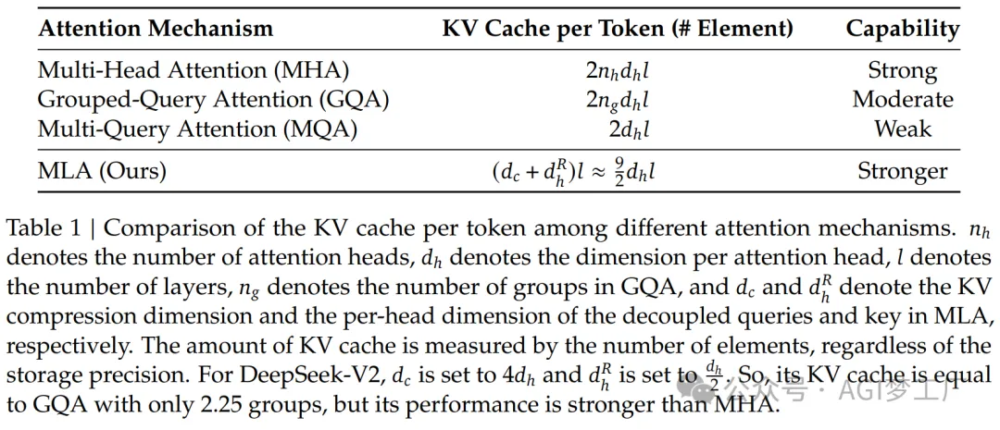

   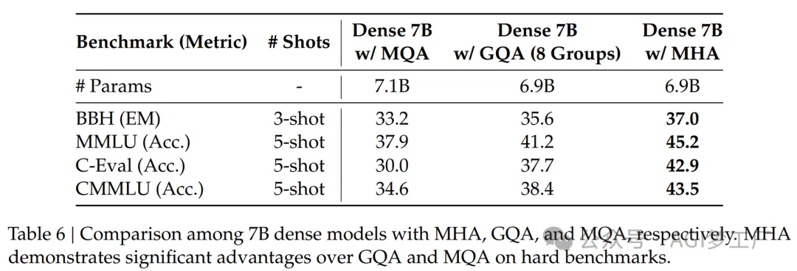

   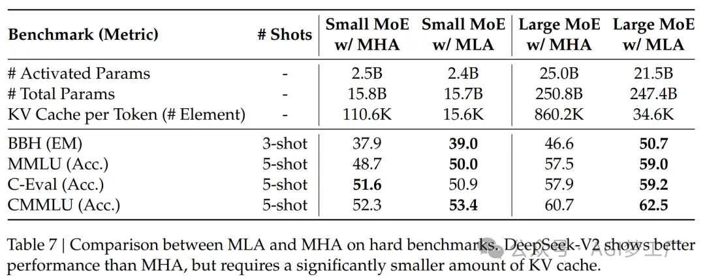

7. DeepSeekMoE

   对于前馈神经网络，DeepSeek-V2 采用了MoE的架构。DeepSeekMoE主要包括细粒度专家（finer granularity for higher expert）和共享专家（shared experts）这两个特点，在激活和总专家参数数量相同的情况下，DeepSeekMoE可以大幅超越传统的MoE架构。
   
   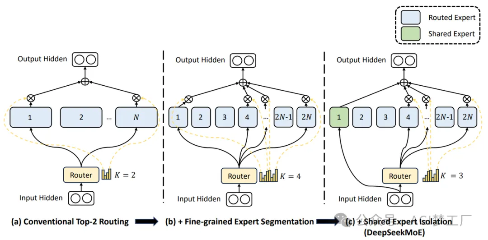

   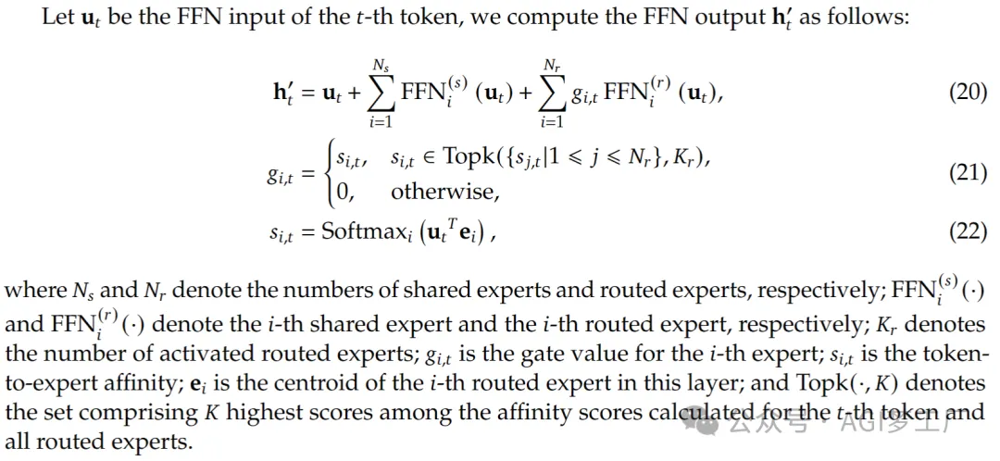

# 4. 训练

## 4.1 预训练

1. 数据构建

   DeepSeek-V2在保持DeepSeek 67B数据处理流程不变的同时，增加了数据量和质量。通过深入挖掘互联网数据、优化清洗流程，恢复了误删数据，并引入更多中文数据，以充分利用中文网络资源。重点在于数据质量提升，采用多种高质量数据源丰富预训练语料库，并改进质量过滤算法，移除无效数据，保留高质量内容，同时排除有争议内容以减少文化偏见。分词器沿用DeepSeek 67B的基于BBPE算法的版本，词汇量100K，预训练语料库达8.1T Token，其中中文 Token占比12%高于英文。

2. 超参数

   模型配置如下：Transformer层60层，隐藏维度5120。参数随机初始化，标准偏差0.006。在MLA中，注意力头数128，每头维度128。KV压缩维度512，查询压缩维度1536。解耦查询和键，每头维度64。除首层外，FFN层替换为MoE层，每层含2个共享专家和160个路由专家，专家中间隐藏维度1536。每 Token激活6个专家。低秩压缩和精细化专家分割影响输出规模，故添加RMS Norm层和缩放因子。DeepSeek-V2总参数236B，每 Token激活参数21B。
   
   训练配置：AdamW优化器，𝛽1=0.9，𝛽2=0.95，权重衰减0.1。学习率预热后阶梯衰减，最大2.4×10−4，梯度裁剪1.0。批量大小前225B Token从2304增至9216。最大序列长度4K，8.1T Token训练。模型层流水线并行，路由专家均匀部署在8设备上，每 Token至多3设备路由。平衡损失𝛼1=0.003，𝛼2=0.05，𝛼3=0.02。训练时采用 Token丢弃策略，评估时不禁用。

3. 实验设备

   DeepSeek-V2 使用了内部开发的 HAI-LLM 框架进行训练，该框架高效且轻量级。它实现了16路零气泡流水线并行、8路专家并行以及ZeRO-1数据并行。由于模型参数激活较少，通过重新计算操作符节省了激活内存，避免了张量并行，减少了通信成本。训练效率通过重叠共享专家计算和专家并行全通信进一步提升，同时定制了CUDA核心以加速通信、路由算法和专家间融合计算。MLA 采用了改进的 FlashAttention-2 进行优化。
   
   实验在配备 NVIDIA H800 GPU 的集群上进行，每个节点包含8个GPU，通过 NVLink 和 NVSwitch 在节点内连接，节点间使用 InfiniBand 互连。

4. 长上下文扩展

   DeepSeek-V2 初始预训练后，采用YaRN将上下文窗口长度从4K扩展到128K。YaRN 专门用于处理解耦共享密钥，负责携带 RoPE。设置比例 s 为40，α 为1，β 为32，目标最大上下文长度为160K，以期待模型对128K的上下文长度有良好的响应。还对模型进行了1000步的额外训练，序列长度为32K，批量大小为576序列。虽然训练仅在32K的序列长度进行，但在评估128K的上下文长度时，模型仍然显示出强大的性能。

    

   大海捞针 (NIAH) 测试的评估结果显示了 DeepSeek-V2 在所有测试的上下文窗口长度（高达128K）中表现良好。

5. 评估

   DeepSeek-V2 在多种语言理解和生成任务的基准测试上进行了评估，并与代表性的开源模型进行了比较，包括 DeepSeek 67B、Qwen1.5 72B、LLaMA3 70B 和 Mixtral 8x22B。
   
   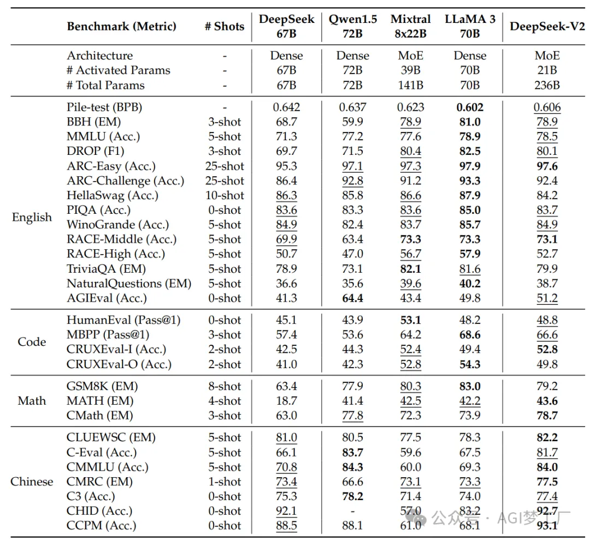
   
   在训练成本方面，DeepSeek-V2 由于激活参数较少，因此在训练每个万亿tokens时，与 DeepSeek 67B 相比，可以节省42.5%的训练成本。
   
   在推理效率方面，DeepSeek-V2 通过将参数转换为 FP8 精度，并采用 KV 缓存量化，显著减少了所需的 KV 缓存。这使得 DeepSeek-V2 能够处理更大的批量大小，从而提高了推理吞吐量。在单个节点上使用 8 个 H800 GPU 进行评估时，DeepSeek-V2 的生成吞吐量超过了每秒 50K 个tokens，这是 DeepSeek 67B 最大生成吞吐量的 5.76 倍。

## 4.2 有监督微调

SFT是一种常见的模型优化技术，通过在特定任务上的训练数据集上进行微调，来提高模型在该任务上的性能。在DeepSeek-V2的上下文中，SFT用于提高模型在对话任务上的表现，特别是在提供有用和安全响应方面。

数据集构建：研究人员构建了一个包含1.5M实例的指令调优数据集，其中1.2M实例用于提高响应的有用性，0.3M实例用于提高安全性。

微调过程：DeepSeek-V2使用这个数据集进行了2个epoch的微调，学习率设置为5×10^-6。

评估：评估DeepSeek-V2 Chat (SFT)时，主要使用了基于生成的基准测试，但也包括了一些代表性的多项选择任务（如MMLU和ARC）。此外，还使用了指令遵循评估（IFEval）来评估模型遵循提示的能力。

## 4.2 对齐

RL是一种训练策略，通过与环境的交互来学习最优行为策略，以最大化累积奖励。在DeepSeek-V2中，RL用于进一步调整模型，使其生成的响应更符合人类的偏好。

RL算法：为了节省RL训练的成本，研究人员采用了Group Relative Policy Optimization (GRPO)算法，该算法避免了通常与策略模型大小相同的评估模型，并从组分数中估计基线。

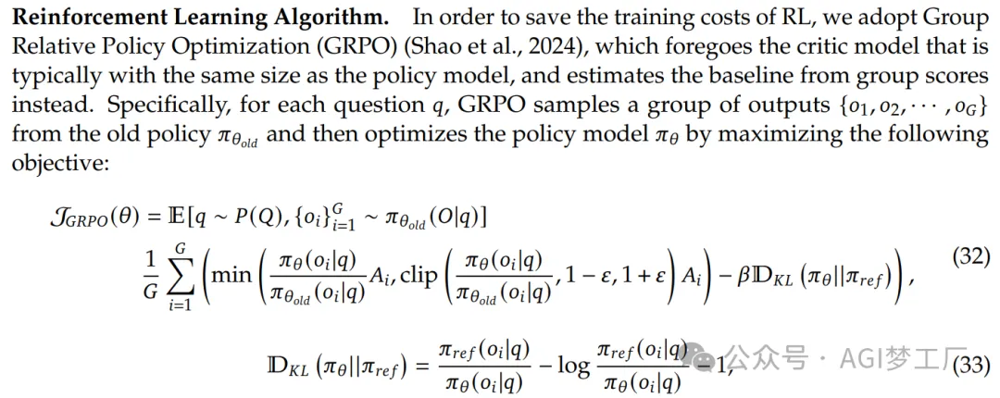

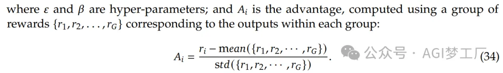

训练策略：在初步实验中，研究人员发现在推理数据（如代码和数学提示）上的RL训练与一般数据的训练有显著不同。因此，他们采用了两阶段的RL训练策略：首先进行推理对齐，然后进行人类偏好对齐。在推理对齐阶段，训练一个奖励模型来优化代码和数学推理任务的反馈；在人类偏好对齐阶段，采用多奖励框架，从有用性、安全性和规则性奖励模型中获取奖励。

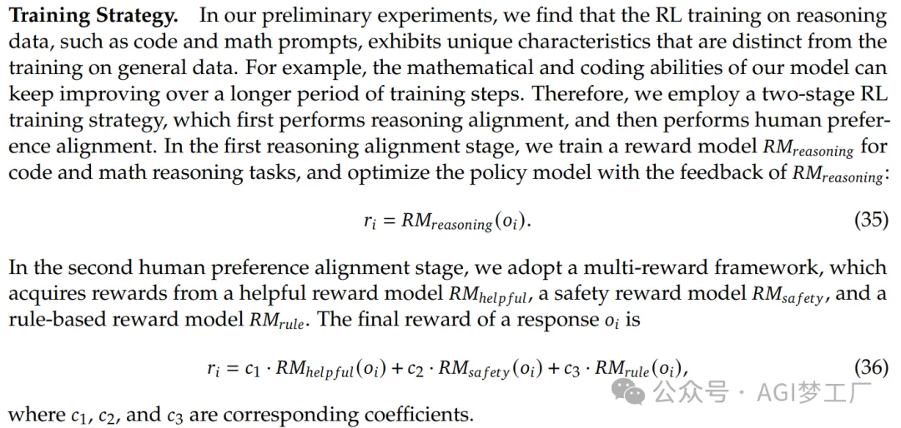

训练效率优化：为了高效地进行RL训练，研究人员实施了多项工程优化，包括采用不同的并行策略以提高GPU利用率，使用大批量推理来加速推理速度，以及设计了模型卸载到CPU和重新加载到GPU的调度策略。

评估结果

基准测试

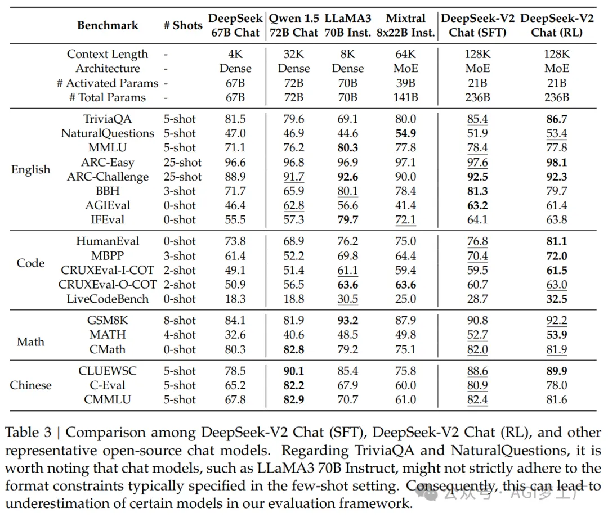

英文能力

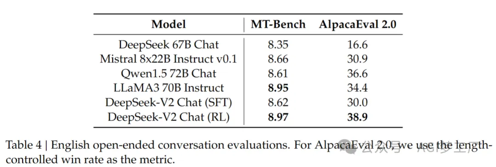

中文能力

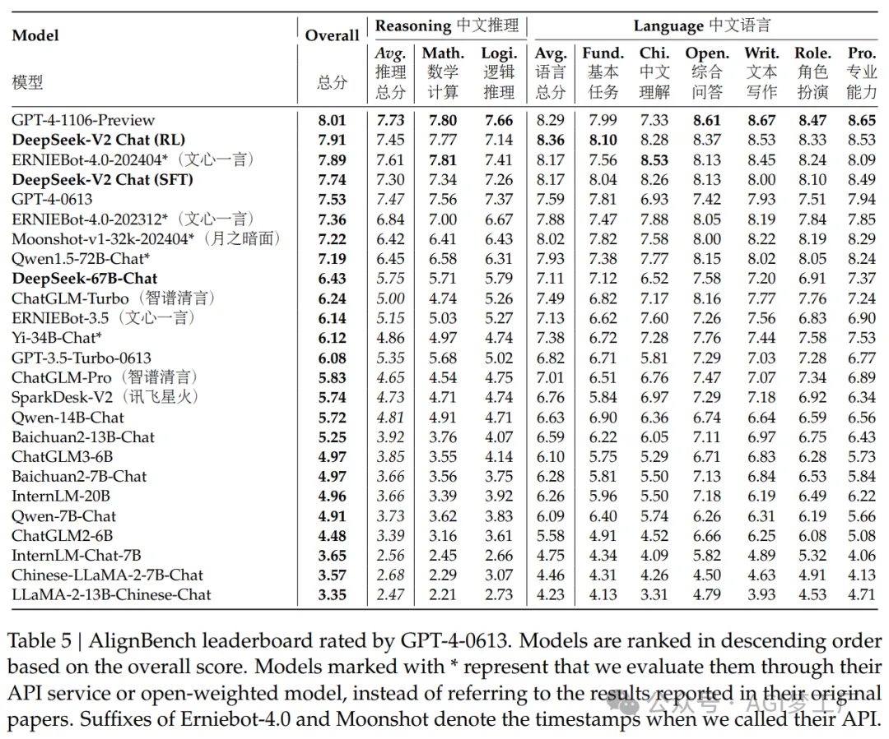

评估结果显示，通过SFT和RL训练的DeepSeek-V2 Chat模型在标准基准测试上取得了显著的性能提升。特别是在GSM8K、MATH和HumanEval等数学和代码基准测试中，DeepSeek-V2 Chat (SFT)相比基础版本有显著改进。此外，DeepSeek-V2 Chat (RL)在数学和代码基准测试中的性能进一步提升，展示了RL训练在提高模型对齐人类偏好方面的有效性。

# 5. 讨论

1. SFT数据量的必要性

   研究者们讨论了用于监督式微调（SFT）的数据集大小对模型性能的影响。先前的研究认为，少于10,000个实例的SFT数据就足以产生令人满意的结果。然而，在DeepSeek-V2的实验中，如果使用少于10,000个实例进行SFT，模型在IFEval基准测试上的性能会有显著下降。这表明语言模型需要一定量的数据来发展特定技能，而且数据量的减少并不能完全通过增加模型大小来补偿。

2. 强化学习中的对齐税

   在进行人类偏好对齐时，研究者们观察到在开放式生成基准测试上的性能有显著提升，但同时也注意到了“对齐税”现象，即对齐过程可能会负面影响模型在某些标准基准测试（如BBH）上的性能。

   为了减轻对齐税，研究者们在RL阶段投入了大量努力进行数据处理和改进训练策略，最终实现了在标准和开放式基准测试性能之间的可接受权衡。

3. 在线强化学习

   在偏好对齐实验中，研究者们发现在线方法显著优于离线方法，并投入了巨大努力实施在线RL框架来对齐DeepSeek-V2。在线和离线对齐的结论可能因不同情境而异，研究者们计划在未来的工作中进行更深入的比较和分析。


# 参考

[1] 浅读 DeepSeek-V2 技术报告，https://mp.weixin.qq.com/s/iSfMWde4aVNHlvjpwM-t5Q