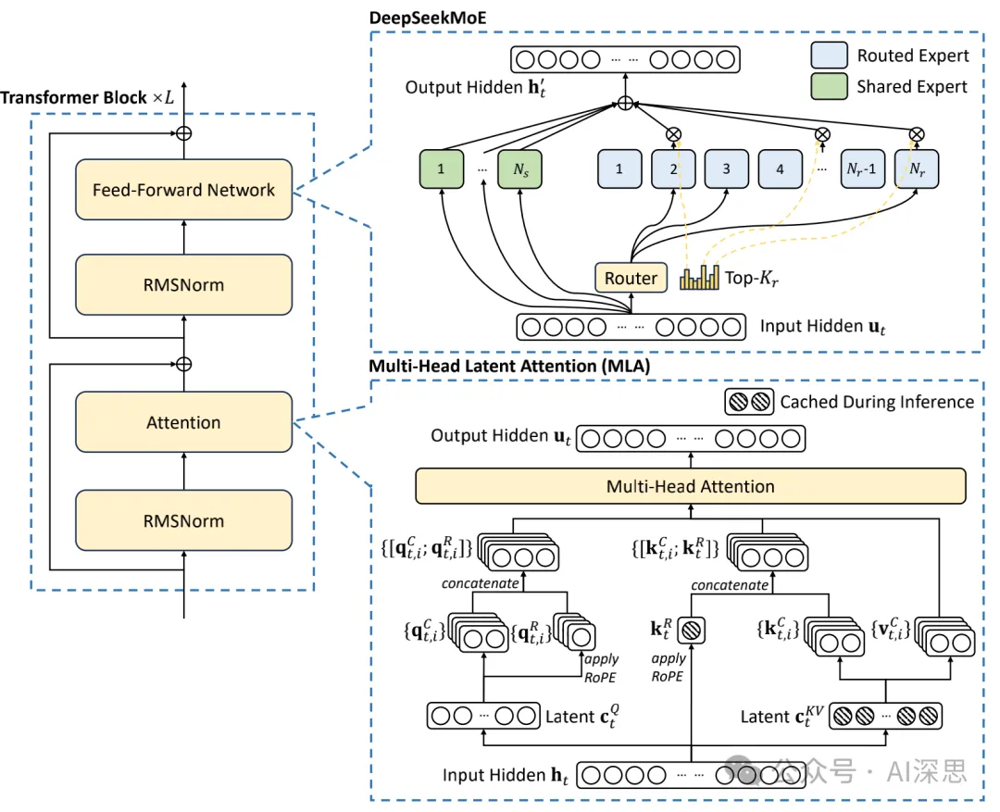
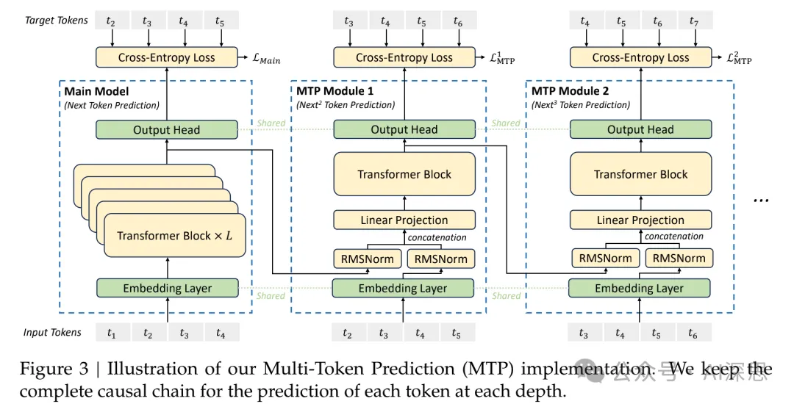

# 资源

- https://github.com/deepseek-ai/DeepSeek-V3
- https://huggingface.co/deepseek-ai

# 18大核心亮点

## 模型架构方面

1. 使用极大规模混合专家模型（MoE）

总参数量达6710亿，每个token激活370亿参数。 

每个MoE层采用1个共享专家和256个路由专家，每个专家的中间隐藏维度为2048。

2. 使用多头潜在注意力（MLA）

通过低秩联合压缩，减少键值（KV）缓存需求，提升推理效率。 

注意力头数设置为128，每个头的维度为128，KV压缩维度为512。 

3. 使用无辅助损失的负载均衡策略

创新性地避免传统负载均衡方法对模型性能的负面影响。 

通过灵活的批量负载均衡，允许专家在不同领域中更好地专业化。 

4. 使用多token预测（MTP）训练目标

同时预测2个未来token，增加训练信号密度，可能提高数据效率。 

第二个token预测的接受率在85%到95%之间，显著加快解码速度。 

使用1层MTP模块，顺序预测额外token，并在每个预测深度保持完整的因果链。 

## 高效训练方面

5. 使用FP8混合精度加速训练

支持FP8计算和存储，加速训练并减少 GPU 内存使用。 

大多数 GEMM 操作（如 Fprop、Dgrad、Wgrad）在 FP8 下执行，计算速度比 BF16 提升2倍。 

保留高精度操作（如嵌入模块、MoE 门控模块）以确保数值稳定性。 

6. 使用DualPipe算法提升训练效率

通过计算-通信重叠，减少管道气泡，提升训练效率。 

将每个块划分为注意力机制、全对全分发、MLP 和全对全组合四个组件，并手动调整 GPU 流式多处理器（SMs）的比例。 

采用双向管道调度，从管道两端同时输入微批次，隐藏大部分通信开销。 

7. 进行了极致的内存优化

通过重新计算RMSNorm和MLA上投影，减少内存占用。 

将指数加权平均（EMA）参数存储在 CPU 内存中，异步更新以减少 GPU 内存压力。 

多token预测（MTP）模块与主模型共享嵌入层和输出头，进一步提高内存效率。

8. 训练稳定性极高

整个训练过程无不可恢复的损失峰值，未进行过回滚。 

训练成功率100%，展现了极高的稳定性。 

9. 成本训练极低    

完整训练仅需278.8万H800 GPU小时，展现高效成本效益。训练成本仅为557万美元，远低于国内外其他已知模型。 

## 数据处理与预训练

10. 高质量多样化数据

在14.8万亿 token 上进行预训练，涵盖多语言、数学、编程等领域。 

增强数学和编程样本的比例，扩展多语言覆盖范围（不仅限于英语和中文）。 

11. 文档打包与FIM策略

通过文档打包保持数据完整性，避免跨样本注意力掩码。 

引入Fill-in-Middle（FIM）策略，使用率为10%，结构化数据如下：

`<|fim_begin|> pre <|fim_hole|> suf <|fim_end|> middle <|eos_token|>`。 

12. 多语言分词器优化

使用字节级BPE，词汇量扩展到128K token。 

 引入结合标点符号和换行符的token，优化多语言压缩效率。 

13. 长上下文扩展技术

通过两阶段训练，将上下文长度从4K扩展到128K。 

采用YaRN技术，配置为`scale = 40, base = 1, factor = 32`，确保扩展稳定性。 

## 后训练与性能提升

14. 监督微调（SFT）

 使用150万个指令微调实例，涵盖推理、数学、编程等多个领域。 

通过内部DeepSeek-R1模型生成推理数据，平衡准确性和格式清晰性。     

15. 强化学习（RL）

使用基于规则和基于模型的奖励模型，优化复杂推理任务表现。 

采用分组相对策略优化（GRPO），从组分数中估计基线，提升模型性能。 

16. 知识蒸馏

从DeepSeek-R1系列模型中蒸馏推理能力，显著提升数学和编程任务表现。 

在LiveCodeBench和MATH-500基准测试中，性能提升显著。 

## 性能表现

17. 在多领域评测性能领先

在MMLU 基准测试中准确率达85.6%，在GSM8K数学任务中准确率达92.3%。

 在HumanEval代码生成任务中，通过率提升15%。 

18. 效果与最好的闭源模型相当

在LongBench v2长上下文基准测试中，F1分数达91.6，与GPT-4o 相当。 

在FRAMES 基准测试中，处理100K token 上下文的能力显著优于其他模型。 

# 详细解读

## 多头潜在注意力

对于注意力机制，DeepSeekV3采用了MLA架构。设d为嵌入维度，h为注意力头的数量，d_h为每个头的维度，h_t为给定注意力层第t个token的注意力输入。MLA的核心是通过低秩联合压缩注意力键和值来减少推理期间的键值（KV）缓存。

MTP模块：具体来说，MTP的实现使用了n个顺序模块来预测k个额外token。第n个MTP模块包括一个共享嵌入层Emb(·)，一个共享输出头OutHead(·)，一个Transformer块TRM(·)，以及一个投影矩阵W ∈ R×2k。

## 长上下文扩展

采用与DeepSeek-V2（DeepSeek-AI, 2024c）类似的方法，以启用DeepSeek-V3的长上下文能力。

在预训练阶段之后，应用YaRN（Peng et al., 2023a）进行上下文扩展，并执行两个额外的训练阶段，每个阶段包含1000步，逐步将上下文窗口从4K扩展到32K，然后扩展到128K。

YaRN配置与DeepSeek-V2中使用的配置一致，仅应用于解耦的共享键k。

两个阶段的超参数保持不变，其中scale = 40，base = 1，factor = 32，缩放因子√scale = 0.1 ln base + 1。

在第一阶段，序列长度设置为32K，批量大小为1920。

在第二阶段，序列长度增加到128K，批量大小减少到480。

两个阶段的学习率设置为7.3 × 10−6，与预训练阶段的最终学习率匹配。 

# 参考

[1] DeepSeek V3的18大技术亮点！（附技术报告万字精读中文版）,https://mp.weixin.qq.com/s/6OHg-zJfkRY8VXYjOaLfAg