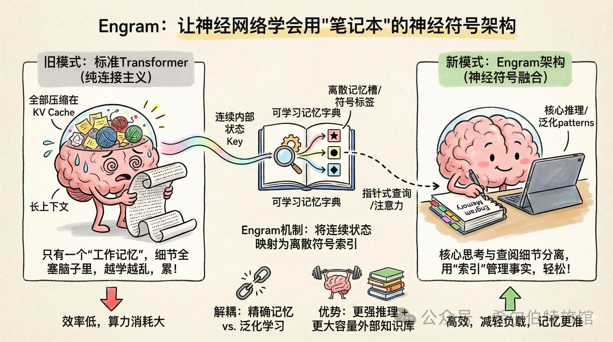
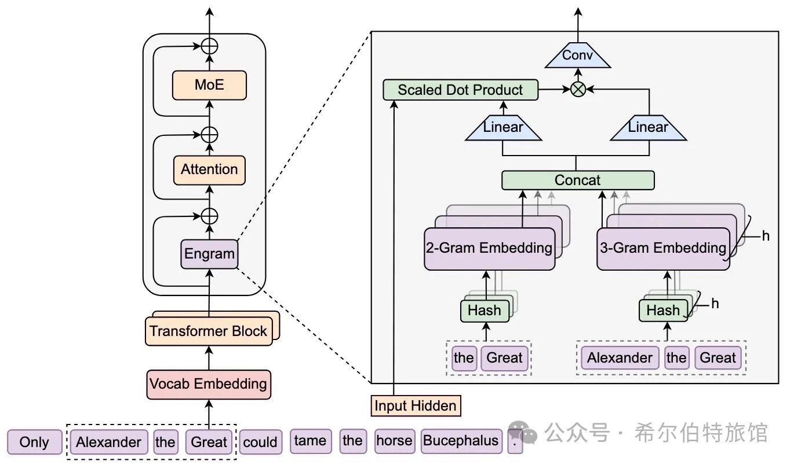

话说最近调用V3.2感受其越加agentic化，工具能力再加强，结果也逐渐精准。

这次发布的Engram，相当于在Transformer引入了一层查字典，又是一次对LLM Memory的调控管理。
Engram将连续、高维的神经网络内部状态（Key），通过查找一个固定的、可学习的“记忆字典”，映射到一个离散的、指针式的“记忆地址”或“记忆槽”。这个过程本身，就类似于为一个连续的概念或模式，分配了一个准符号性的标签或索引。
· 外挂的、结构化的记忆体：这个“字典”或记忆模块，在概念上独立于网络的前馈计算流。它像一个可读可写的外部知识库，模型可以根据需要（通过注意力）去“查询”和“更新”它。这与符号系统中分离的“事实库”或“工作记忆”在结构功能上相似。

· 使用精确记忆与泛化学习去解耦：传统Transformer把所有信息（无论是泛化知识还是一次性事实）都压缩在权重和连续的KV Cache中。Engram试图将需要精确、长期保留的具体信息（如对话历史、长篇文档中的关键事实）存入一个结构化的记忆模块，而让网络权重更多地专注于学习泛化的、可迁移的 patterns。这模仿了人类将“陈述性记忆”与“程序性记忆/技能”部分分离的认知架构。

哲学层面：它回应了我们最初关于“神经符号融合”的讨论。Engram在神经网络内部构建了一个显式、结构化、可快速索引的符号化记忆系统，但它所有的“符号”（记忆槽）及其含义都是从数据中端到端学习得来的。这是一种连接主义框架下的符号主义增强，是向着更高效、更可解释的智能架构迈出的坚实一步

[1]: Understanding the physical basis of memory: Molecular mechanisms of the engram - PMC 
[2]: Memory engram stability and flexibility - PubMed - NIH 
[3]: Synaptic architecture of a memory engram in the mouse hippocampus | Scilict
[4]: https://github.com/deepseek-ai/Engram/

# 参考

DeepSeek新发布：又一次符号主义的回归， https://mp.weixin.qq.com/s/g0C-2YirGpDT3dO8iwoWZg