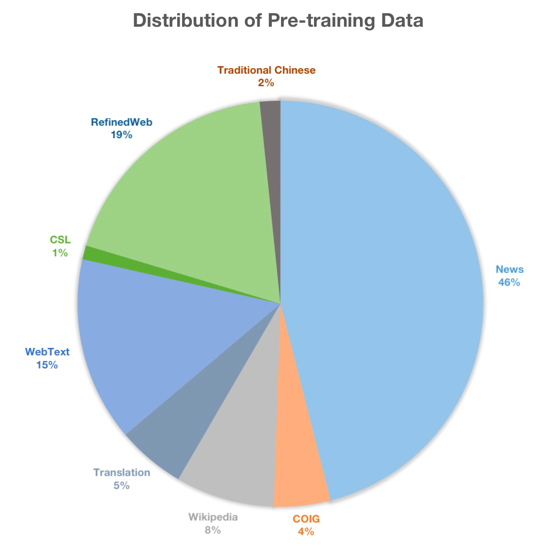

# 1. 简介

预训练
- 预训练数据（建议从huggingface下载，modelscope存在问题）：https://huggingface.co/datasets/YeungNLP/firefly-pretrain-dataset
- Github （322 Stars）: https://github.com/yangjianxin1/Firefly-LLaMA2-Chinese

指令微调
- Github（3.6k Stars）: https://github.com/yangjianxin1/Firefly
- SFT数据：https://huggingface.co/datasets/YeungNLP/firefly-train-1.1M
- 
在中文人工评测中，我们的模型以66.15%胜、30.77%平、3.08%负的成绩大幅领先Llama2，以33.08%胜、60.77%平、6.15负的成绩领先Linly。

## 1.1 预训练

- 预训练数据（建议从huggingface下载，modelscope存在问题）：https://huggingface.co/datasets/YeungNLP/firefly-pretrain-dataset
- Github （322 Stars）: https://github.com/yangjianxin1/Firefly-LLaMA2-Chinese
- （博客）QLoRA增量预训练与指令微调，及汉化Llama2的实践：https://mp.weixin.qq.com/s/26-Qxma9M2wGoTQgOlKRmQ
- 预训练数据集命名为firefly-pretrain-dataset，主要包含CLUE、ThucNews、CNews、COIG、维基百科等开源数据集，以及我们收集的古诗词、散文、文言文等

主要工作：

📗 对LLaMA2进行中文词表扩充，提高编解码效率。与原始LLaMA2相对，中文序列长度减少约54.11%，变相提升了模型在中文域的最大长度。
📗 使用大规模中英文语料进行增量预训练，然后进行多轮指令微调。开源7B和13B的Base和Chat的模型权重。
📗 收集、整理并开源训练数据，包括22GB中英文预训练语料，以及多轮指令数据。
📗 开源增量预训练、指令微调等全流程代码。支持在主流的开源模型上进行增量预训练和指令微调，如Baichuan2、Baichuan、Qwen、InternLM、LLaMA2、LLaMA、Falcon等。
📗 对模型进行开源榜单评测和人工评测。构建人工评测集，包含13种评测任务，对模型进行人工评测。

人工评测

我们构建了评测集，其中包含13种评测任务，评测数据详见data/firefly-eval.xlsx。大部分数据从Belle数据中进行采样和优化。 
每种任务包含10条数据，一共130条数据。13种任务包含：头脑风暴、分类、Close QA、代码生成、 信息抽取、开放式生成、
有害性检验、数学题、阅读理解、Open QA、Rewrite、Summarization、翻译。

评测标准如下：

- 对于同一道题目，对两两模型的生成结果进行比较，存在胜负平三种关系。
- 对于客观题，如果两个模型均回答正确，或均回答错误，则为平局。
- 对于主观题，回答更加详细、真实、细节更丰富，则为获胜。当两者内容正确，并且详细程度非常接近时，或者各有千秋时，可视为平局。
- 对于中文题目，如果目标回复为中文，但模型却回复英文，则判为错误。

## 1.2 SFT

- Github（3.6k Stars）: https://github.com/yangjianxin1/Firefly
- SFT数据：https://huggingface.co/datasets/YeungNLP/firefly-train-1.1M

其中firefly-train-1.1M的数据分布如下图所示：

# 2. 训练细节

Llama系列模型具备非常强大的能力，但因为它主要在英文数据上进行训练，所以它的中文能力相对较弱。并且，
Llama模型对中文的编解码效率较低，一个汉字往往会被编码成多个token，降低了训练和推理的速度，变相降低了模型可输入的最大文本长度。

为了解决上述问题，出现了许多中文Llama模型，它们通过对Llama模型进行中文词表扩充、增量预训练和指令微调，
以提升Llama模型在中文域的表现。较为典型的模型有Chinese-Alpaca-2、Ziya-Llama、Linly-Llama2等。

Chinese-Alpaca-2对Llama2进行词表扩充、增量预训练(120GB)、指令微调(500万条)，在48*A40 GPU上采用LoRA方案进行训练。
Ziya-Llama对Llama进行词表扩充、增量预训练(110B token)、指令微调、RLHF，在160*A100 GPU上进行全量参数训练。
Linly-Llama2对Llama2进行词表扩充、混合训练，在32*A100 GPU上进行全量参数训练。

尽管与重头训练相比，上述工作已经节约了非常多训练资源，但仍然需要消耗几十张甚至上百张显卡，
对于小公司或者普通玩家仍然遥不可及。为了进一步降低增量预训练的资源消耗，我们探索了一种基于QLoRA的增量预训练方案，
并且验证了该方法的有效性。该方法可进一步推广至原生中文模型的增量预训练，例如Baichuan、InternLM、Qwen等。

## 2.1 增量预训练

我们的训练流程在QLoRA上进行优化，流程大致如下：

- 对LLaMA2进行中文词表扩充，词表由32000扩展至55296，提高模型在中文上的编解码效率。我们使用了Chinese-LLaMA-Alpaca-2项目扩充后的词表。
- 使用22GB中英文语料，对扩充词表后的模型进行增量预训练，采用自回归任务。
- 使用两百多万条中英文多轮对话指令数据，对增量预训练模型进行指令微调。
- 
我们对LLaMA2的词表进行扩充，加入了常见的中文token，提高模型对中文的编解码效率。我们在CNews数据集上对新的tokenizer进行了测试，
经过词表扩充后，token数量由2.98亿减少为1.37亿， 长度减少约54.11%。对于中文任务，不仅极大地提高了模型的训练和推理效率，
并且变相地提高了模型的最大长度。

由于训练资源等原因，在增量预训练阶段，我们并未充分利用全部数据，仅消耗了大约2B的token。

## 2.2 指令微调

指令微调的数据主要包括UltraChat、Moss、school math等数据，对这些数据进行清洗、
过滤、采样、合并等操作，最终获得两百多万条数据，原始数据详见Firefly项目。

在整个训练流程中，我们最多仅使用了4*V100 GPU，两个阶段的训练长度均为1024，LoRA rank=64, LoRA alpha=16。
在预训练与指令微调阶段，word embedding与lm_head的权重均参与训练。 7B与13B模型，最终参与训练的参数量分别约为612.9M
和816.6M。 指令微调阶段使用Firefly项目的训练代码。

Firefly-LLaMA2-Chat模型的训练loss曲线如下图所示，训练loss具有良好的收敛性。7b和13b模型分别对应粉色和橙色曲线：

# 3. 评测

## 3.1 开放测试

1. Open LLM leaderboard

    

2. CMMLU

   

同为中文Llama2模型，在CMMLU上，Firefly-Llama2-13B-Chat与Chinese-Alpaca-2-13b仍有一定的差距，
我们将其归因为增量预训练不够充分。Chinese-Alpaca-2-13B在预训练阶段使用了约120GB数据，而我们收集了约22GB的预训练数据，
但并未完全使用，仅消耗了大约2B左右的token。

## 3.2 人工评测

我们构建了人工评测集，其中包含13种评测任务。大部分数据从Belle数据中进行采样和优化。
每种任务包含10条数据，一共130条数据。13种任务包含：头脑风暴、分类、Close QA、代码生成、
信息抽取、开放式生成、有害性检验、数学题、阅读理解、Open QA、Rewrite、Summarization、翻译。

评测标准如下：

- 对于同一道题目，对两两模型的生成结果进行比较，存在胜负平三种关系。
- 对于客观题，如果两个模型均回答正确，或均回答错误，则为平局。
- 对于主观题，回答更加详细、真实、细节更丰富，则为获胜。当两者内容正确，并且详细程度非常接近时，或者各有千秋时，可视为平局。
- 在与Llama2官方模型比较时，对于中文题目，如果目标回复为中文，但模型却回复英文，则判为错误。

人工评测的全部结果详见下述共享文档：

https://docs.qq.com/sheet/DU1h1bE1xWG50ZVlI?tab=BB08J2

# 4. 总结

虽然我们收集了22GB的增量预训练数据，但与动辄上百GB或者上千亿token的其他中文Llama项目相比，仍是相形见绌。
并且由于训练资源的问题，在增量预训练阶段，我们并未完全使用这些数据，大约仅消耗了2B token。

在模型词表扩充的情况下，这会导致新增的词向量训练不够充分，但最终的评测结果仍足以表明我们的方法是有效的。
如果直接在中文Base模型上使用该方案进行垂直域增量预训练，不改变模型词表，模型将会在垂直域具有更优秀的效果。

# 参考

[1] QLoRA增量预训练与指令微调，及汉化Llama2的实践，https://mp.weixin.qq.com/s/26-Qxma9M2wGoTQgOlKRmQ