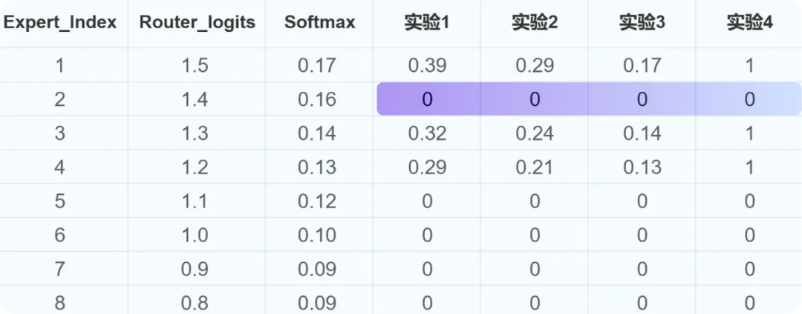

Hugging Face：https://huggingface.co/xverse/XVERSE-MoE-A36B

魔搭：https://modelscope.cn/models/xverse/XVERSE-MoE-A36B

Github：https://github.com/xverse-ai/XVERSE-MoE-A36B

官网：chat.xverse.cn

（1）效率方面

MoE 架构与 4D 拓扑设计：MoE 架构的关键特性是由多个专家组成。由于专家之间需要大量的信息交换，通信负担极重。为了解决这个问题，我们采用了 4D 拓扑架构，平衡了通信、显存和计算资源的分配。这种设计优化了计算节点之间的通信路径，提高了整体计算效率。

专家路由与预丢弃策略：MoE 的另一个特点是「专家路由机制」，即需要对不同的输入进行分配，并丢弃一些超出专家计算容量的冗余数据。为此团队设计一套预丢弃策略，减少不必要的计算和传输。同时在计算流程中实现了高效的算子融合，进一步提升模型的训练性能。

通信与计算重叠：由于 MoE 架构的专家之间需要大量通信，会影响整体计算效率。为此团队设计了「多维度的通信与计算重叠」机制，即在进行参数通信的同时，最大比例并行地执行计算任务，从而减少通信等待时间。

（2）效果方面

专家权重：MoE 中的专家总数为 N ，每个 token 会选择 topK 个专家参与后续的计算，由于专家容量的限制，每个 token 实际选择到的专家数为 M，M<=K<N。被选择到的专家计算完之后，会通过加权平均的方式汇总得到每个 token 的计算结果。这里专家的权重如何设置是一个问题，我们通过对比实验的方式来进行选择。根据对比实验的效果，我们选择实验 2 的设置进行正式实验。

举例说明，假设 N=8，K=4，M=3（2 号专家上 token 被丢弃），不同专家权重的计算方式所得的权重如下图：

