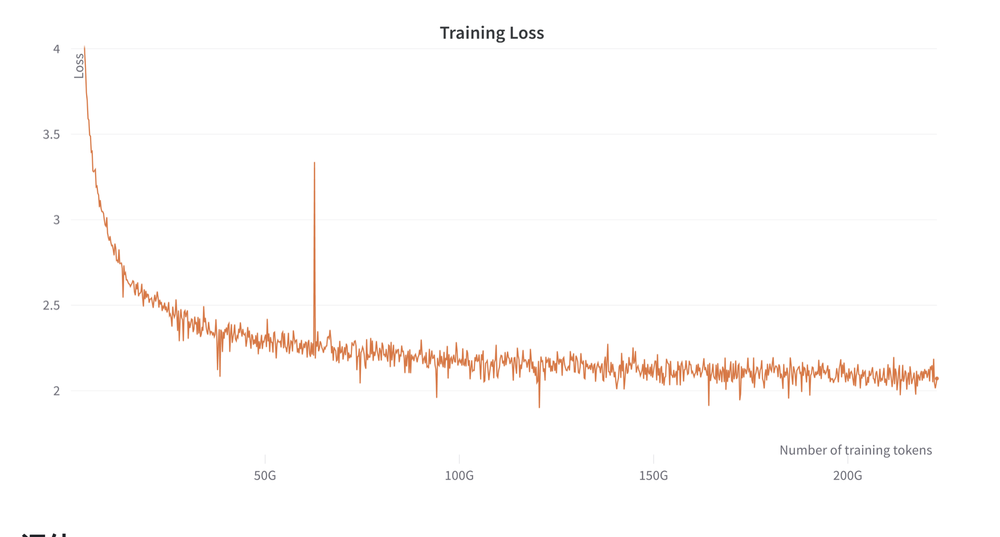

复刻llama

模型GitHub：

https://github.com/openlm-research/open_llama

模型HuggingFace：

https://huggingface.co/openlm-research/open_llama_7b_preview_200bt

OpenLLaMA: An Open Reproduction of LLaMA

https://github.com/openlm-research/open_llama

最初的LLaMA模型接受了1万亿个代币的训练，GPT-J接受了5000亿个代币的训练，
而OpenLLaMA接受了2000亿个代币的训练。我们在下表中列出了结果。OpenLLaMA在大多数任务中表现出与原始LLaMA
和GPT-J相当的性能，并且在某些任务中表现优于它们。我们预计，在完成1万亿代币的培训后，OpenLLaMA的性能将进一步提高。

其中GPT-J  6B是EleutherAI研究小组创建的开源自回归语言模型。它是OpenAI的GPT-3的最先进替代品之一，
在各种自然语言任务（如聊天、摘要和问答等）方面表现良好。"GPT-J"指的是模型类别，而"6B"表示可训练参数的数量为60亿。
在5000亿tokens的Pile数据集上训练，而原始的LLaMA则是在1万亿tokens数据集训练，此次发布的OpenLLaMA 
7B预览版则是基于2000亿tokens数据的RedPajama数据集训练。从上面的结果看，这三个模型效果似乎差不多。但是，
OpenLLaMA模型将会继续训练，直到完成在1万亿tokens上的训练，预期最终结果会更好。

# 参考

[1] OpenLLaMA：LLaMA的开源复现，5天已1.6k星，https://hub.baai.ac.cn/view/26581
