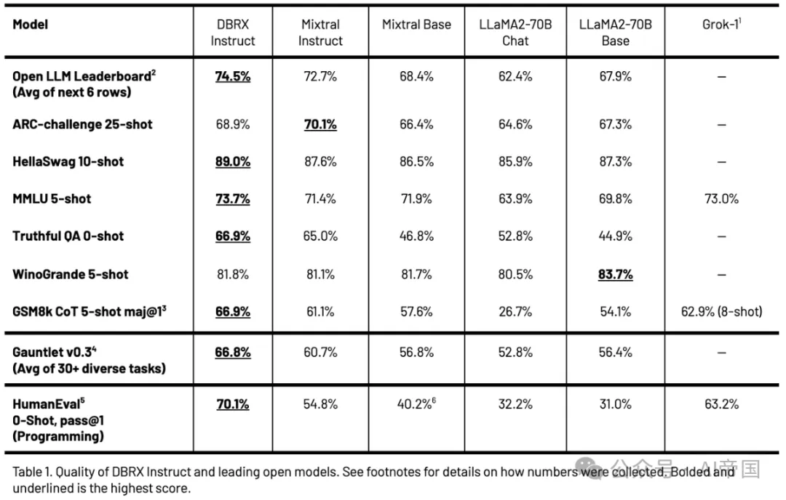
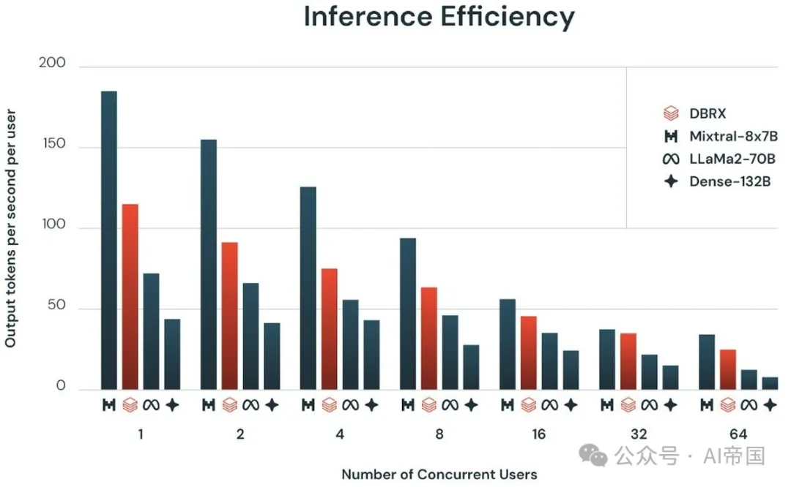
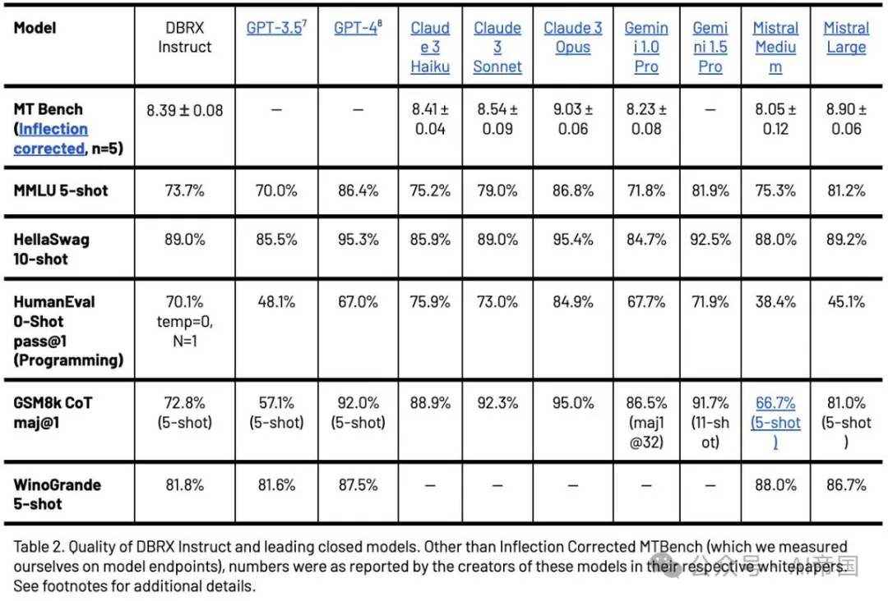

# 1. 资源

训练是用 MosaicML's LLM-Foundry：https://github.com/mosaicml/llm-foundry

技术报告：https://www.databricks.com/blog/introducing-dbrx-new-state-art-open-llm 

# 2. 介绍

DBRX 是一个训练于 12 万亿token的 16 倍 120 亿参数的混合专家大型语言模型。DBRX 为开源LLM树立了新标准，在各种基准测试中表现优于现有模型。

DBRX 详情:

•16个专家模型

•每个单一专家模型12B参数

•top_k=4路由

•36B有效参数

•132B总参数    

•训练token数12万亿

•32k序列长度训练

混合专家(MoE)架构产生了一个总容量为132B参数的模型，但在处理每个标记时只使用36B参数。DBRX不仅在性能上优于LLaMA2-70B和Grok等模型，而且更加高效。

精细的混合专家(MoE)架构使DBRX具有高效性 - 推理速度几乎比LLaMA2-70B快2倍 - 总参数和有效参数数量比Grok小约40%。  

在效果方面，它超过了GPT-3.5，并且可与Gemini 1.0 Pro和Mistral Medium相媲美，同时推理速度substantially更快。 

32k序列长度的训练使DBRX成为了一个最先进的检索增强生成(RAG)模型。DBRX不仅优于最佳的开源模型，甚至在性能上也超越了GPT-3.5 Turbo。

# 参考

[1] 【LLM】DBRX：开源LLM的新标准，https://mp.weixin.qq.com/s/VKBBihxwgB8qlndKdQ6jlA