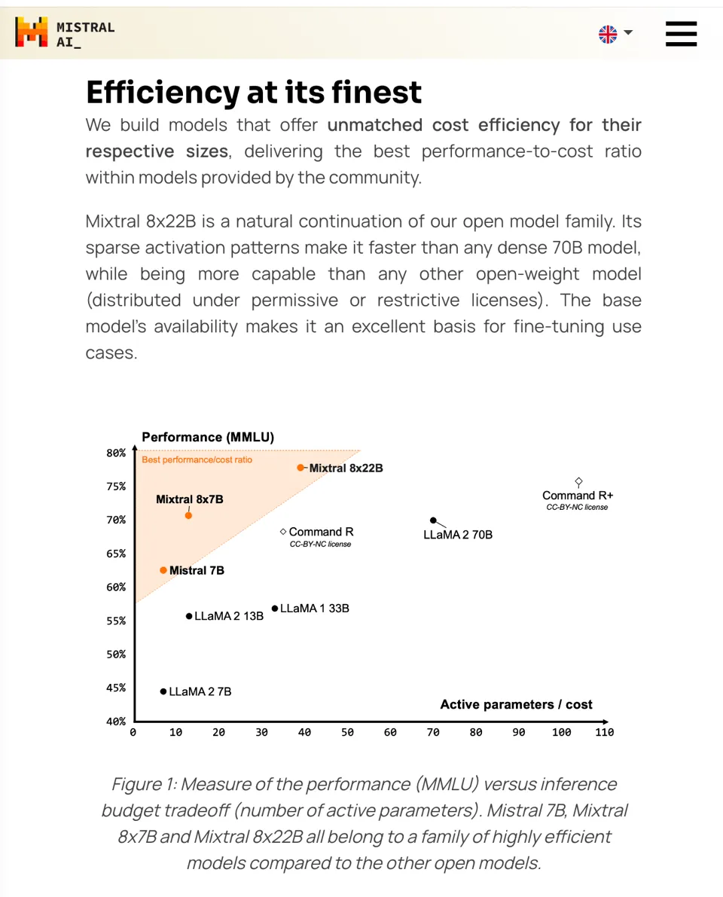
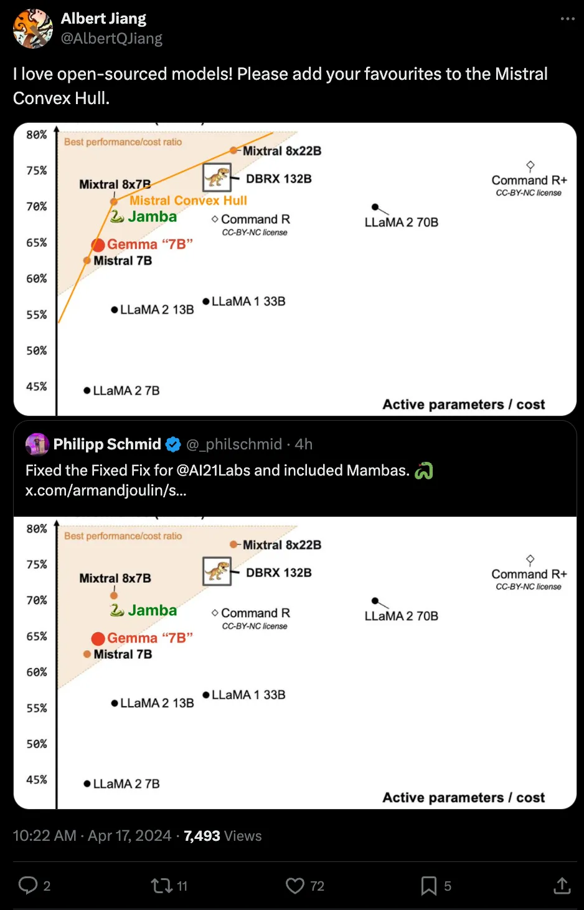

# 1. 资源

# 2. 简介

Mixtral 8x22B是一个采用稀疏专家混合（SMoE）架构的模型，它在141亿个参数中仅使用了39亿个活跃参数，这一创新使其在保持模型规模的同时，提供了前所未有的成本效益。

该模型支持英语、法语、意大利语、德语和西班牙语等多种语言，能够流畅地进行语言理解和生成。

此外，它还具备强大的数学和编码能力，以及天生的函数调用能力。

特别值得一提的是，Mixtral 8x22B拥有64K令牌的上下文窗口，这使得它能够从大型文档中精确地回忆和处理信息。

# 参考

[1] 最大开源MoE指令微调模型：Mistral 8x22B，https://mp.weixin.qq.com/s/Wd35syCUdx6bf6obv1iEYA