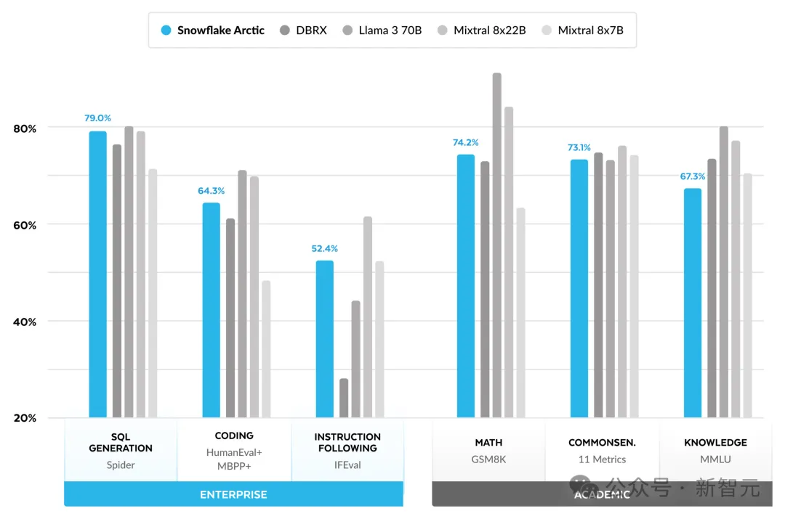
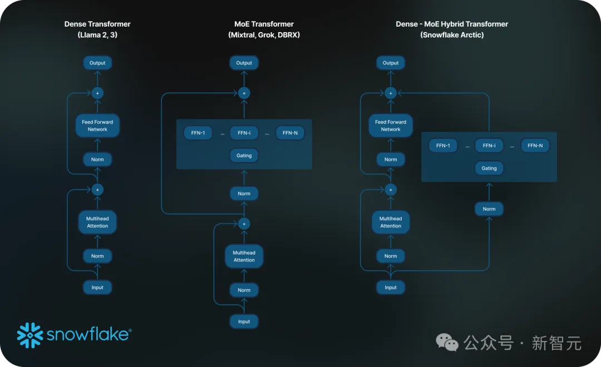
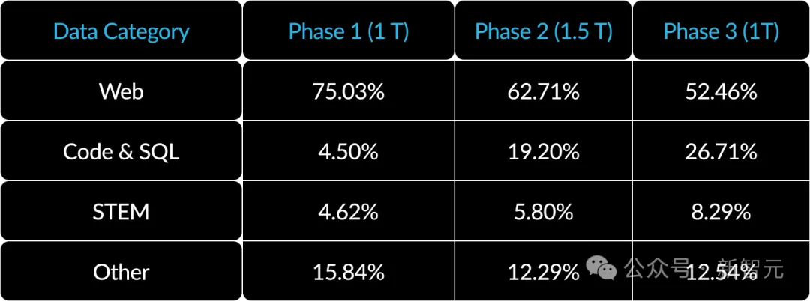

# 1. 资源

项目地址：https://github.com/Snowflake-Labs/snowflake-arctic
Cookbook：https://medium.com/snowflake/snowflake-arctic-cookbook-series-exploring-mixture-of-experts-moe-c7d6b8f14d16

# 2. 简介

Snowflake的Arctic，以128位专家和4800亿参数

它基于全新的Dense-MoE架构设计，由一个10B的稠密Tranformer模型和128×3.66B的MoE MLP组成，并在3.5万亿个token上进行了训练。

该架构将一个10B规模的稠密Transformer模型与一个128×3.66B规模的残差MoE MLP相结合，虽然总参数量达到480B，但通过top-2 gating的方式只选择了其中17B个参数保持活跃。

作为一个比「开源」更「开源」的模型，团队甚至把训练数据的处理方法也全给公开了。

# 2. 原理

因此，Arctic采用了三阶段课程进行训练，每个阶段的数据组成不同——

第一阶段（1T Tokens）侧重于通用技能，后两个阶段（1.5T和1T Tokens）侧重于企业级技能。

# 参考

[1] 全球最大开源模型再刷爆纪录！4800亿参数MoE击败Llama 3、Mixtral，https://mp.weixin.qq.com/s/qmEVi72ZKbd8kE-EXz6ULA