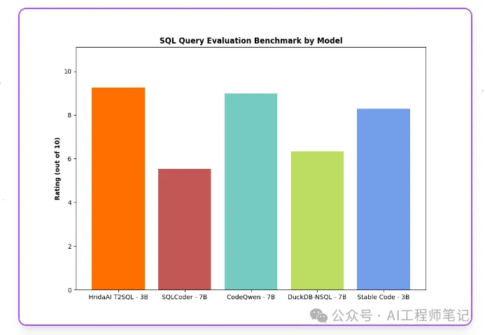

# 1. 简介

- https://ollama.com/HridaAI/hrida-t2sql

Hrida-T2SQL-3B-V0.1 是HridaAI 开源的一个基于 Phi 3 架构的文本到 SQL 的转换模型，旨在提高数据库查询的准确性和效率，使得数据分析和数据库交互更加直观和高效。

主要内容
1. 数据驱动的世界中高效查询数据库的能力至关重要，但并非每个人都精通 SQL。 Hrida-T2SQL-3B-V0.1 通过自然语言处理技术，使得非 SQL 专家也能够高效地与数据库交互，从而提高了数据分析的可访问性和效率。

2. Hrida-T2SQL-3B-V0.1 在基准测试中表现出色，展示了其在处理各种 SQL 查询和场景时的准确性和可靠性。 通过对 50 个精心策划的问题进行评估，该模型展示了其在不同查询类型和复杂性上的强大性能，平均得分为 9.26，超越了其他领先的模型。

3. Hrida-T2SQL-3B-V0.1 的推出代表了在使数据库交互更加用户友好和可访问方面的飞跃。 该模型使得用户无需深入了解 SQL，就能够更直观地进行数据库查询和数据分析，从而使得数据库的使用更加广泛和深入。

4. 用户可以通过 Huggingface 页面获取更多关于 Hrida-T2SQL-3B-V0.1 的信息和访问权限。 HridaAI 邀请用户探索该模型，并通过 Huggingface 平台获取最新的更新和增强，以便更好地利用该模型的功能。

# 2. 测试

基准测试

为了确保Hrida-T2SQL-3B-V0.1在实际应用中表现优异，官方进行了广泛的基准测试。精心挑选了50个不在训练数据范围内的问题。这些问题涵盖了各种SQL查询和场景，为模型在不同查询类型和复杂度下的整体性能评估提供了全面的参考。每个问题都是经过精心挑选的，以代表广泛的SQL查询结构和数据库交互场景。为了确保公平和客观，官方采用Mistral 7B模型来判断输出，并在1到10的范围内对它们进行评级。以下是Hrida-T2SQL-3B-V0.1与其他模型的对比：

Hrida-T2SQL - 3B: 9.26

• CodeQwen - 7B: 8.98

• Stable Code - 3B: 8.28

• DuckDB-NSQL - 7B: 6.34

• SQLCoder - 7B: 5.54

从测试结果看Hrida-T2SQL-3B-V0.1表现出色，平均得分为9.26分，表现出了较高的准确性和可靠性，并超越了其他现有的模型。凭借将自然语言查询转换为SQL的精确性，我们能够使用户能够更直观、更高效地与数据库交互。

# 参考

[1] 专为Text2SQL设计的3B小钢炮模型，https://mp.weixin.qq.com/s/aZVVjlMT7LnMjY9Cm5Fh-w