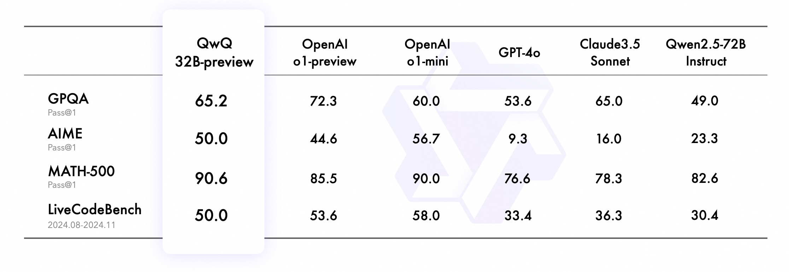

# 1. 介绍

注意：QwQ 的发音为 /kwju:/ ，与单词 “quill” 的读音近似。

思考、质疑、理解，是人类探索未知的永恒追求。在这条探索之路上，QwQ犹如一位怀抱无尽好奇的学徒，以思考和疑问照亮前路。QwQ体现了古老的哲学精神：它深知自己一无所知，而这种认知正是其好奇心的源泉。在探寻答案的过程中，它始终保持自省，以理性之光审视每一个假设，在不同的思维维度中穿行，追寻更深层的真理。

然而，正如所有智慧的追求者一样，QwQ也有其局限性。这个版本只是漫长旅程中的一个初步阶段——它仍在学习如何行走于理性之路。它的思绪偶尔飘散，答案或许未尽完善，智慧仍在积淀。但这就是学习的美妙之处：既有能力又保持谦逊，既有知识又永远充满疑问。我们邀请您与QwQ一同探索，接纳它的洞见与不完美，共同踏上这无尽的理解之旅。

# 2. 模型局限性
QwQ-32B-Preview 是由 Qwen 团队开发的实验性研究模型，专注于增强 AI 推理能力。作为预览版本，它展现了令人期待的分析能力，同时也存在以下局限：

语言切换问题：模型可能在回答中混合使用不同语言，影响表达的连贯性。

推理循环：在处理复杂逻辑问题时，模型偶尔会陷入递归推理模式，在相似思路中循环。这种行为虽然反映了模型试图全面分析的努力，但可能导致冗长而不够聚焦的回答。

安全性考虑：尽管模型已具备基础安全管控，但仍需要进一步增强。它可能产生不恰当或存在偏见的回答，且与其他大型语言模型一样，可能受到对抗攻击的影响。我们强烈建议用户在生产环境中谨慎使用，并采取适当的安全防护措施。

能力差异：QwQ-32B-Preview 在数学和编程领域表现出色，但在其他领域仍有提升空间。模型性能会随任务的复杂度和专业程度而波动。我们正通过持续优化，努力提升模型的综合能力。

# 3. 模型表现
通过深入的探索和无数的试验，我们发现了一个深刻的道理：当模型有足够的时间思考、质疑和反思时，它对数学和编程的理解就会深化。就像学生通过认真地检查自己的工作并从错误中学习变得更加聪明一样，我们的模型也通过耐心和深思熟虑的分析获得了更深入的见解。这种细致的反思和自我质疑的过程使得模型能够取得解决复杂问题的突破性进展。我们的探索之旅揭示了模型在数学和编程领域解决一些最具挑战性的问题的卓越能力，包括：

GPQA：一个通过研究生级别问题评估高阶科学解题能力的评测集，旨在考察科学问题解决能力。

AIME：涵盖算术、代数、计数、几何、数论、概率等中学数学主题的综合评测，测试数学问题解决能力。

MATH-500：包含500个测试样本的MATH评测集，全面考察数学解题能力。

LiveCodeBench：评估真实编程场景中代码生成和问题解决能力的高难度评测集。



具体表现如下：

- GPQA：65.2%，展示了研究生水平的科学推理能力；
- AIME：50.0%，证明了强大的数学问题解决技能；
- MATH-500：90.6%，体现了在各类数学主题上的全面理解；
- LiveCodeBench：50.0%，验证了在实际编程场景中的出色表现。

这些成果充分体现了QwQ在分析和问题解决能力方面的显著进步，尤其是在需要深度推理的技术领域。

样例

下列样例展示了QwQ深度自省的能力——质疑自身假设、进行深思熟虑的自我对话，并仔细审视其推理过程的每一步。

```text
Example: Logical Reasoning (1/2)
Next
User
S先生、P先生、Q先生他们知道桌子的抽屉里有16张扑克牌：红桃A、Q、4 黑桃J、8、4、2、7、3 草花K、Q、5、4、6 方块A、5。约翰教授从这16张牌中挑出一张牌来，并把这张牌的点数告诉 P先生，把这张牌的花色告诉Q先生。这时，约翰教授问P先生和Q 先生：你们能从已知的点数或花色中推知这张牌是什么牌吗？于是，S先生听到如下的对话：

P先生：我不知道这张牌。

Q先生：我知道你不知道这张牌。

P先生：现在我知道这张牌了。

Q先生：我也知道了。

请问：这张牌是什么牌？

QwQ-32B-Preview
这道题是逻辑推理题，涉及到信息的逐步披露和推理。题目中有一副16张扑克牌，分别是：

红桃：A、Q、4

黑桃：J、8、4、2、7、3

草花：K、Q、5、4、6

方块：A、5

约翰教授选了一张牌，把点数告诉了P先生，把花色告诉了Q先生。然后通过他们的对话，我们要推断出是哪张牌。

首先，让我们来梳理一下对话的内容：

P先生说：“我不知道这张牌。”

这意味着点数是重复的，因为如果点数唯一，P先生就能确定是哪张牌。例如，如果点数是K，只有草花K，那P先生就能确定是草花K。但P先生说不知道，所以点数必须在多个花色中出现。看看哪些点数是重复的：

A：红桃和方块

Q：红桃和草花

4：红桃、黑桃和草花

5：草花和方块

其他点数都是唯一的在某个花色中。

所以，可能的点数是A、Q、4、5。

Q先生说：“我知道你不知道这张牌。”

这句话有点 tricky。Q先生知道花色，而且他说他知道P先生不知道。这意味着，根据Q先生知道的花色，可以确定点数一定是重复的。因为如果花色中的点数是唯一的，那么P先生就能知道是哪张牌。但Q先生肯定地说他知道P先生不知道，所以花色中的点数必须是重复的。

让我们看看每个花色中的点数情况：

红桃：A、Q、4

A：红桃和方块

Q：红桃和草花

4：红桃、黑桃、草花

所以，红桃花色中的所有点数都是重复的。

黑桃：J、8、4、2、7、3

4：黑桃、红桃、草花

其他点数在黑桃中是唯一的。

但Q先生说他知道P先生不知道，所以花色中的所有点数都必须是重复的。但在黑桃中，除了4，其他点数都是唯一的。所以，如果花色是黑桃，且点数是J、8、2、7、3，那么P先生就能知道，这与Q先生的说法矛盾。因此，花色不能是黑桃。

草花：K、Q、5、4、6

Q：草花和红桃

4：草花、红桃、黑桃

5：草花和方块

K和6是唯一的。

所以，如果花色是草花，点数是K或6，P先生就能知道，这又与Q先生的说法矛盾。因此，花色不能是草花。

方块：A、5

A：方块和红桃

5：方块和草花

所以，方块中的点数都是重复的。

综上所述，Q先生知道花色，且确定所有可能的点数都是重复的，所以花色只能是红桃或方块。

P先生说：“现在我知道这张牌了。”

P先生原来不知道，但现在知道了。这意味着，在Q先生发言后，P先生通过点数和花色的可能组合，确定了是哪张牌。

我们已经知道花色只能是红桃或方块，点数是A、Q、4、5。

但P先生现在知道牌了，说明点数加上花色的限制，使得只有唯一一个可能性。

让我们看看点数在红桃和方块中的分布：

A：红桃和方块

Q：只有红桃

4：红桃

5：方块

等一下，Q先生说花色只能是红桃或方块，但根据之前的分析，花色是红桃或方块。

但是，点数Q只有红桃，4只有红桃，A有红桃和方块，5只有方块。

P先生原来不知道，说明点数是重复的，即A或5。

如果点数是Q或4，只有红桃，那么P先生知道点数后，结合花色是红桃，就能知道是哪张牌，这与P先生第一句“我不知道这张牌”矛盾。

所以，点数不能是Q或4，只能是A或5。

现在，P先生说他知道牌了，说明在A或5中，结合花色，只有唯一可能性。

但A在红桃和方块都有，5只有方块有。

等一下，如果点数是5，只有方块5，那么P先生知道点数是5，结合花色是方块，就可以确定是方块5。

如果点数是A，花色可以是红桃或方块，那么P先生还是不能确定是哪一张。

但是，P先生说现在知道这张牌了，所以点数不能是A，因为A在红桃和方块都有，除非花色是方块，但P先生只有点数信息。

等一下，也许我需要更仔细地思考。

Q先生说花色是红桃或方块，因为只有这些花色的点数都是重复的。

P先生知道点数，现在他说知道了，说明在花色是红桃或方块的限制下，点数唯一确定了牌。

对于点数A，花色可以是红桃或方块，所以P先生不能确定是哪一张。

对于点数5，只有方块5，所以P先生知道是方块5。

因此，只有当点数是5时，P先生才能确定是方块5。

所以，牌是方块5。

Q先生说：“我也知道了。”

Q先生原来只知道花色，但不知道是哪张牌，现在他也知道了。

如果花色是方块，点数是A或5。

但P先生刚才已经确定是方块5，所以Q先生现在也知道了是方块5。

如果花色是红桃，点数是A、Q、4。

但是，根据之前的推理，点数Q和4只有红桃，点数A有红桃和方块。

但P先生原来不知道，所以点数不能是Q或4，只能是A。

但是，如果花色是红桃，点数是A，P先生不能确定是红桃A还是方块A。

但P先生说现在知道了，所以只有当点数是5，花色是方块时，P先生才能确定。

因此，Q先生现在也确定是方块5。

综上所述，这张牌是方块5。

最终答案

方块5
方块5
​

```

# 探索之路的反思

大型语言模型的推理过程是一个复杂而多面的课题，我们的研究团队在多个领域进行了深入的探索。从 Process Reward Model 到 LLM Critique，从多步推理到强化学习，我们一步步地推进着对智能的理解。虽然我们尚未明确最终的目标，但每一步的努力都使我们更接近真理、更接近智能。我们坚信，通过不懈的努力和探索，奇迹终将发生。

# 参考

[1] QwQ: 思忖未知之界, https://qwenlm.github.io/zh/blog/qwq-32b-preview/