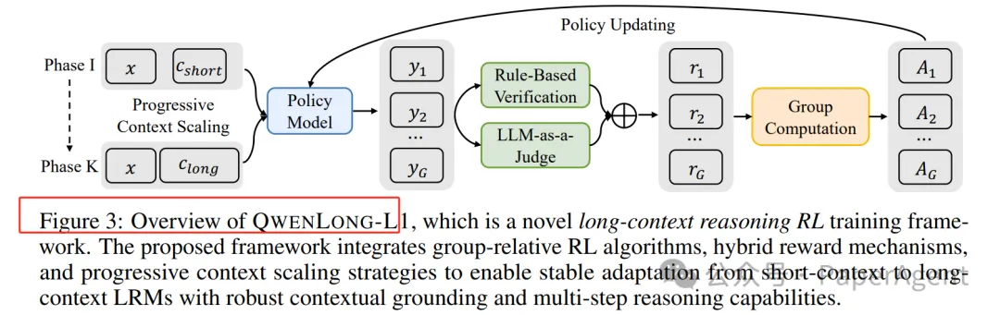
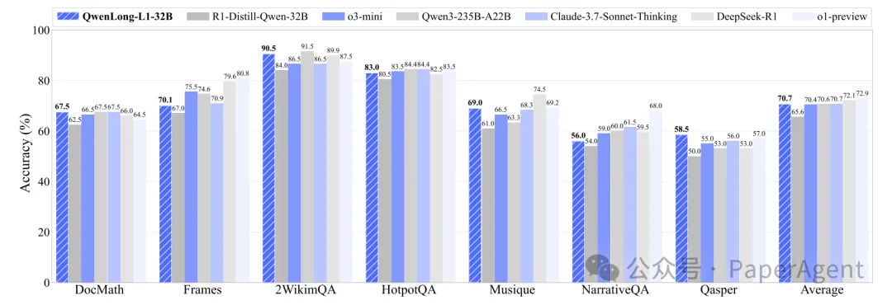
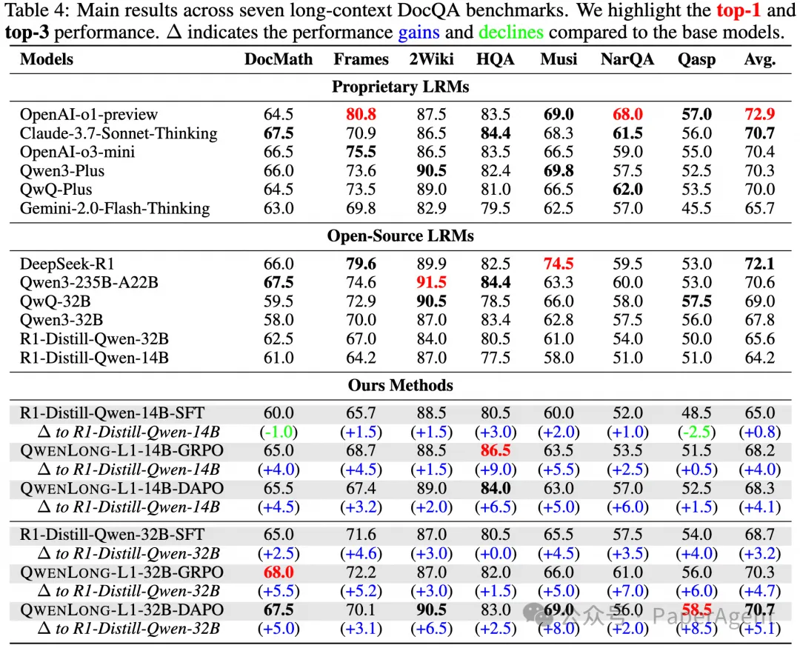

# 1. 资源

- https://www.arxiv.org/pdf/2505.17667
- QWENLONG-L1: Towards Long-Context Large Reasoning Models with Reinforcement Learning
- https://huggingface.co/Tongyi-Zhiwen/QwenLong-L1-32B

# 2. 原理

QWENLONG-L1 框架：该框架通过逐步扩展上下文（progressive context scaling）的方式，将短文本情境的 LRMs 适应到长文本情境。它包含三个核心组件：

预热阶段的有监督微调（Supervised Fine-Tuning, SFT）：通过高质量的标注数据对模型进行初始化，以建立稳健的初始策略。

基于课程的分阶段强化学习（Curriculum-Guided Phased RL）：通过逐步增加输入长度的方式，稳定地从短文本到长文本进行适应。

基于难度感知的回顾性采样策略（Difficulty-Aware Retrospective Sampling）：通过优先采样复杂实例来激励策略探索。

RL 算法：文章采用了 GRPO（Group Relative Policy Optimization） 和 DAPO（Decoupled Clip and Dynamic Sampling Policy Optimization） 两种算法，以提高训练的稳定性和效率。

混合奖励机制（Hybrid Reward Mechanisms）：结合基于规则的验证（rule-based verification）和基于 LLM 的判断（LLM-as-a-judge），平衡了精确性和召回率。

QwenLong-L1-32B是第一个使用强化学习训练的用于长上下文推理的长上下文 LRM。在七个长上下文 DocQA 基准上的实验表明，QwenLong-L1-32B 的表现优于 OpenAI-o3-mini 和 Qwen3-235B-A22B 等旗舰 LRM，达到了与 Claude-3.7-Sonnet-Thinking 相当的性能，在最先进的 LRM 中表现出色。

# 3. 性能

# 参考

[1] 阿里开源QwenLong-L1：首个以强化学习训练的长上下文推理大模型,https://mp.weixin.qq.com/s/KIZ4XuWgLSPqIRktq70soA