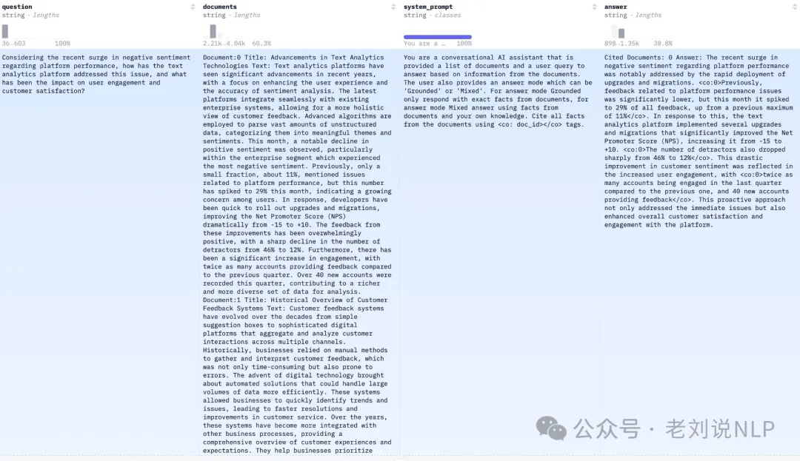

# 1. 资源

## 1.1 Mixtral_13B_Chat_RAG-Reader

Mixtral_13B_Chat_RAG-Reader(https://huggingface.co/HIT-TMG/Mixtral_13B_Chat_RAG-Reader)，基于Mixtral_13B_Chat进行为微调形成的RAG模型。

其微调数据使用TruthReader(https://huggingface.co/datasets/HIT-TMG/TruthReader_RAG_train)

其数据集构成如下：


```text
请基于给定的文档，生成问题的答案。
如果文档中没有包含答案的信息，请回复抱歉并给出理由。
# DOCUMENTS:
## 文档[1]      this is dummy title 1
this is dummy document text 1

## 文档[2]      this is dummy title 2
this is dummy document text 2

# QUESTION: this is a dummy question

# ANSWER:
```

## 1.2 Orion-14B-RAG

Orion-14B-Chat-RAG(https://huggingface.co/OrionStarAI/Orion-14B-Chat-RAG)，在一个定制的检索增强生成数据集上进行微调的聊天模型，但是细节并未公开。

地址：https://modelscope.cn/models/OrionStarAI/Orion-14B-Chat-RAG/summary

4、Llama-3-8B-RAG-v1

Llama-3-8B-RAG-v1(https://huggingface.co/glaiveai/Llama-3-8B-RAG-v1)基于Llama-3-8B，利用Glaive-RAG-v1数据集微调而成。

对应的数据集在：

Glaive-RAG-v1（https://huggingface.co/datasets/glaiveai/RAG-v1）：



也可以顺便来看看数据的构成，如上表所示，包括List of documents for context、Question、Answer Mode、Answer几个字段。

其中，Answer Mode定义了模型是否应该只输出基于事实的回答，或者是否应该结合其内部信息。

Answer在开头引用了相关文档，并且在文本中使用了 <co：1> 标签来标记引用。

因此，答案中文章的引用信息也是直接生成的。

## 1.3 Mistral-RAG

Mistral-RAG(https://huggingface.co/DeepMount00/Mistral-RAG)是Mistral-Ita-7b模型的微调版本，专门设计用于增强问答任务。

其使用的数据为：https://huggingface.co/datasets/DeepMount00/gquad_it

同类型的，还有Minerva-3B-base-RAG(https://huggingface.co/DeepMount00/Minerva-3B-base-RAG)

## 1.4 姜子牙-知识问答大模型-13B-v1.0

   - 模型下载（ModelScope）：https://modelscope.cn/models/Fengshenbang/Ziya-Reader-13B-v1.0/summary
   - 模型下载（Hugging Face）：https://hf.co/IDEA-CCNL/Ziya-Reader-13B-v1.0
   - 论文（2023）：Never Lost in the Middle: Improving Large Language Models via Attention Strengthening Question Answering
   - 论文（2023）：Fengshenbang 1.0: Being the Foundation of Chinese Cognitive Intelligence

## 1.5 QAnything模型
   - 基于Qwen-7B微调
   - 模型下载（ModelScope）：https://modelscope.cn/models/netease-youdao/Qwen-7B-QAnything/summary

## 1.6 Command R
   - Cohere公司发布的，针对RAG和工具调用场景，性能匹敌GPT-4
   - 文档：https://docs.cohere.com/docs/retrieval-augmented-generation-rag
   - 模型下载（ModelScope）3.5B：
     - https://modelscope.cn/models/mirror013/c4ai-command-r-v01-4bit/summary
   - 模型下载（ModelScope）104B:
     - https://modelscope.cn/models/AI-ModelScope/c4ai-command-r-plus/summary