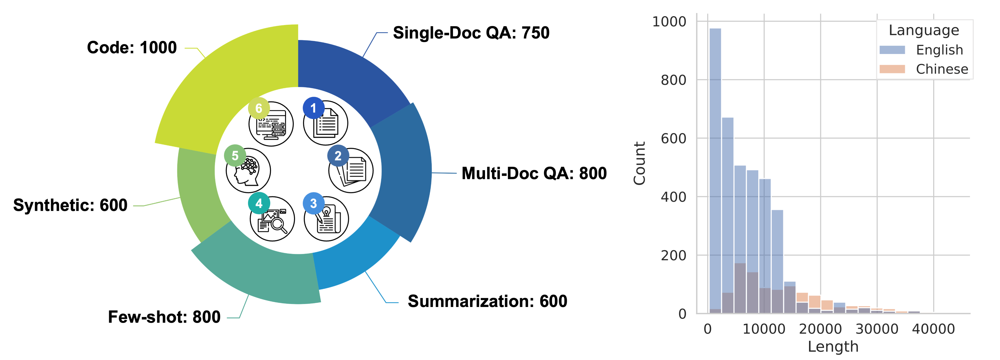
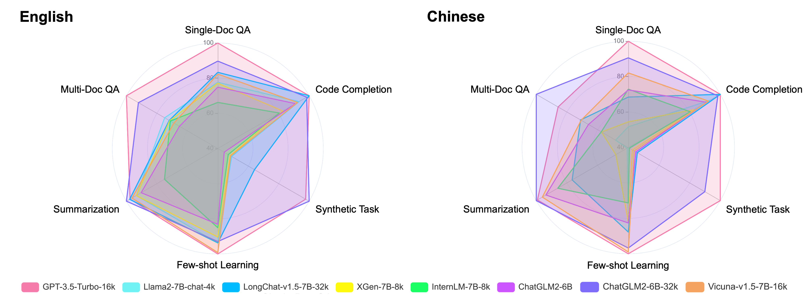
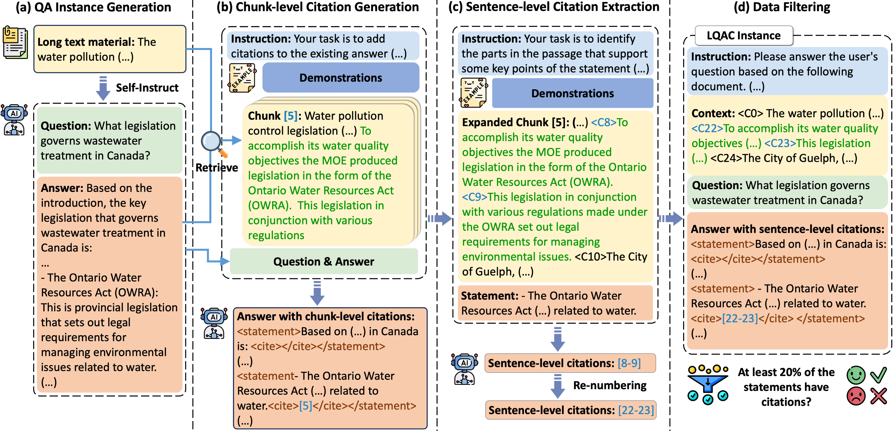
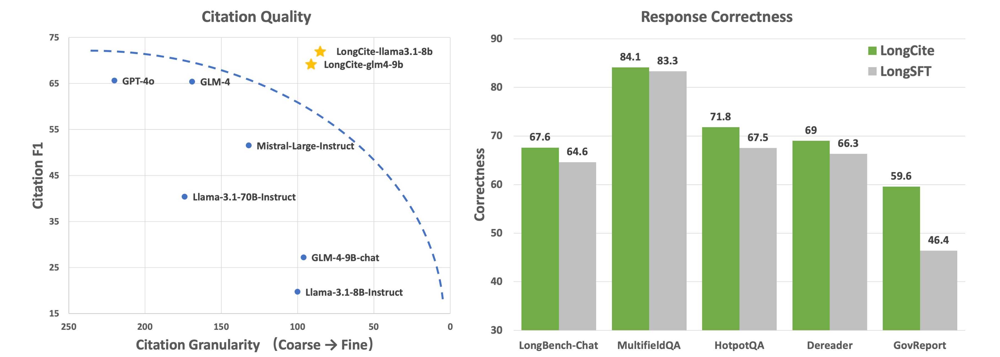

# 1. 资源

几乎全开源，从训练数据及构造方法、训练框架代码、模型、论文、测试框架及数据全开源。

- Github (39 stars): https://github.com/THUDM/LongCite
- Modelscope模型下载：https://modelscope.cn/models/ZhipuAI/LongCite-glm4-9b/summary
- 论文：LongCite: Enabling LLMs to Generate Fine-grained Citations in Long-context QA
  - https://arxiv.org/abs/2409.02897
- 数据：https://huggingface.co/datasets/THUDM/LongCite-45k
- 使用的训练框架：
  - 轻量Github (190 stars)：https://github.com/THUDM/LongAlign
    - investigate on training strategies, namely packing (with loss weighting) and sorted batching,
    - 仅支持32k训练
    - 包含文本长度分组，提前token
  - 推荐：https://github.com/NVIDIA/Megatron-LM
- 评估：
  - LongBench: https://github.com/THUDM/LongBench
    - A Bilingual, Multitask Benchmark for Long Context Understanding
    - tasks: single-document QA, multi-document QA, summarization, few-shot learning, synthetic tasks and code completion.
    - 14 English tasks, 5 Chinese tasks, and 2 code tasks, with the average length of most tasks ranging from 5k to 15k, and a total of 4,750 test data.
    - 
    - 
  - LongAlign： https://github.com/THUDM/LongAlign
    - 10,000 long instruction data of 8k-64k in length
    - LongBench-Chat that evaluates the instruction-following capability on queries of 10k-100k length.
    
# 2. 原理

## 2.1 数据构造

run the following four scripts to obtain the final data: 1_qa_generation.py, 2_chunk_level_citation.py, 3_sentence_level_citaion.py, and 4_postprocess_and_filter.py.

## 2.2 训练

可以混合sharegpt做sft。

sharegpt: https://huggingface.co/datasets/anon8231489123/ShareGPT_Vicuna_unfiltered/tree/main/HTML_cleaned_raw_dataset

训练采用megatron-lm，也可采用他们开源的轻量框架LongAlign。

- LongAlign (最大支持32k训练): https://github.com/THUDM/LongAlign
- Megatron-LM: https://github.com/NVIDIA/Megatron-LM

# 2.3 评估

长文问答评测集：LongBench-Cite

