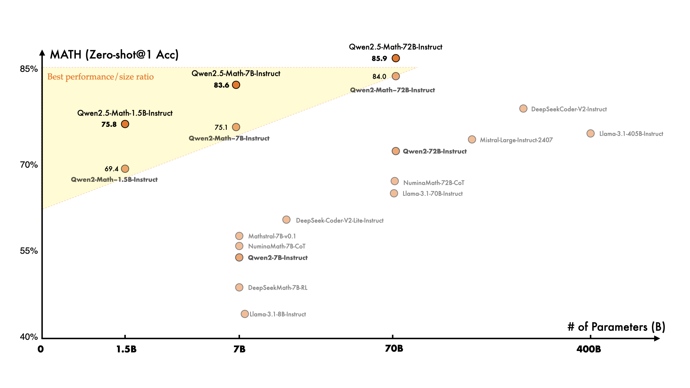
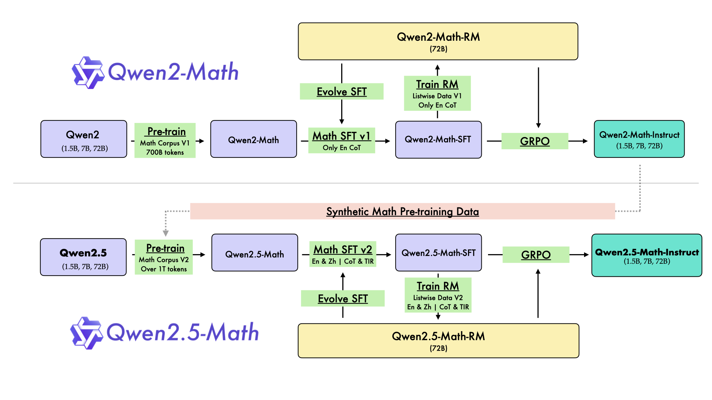
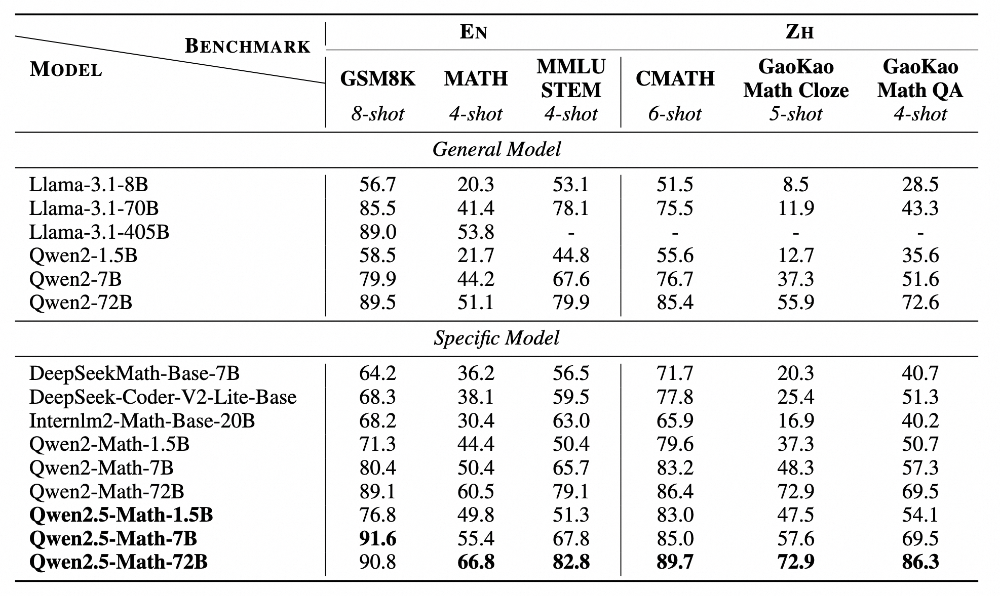
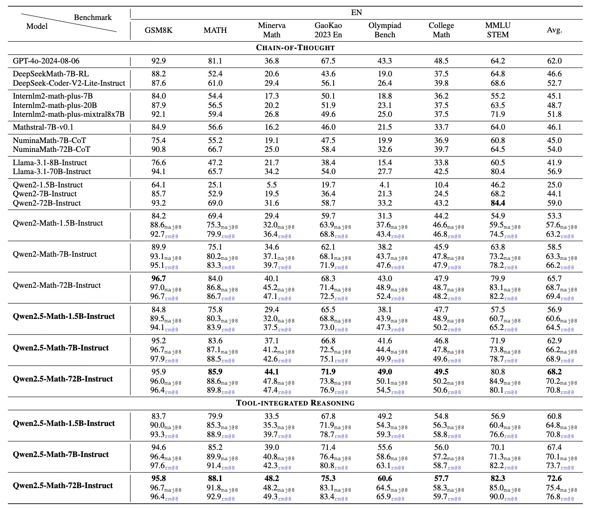
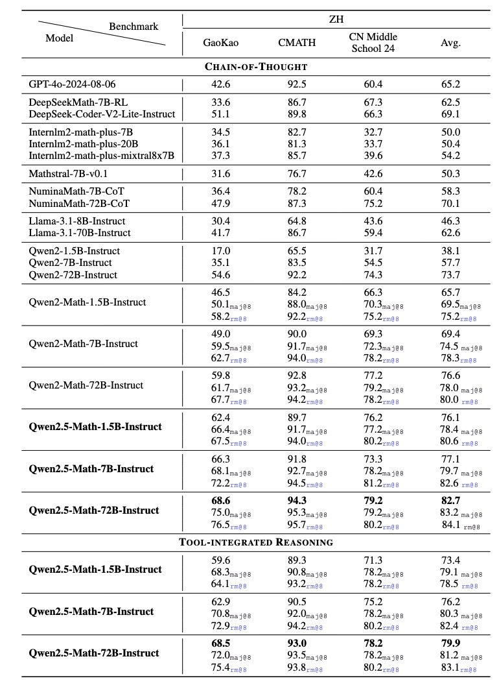
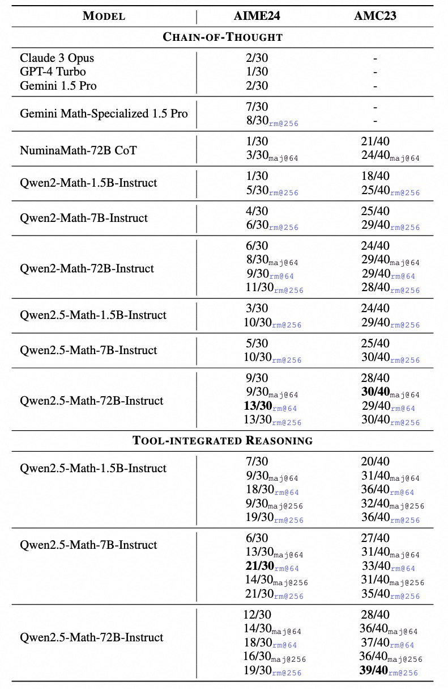

# Qwen2.5-Math: 世界领先的数学开源大语言模型

🚨 Qwen2.5-Math主要被设计用于通过CoT或TIR的方式解中英数学题，我们不推荐在其他任务上使用该系列模型。

# 1. 简介

一个月前，我们开源了 Qwen 家族的第一款数学专项大语言模型- Qwen2-Math。 今天，我们将它再度升级并开源 Qwen2.5-Math 系列，包括基础模型 Qwen2.5-Math-1.5B/7B/72B，指令微调模型Qwen2.5-Math-1.5B/7B/72B-Instruct和数学奖励模型 Qwen2.5-Math-RM-72B。

相较于 Qwen2-Math 只支持使用思维链（CoT）解答英文数学题目，Qwen2.5 系列扩展为同时支持使用思维链和工具集成推理（TIR） 解决中英双语的数学题。Qwen2.5-Math系列相比上一代Qwen2.5-Math在中文和英文的数学解题能力上均实现了显著提升。

虽然 CoT 在增强 LLM 的推理能力方面发挥着重要作用，但它在实现计算精度和处理复杂的数学或算法推理任务方面依然面临挑战，例如寻找二次方程的根或计算矩阵的特征值等等。而 TIR（如使用python解释器）可以进一步提高模型在精确计算、符号操作和算法操作方面的能力。Qwen2.5-Math-1.5B/7B/72B-Instruct 使用 TIR 在 MATH 基准测试中分别达到 79.7、85.3 和 87.8的高分。

# 2. Qwen2.5-Math: 基础模型
Qwen2-Math 和 Qwen2.5-Math 的整体训练流程如上图所示。在训练完 Qwen2-Math 基础模型后，我们通过三个主要途径将其进一步升级为 Qwen2.5-Math 模型：

1）利用 Qwen2-Math-72B-Instruct 模型合成更多高质量的数学预训练数据。

2）通过多轮召回从网络资源、书籍和代码中获取更多高质量的数学数据，尤其是中文数学数据。

3）利用 Qwen2.5 系列基础模型进行参数初始化，它们相比Qwen2有更强大的语言理解、代码生成和文本推理能力。

最终，我们为 Qwen2.5-Math-1.5B/7B/72B 构建了名为 Qwen Math Corpus v2 的预训练数据集，并保持上下文长度为4K。与用于 Qwen2-Math 预训练的 Qwen Math Corpus v1 相比，Qwen Math Corpus v2 的总 token 数量从 700B 增加到超过 1T。

我们在三个广泛使用的英语数学基准 GSM8K、Math 和 MMLU-STEM 上评估了我们的 Qwen2.5-Math 基础模型。此外，我们还评估了三个中国数学基准 CMATH、GaoKao Math Cloze 和GaoKao Math QA。所有评估都使用 few-shot CoT 的方式进行测试。

与 Qwen2-Math-1.5B/7B/72B 相比，Qwen2.5-Math-1.5B/7B/72B 在各项测试中均取得了显著提升，例如 Qwen2.5-Math-1.5B/7B/72B 在MATH评测集中分别提升了 5.4、5.0、6.3 分，在GaoKao Math QA中分别提升了 3.4、12.2、19.8 分。

# 3. Qwen2.5-Math-Instruct: 指令微调模型

与 Qwen2-Math-Instruct 类似，我们基于 Qwen2.5-Math-72B 训练了一个数学专用奖励模型 Qwen2.5-Math-RM-72B。此 RM 通过拒绝抽样构建 SFT 数据，也用于 SFT 之后的 GRPO 强化学习。

在 Qwen2.5-Math-Instruct 的开发过程中，我们额外使用 Qwen2-Math-Instruct 模型和 Qwen2.5-Math-RM-72B 进行了迭代，以在拒绝抽样期间进一步提高解题过程的质量。

与 Qwen2-Math 的后训练相比，我们进一步为 Qwen2.5 后训练引入了中文和英文的 TIR 数据和 CoT 数据。

我们在英文和中文的数学基准上评估 Qwen2.5-Math-Instruct。除了广泛使用的基准测试（例如 GSM8K 和 Math）之外，我们还涉及更多更具挑战性的考试，以全面评估 Qwen2.5-Math-Instruct 的数学能力 ，例如 OlympiadBench、CollegeMath、GaoKao、AIME2024 和 AMC2023。对于中国数学基准测试，我们使用 CMATH、Gaokao（中国大学入学考试 2024）和 CN Middle School 24（中国高中入学考试 2024）。

我们报告了零样本设置下所有基准测试的 Greedy、Maj@8 和 RM@8 性能，而多项选择基准测试（包括 MMLU STEM 和 GaoKao 和 CN Middle School 24 中的多项选择题）采用 5 样本设置。

实验结果表明 Qwen2.5-Math-72B-Instruct 模型在英文和中文上分别比上一代 Qwen2-Math-72B-Instruct 模型平均高出 4.4 分和 6.1 分，成为目前最好的开源数学模型。

旗舰模型 Qwen2.5-Math-72B-Instruct 的表现显著优于开源模型和领先的闭源模型（例如 GPT-4o、Gemini Math-Specialized 1.5 Pro）。在RM@8的TIR设置下，在MATH上取得了92.9的高分。

借助 72B 模型的合成预训练和监督微调数据，Qwen2.5-Math-7B-Instruct 在性能上超越了 Qwen2-Math-Instruct 72B。在 CoT 和 TIR 设置下，其 MATH 分数分别达到 83.6 和 85.3。

即使是我们最小的 1.5B 模型，在使用 Python 解释器时也能达到 80 左右的数学分数，优于该领域当前的大多数模型。

在 AIME 2024 和 AMC 2023 等更复杂的数学竞赛评估中，Qwen2.5-Math-Instruct 在各种设置中也表现良好，包括 Greedy、Maj@64、RM@64 和 RM@256。

在 Qwen2.5-Math-RM-72B 的支持下，Qwen2.5-Math-1.5B-Instruct 使用 CoT 模式下的 RM@256，成功解决了 AMC 2023 的 40 道题中的 29 道。

此外，Qwen2.5-Math-72B-Instruct 在 TIR 模式下几乎获得了满分，解决了几乎所有的问题。

在极难的 AIME 2024 基准测试中，Claude3 Opus、GPT-4 Turbo 和 Gemini 1.5 Pro 只能解决 30 道题中的 1 或 2 道。

相比之下，Qwen2.5-Math-72B-Instruct 在贪婪解码 CoT 模式下解决了 9 道题，在 TIR 模式下解决了 12 道题。在RM的帮助下，Qwen2.5-Math-7B-Instruct甚至可以解决多达21道题，进一步展现了Qwen2.5-Math-Instruct出色的数学解题能力。

# 4. 测试集去污染

测试集去污染对于确保模型性能评估的公正性至关重要。

遵循先前的工作 Qwen2，我们使用 13-gram 匹配排除可能受污染的训练样本。为了提高此匹配过程的准确性，我们执行文本规范化、删除不相关的标点符号等规范化操作。

为了进一步减少假阴性，特别是对于常见的数学表达式，我们引入了一个附加标准：最长公共子序列的比率必须超过 
0.6
0.6，样本才被视为受污染。

对于预训练数据，我们根据 GSM8K 和 MATH 等数据集的测试集过滤可能受污染的样本。

在指令微调和强化学习阶段（包括 SFT 数据、RM 训练数据和 RL 的 query），我们会排除所有报告的评估数据集中任何可能受污染的问题或解题过程。这些评估数据集包括 GSM8K、MATH、Minerva Math、Gaokao 2023 En、Olympiad Bench、College Math、MMLU STEM、GaoKao、CMATH、CN Middle School 24、AIME 24 和 AMC 23。

在分析受污染样本的过程中，我们发现一些现有的训练数据集（例如 MATH 训练数据集）包含相当一部分与测试数据集中的概念或结构高度相似的问题。

虽然这些变化不是完全重复的，但它们可能会损害我们评估的完整性。

因此，我们继续从训练语料库中排除此类样本。

# 5. Demo

我们开发了一个支持TIR模式的Demo —— Qwen-Agent，它允许用户在本地执行代码以体验Qwen2.5-Math的TIR能力。

# 参考

[1] Qwen2.5-Math: 世界领先的数学开源大语言模型，https://qwenlm.github.io/zh/blog/qwen2.5-math/