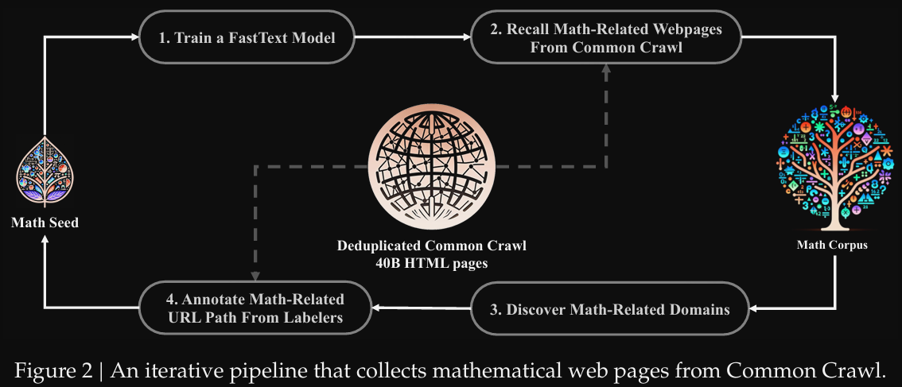

# 资源

- DeepSeekMath: Pushing the Limits of Mathematical Reasoning in Open Language Models
- https://arxiv.org/pdf/2402.03300
- https://github.com/deepseek-ai/DeepSeek-Math

# 数据

预训练：120B math tokens
- Common Crawl (CC)中的数学: 利用fast-text过滤
  - 分类器基于OpenWebMath训练（500,000正例），其它网页数据作为负向（500,000负例）
    - https://fasttext.cc/
  - 利用分类器从CC中找到数据，然后人工标注
  - 再更新分类器
- OpenWebMath

去重：URL、近邻去重

# 模型

基础模型：
- DeepSeek-Coder-Base-v1.5 7B
- 发现coder比general模型好

# 训练

- 预训练
  - 实验了40B, 80B, 120B, and 160B tokens
- SFT
  - COT训练
  - program-of-thought
  - tool-integrated reasoning
- GRPO提出

# 测试

- English and Chinese Mathematical Reasoning
- Formal Mathematics
- Natural Language Understanding, Reasoning, and Code
