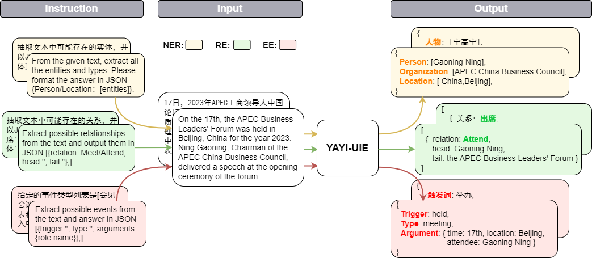
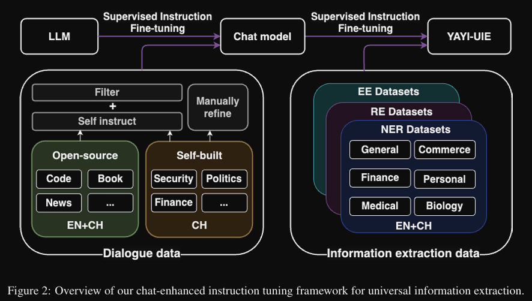
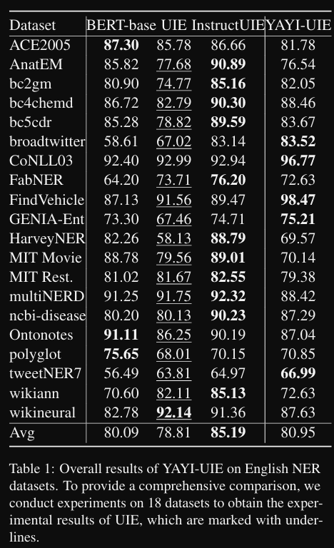
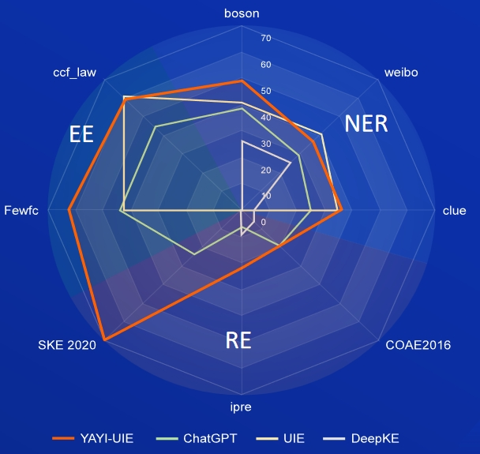

雅意大模型
- 论文 2023.12.24
  - YAYI-UIE: A Chat-Enhanced Instruction Tuning Framework for Universal Information Extraction
  - https://arxiv.org/abs/2312.15548
- Github (162 star): https://github.com/wenge-research/YAYI-UIE
- 模型下载地址：https://modelscope.cn/models/wenge-research/yayi-uie/
- 数据下载地址：https://modelscope.cn/datasets/wenge-research/yayi_uie_sft_data/summary
- 百万级语料中文54%，英文46%；其中其中数据集包括12个领域包括金融，社会，生物，商业，工业制造，化学，车辆，科学，疾病医疗，个人生活，安全和通用。覆盖数百个使用场景
  - NER：中文覆盖28个实体类型包括人物，地缘政治，组织，身体部位，药物等，英文覆盖130个实体类型包括Animal, Weapon, Conference, Book等。
  - RE：中文覆盖232种关系包括买资，增持，重组，国籍，别名，亲属，入股，转让，导致，发生地点，制造商等，英文覆盖236种关系包括founded by，state or province of headquarters，employee of，occupation，creator等。
  - EE：中文覆盖84种事件类型,包括中标，高管变动，产品行为-发布，公司上市等，和203种论元，英文覆盖45种事件类型，包括Born, Demonstrate, Meet, End Organization, Divorce等，和62种论元。
- 
- 
- 
- 
- 

数据样例

1. 实体抽取任务
   
   ```text
    文本：xx
    【实体抽取】抽取文本中可能存在的实体，并以json{人物/机构/地点：[实体]}格式输出。
    ```

2. 关系抽取任务

    ```text
        文本：xx
        【关系抽取】已知关系列表是[注资,拥有,纠纷,自己,增持,重组,买资,签约,持股,交易]。根据关系列表抽取关系三元组，按照json[{'relation':'', 'head':'', 'tail':''}, ]的格式输出。
     ```
   
3. 事件抽取任务

    ```text
    文本：xx
    已知论元角色列表是[时间，地点，会见主体，会见对象]，请根据论元角色列表从给定的输入中抽取可能的论元，以json{角色:论元}格式输出。
    ```