# 1. 资源

- 论文标题：TableGPT2: A Large Multimodal Model with Tabular Data Integration
- 论文地址：https://arxiv.org/pdf/2411.02059
- TableGPT 智能体：https://github.com/tablegpt/tablegpt-agent
- Hugging Face：https://huggingface.co/tablegpt/TableGPT2-7B
- 开源agent代码 （296 stars）： https://github.com/tablegpt/tablegpt-agent

- 平均提升40%
- 基于Qwen2.5-7B开发

个人评价
- 文中提到利用了图像模态，但样例中表格还是以文本形态输入
- 该模型主要用于基于表格分析，用于生成代码，而非问答

# 2. 原理

TableGPT2 是 TableGPT 的新一代版本。初始版本的 TableGPT 就已经引入了结构化特定领域语言（DSL）和专用表格编码器等方法，可以管理复杂的基于表格的查询。在此基础上，TableGPT2 实现了巨大的改进。他们不仅扩大了数据和训练协议的规模，还重新设计了每个组件，同时也引入了一些提升稳健性、扩大适用性以及优化商业智能应用性能的技术。

最终，大规模多模态模型 TableGPT2 诞生了！它有两种配置：7B 和 72B 版本。它们全都基于 Qwen2.5 系列模型。训练过程中，该团队使用了超过 860 亿 token 来进行持续预训练（CPT）、超过 43.75 万个表格 - 语言交织的样本来训练编码器、236 万多个高质量「查询 - 表格 - 输出」元组来进行监督式微调。

在相关研究中，这种规模是前所未有的，足以保证 TableGPT2 满足涉及结构化或表格数据的现代应用的严格要求。

TableGPT2 经历的持续预训练（CPT）、监督式微调（SFT）和支持生产级能力的智能体框架不同于传统 LLM，因为这里的预训练和微调更加注重编程、多轮推理和工具使用。这些特点可确保模型不仅擅长自然语言处理，而且能够很好地处理与表格相关的复杂任务。

此外，该团队还初步探索了表格数据的多模态对齐。具体来说，TableGPT2 创新性地加入了一个单独的模态模块，专门用于读取和解释表格数据。类似于视觉 - 语言模型（VLM），TableGPT2 包含一个表格数据读取模块，其作用是生成与来自文本输入的 token 嵌入相连接的专用嵌入。这个新增模块可让 TableGPT2 更好地捕获表格数据的结构和语义，从而在复杂的商业智能场景中实现更准确的表格理解。图 1 描绘了其整体模型框架。

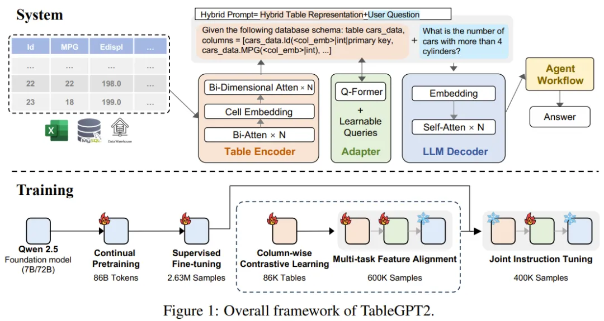

TableGPT2 是如何炼成的

持续预训练

为了实现 TableGPT2 的目标，该团队首先是通过持续预训练（CPT）来提升模型的编程和推理能力。

具体来说，80% 的 CPT 数据都是标注良好的代码，从而确保 TableGPT2 具有稳健的编程能力，这与 DeepSeek-v2 采用的方法是一致的。此外，该团队还做了补充；他们收集整理了大量包含多种领域知识（如金融、制造业、生物技术、市场技术）的推理数据和一般教科书，以保持数据比例平衡，增强推理能力。表 1 展示  CPT 过程中使用的数据分布和总 token 数。

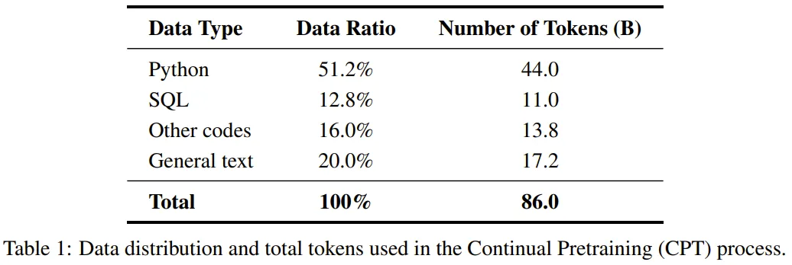

在数据处理方面，他们采用了一种两级过滤策略。

在文档层面，他们使用 54 个不同的类别对数据进行了标注，以确保全面覆盖不同的文档类型。下表展示了一些重要的过滤标签。

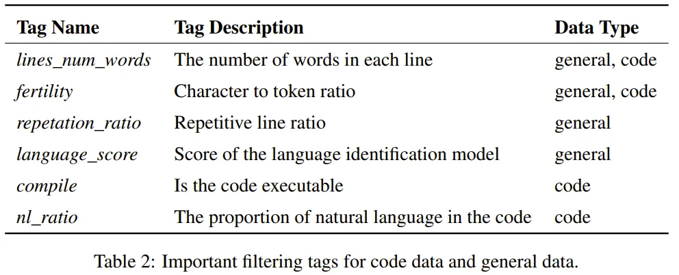

在 token 层面，则是利用了 RHO-1 来微调对高质量 token 的选择。

此外，他们还引入了一种可将代码长度和上下文窗口设置纳入考虑的新方法，这可优化模型有效处理多种不同代码段的能力。

经过彻底过滤后，最终的 CPT 数据包含 86B token，这种稳健强大的预训练可确保 TableGPT2 具备必要的编程和推理能力，足以应对复杂的商业智能和其他相关任务。

有监督微调

在 TableGPT2 中，监督式微调（SFT）的作用是解决在用于商业智能任务和场景时的局限。

为此，该团队编排了一个数据集，其中包含范围广泛的近乎现实的关键场景，包括多轮对话、复杂推理、工具使用和针对具体业务的查询。

这个数据集的构建过程既包括人工标注，也包含一个专家驱动的自动化标注流程，从而可以保证数据的质量和相关性。总体而言，SFT 过程涉及 236 万个样本， token 数量达数十亿，足可用于进一步微调模型，使其满足商业智能和其他涉及表格的环境的特定需求。

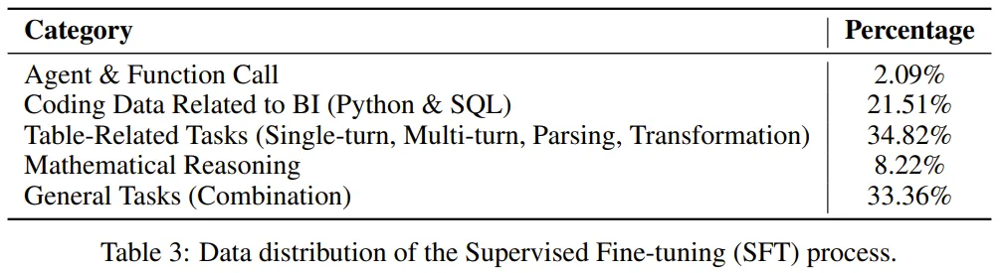

更具体地说，TableGPT2 的 SFT 流程有一个关键差异，即这 236 万个指令样本的组成非常平衡且多样化。如此一来，就可以满足表格相关任务的需求：既需要通用的模型能力，也需要针对表格的技能。

该数据集包含的表格专有任务包括代码生成（Python 和 SQL）、表格查询、数据可视化、统计测试和预测建模。此外，其中还有表格理解、表格生成、缺失值插补和基于表格的问答等多种任务，几乎涵盖了表格使用的所有阶段。输入格式加上随机排列的表格元数据（如字段描述、schema 信息和值枚举），可以产生超过 20 种不同的「表格 - 信息」输入组合，组可确保全面覆盖。

为了保证数据质量，他们还实施了一个多步骤的数据过滤流程：

- 首先，使用一组基于规则的过滤器，包括使用 Python 和 SQL 执行器检查代码的可执行性和正确性，从而消除常见错误（例如键错误和类型转换问题）。此外，还会使用正则表达式和其他规则来丢弃异常输出。
- 然后，使用多个模型（如 GPT-4o）对过滤后的数据进行评分；这里使用的提示词是专门设计的，可以保证得到更为细致的评估。只要当样本在所有评分组合上都超过阈值时，该样本才会被保留下来。
- 之后，通过人工检查进行样本校准。如果样本准确率低于 95%，就重新审查并优化其数据生成和过滤脚本。
- 最后，执行评估，这会用到一个包含约 94.9K 个案例（包括现有案例和新构建的案例）的固定验证集，如此可确保生成的结果是可执行且准确的。同时还会执行进一步的手动验证来抽查任何不一致之处并检测潜在的数据问题，例如缺少函数调用或多轮对话能力较差。

用于表格数据的数据增强

为了提升 TableGPT2 的性能（尤其是商业智能任务性能），该团队采用了多种查询增强技术，包括

- 在查询内引入字段时进行模糊化处理
- 通过匿名化字段名和类别值来实现表格数据增强
- 通过结合单轮和多轮问答任务来增强模型的多功能性
- 使用变动的提示词格式和输出结构来降低 TableGPT2 对某些提示词模板的敏感度
- 在数据生成过程中应用后处理增强来提升训练数据的多样性

语义表格编码器

由于 NL2SQL 等传统工作流程存在局限性，该团队为 TableGPT2 设计了新的语义编码器。

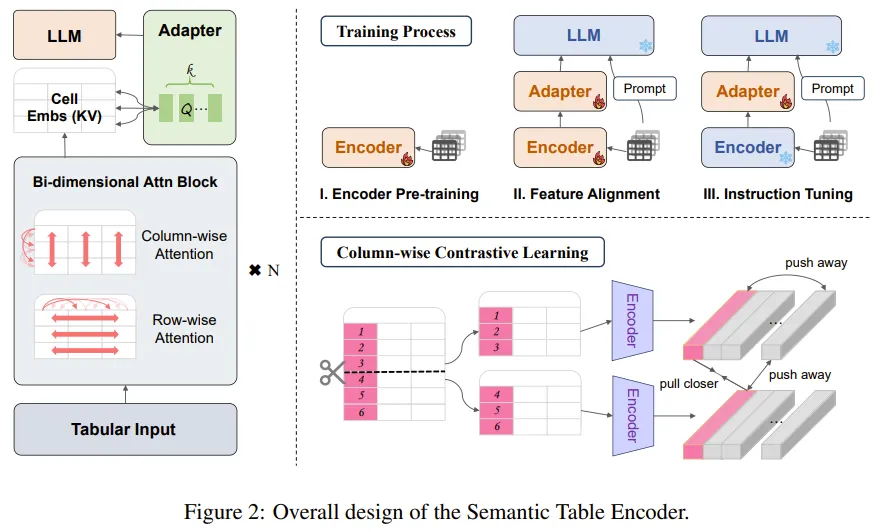

这种新的表格编码器的输入是整张表格。基于此，它可为每一列生成一组紧凑的嵌入。

该架构是根据表格数据的独特属性专门设计的，毕竟表格与文本、图像和其它数据类型存在根本性差异。

表格的语义来自四个关键维度：单元格、行、列和表格整体结构。这些维度都存在排列不变性（permutation invariance）。基于这一观察，该团队实现了一个没有位置嵌入的二维注意力机制以及一个分层特征提取过程。这能确保行方向和列方向的关系都被捕获并被有效理解。

此外，他们还采用了一种逐列式对比学习方法，以鼓励模型学习有意义的、对结构有感知的表格语义表征。

该团队使用了 Q-former 式的适应器（配备了一组可学习的查询）来将列嵌入与文本嵌入对齐。

他们还引入了两个特殊 token <tab> 和 </tab>，以区分表格特征和原生文本，让模型可以同时处理这两种模态，并且不产生混淆。

为进一步增强文本信息、列嵌入和 schema 元数据之间的对齐程度，他们还使用了联合指令微调。此过程有助于优化模型对表格数据的理解，使其能够更有效地集成和解读各种输入。

顺带一提，目前这个编码器部分还尚未开源。至于原因，赵俊博博士表示：「一方面保护下团队学生们未来的小论文，另外一方面确实 VLM 和特定领域的适配没弄好，解码器可以独立使用，效果仍在。」

智能体框架

该团队在开源库中提供了一个全面的智能体工作流程运行时间框架，其设计目标是将 TableGPT2 无缝地集成到企业级数据分析工具中。该框架包含三个核心组件：

运行时间的提示词工程
一个安全的代码沙箱
一个智能体评估模块

它们加在一起，可以提升智能体的能力和可靠性。这个工作流程具有模块化的步骤，因此可支持复杂的数据分析。这些步骤包括输入规范化、智能体执行（可选择 VLM 支持）、工具调用。

再结合检索增强式生成（RAG，用于高效上下文检索）和代码沙箱（用于安全执行），该框架可确保 TableGPT2 为实际问题提供准确、与上下文相关的见解。

下图展示了智能体的完整工作流程：首先通过一个提示词工程模块来准备和处理输入查询。再基于一个外部知识库使用 RAG 模块后，将经过处理的输入送入主模型。然后，TableGPT2 会与一个视觉 - 语言模型（VLM）合作生成工具调用、代码等相关动作。通过观察中间结果，可以根据需求选择是否迭代，以利用该智能体的反思能力。通过智能体与工具之间的无缝交互，这个迭代过程最终可得到最终输出。

图片

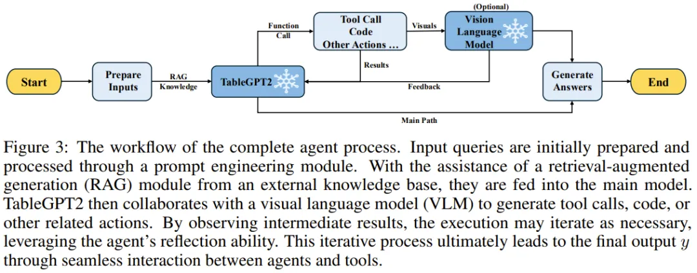

TableGPT2 效果怎么样

在实验部分，团队此次针对表格相关任务进行了全面的基准测试，不仅涵盖了已有的一些数据集，还加入了一个新收集的、面向真实任务的复杂表格数据集，从而提供了一个严格的评估平台。

为了进行全面的比较，团队选择了多样化的基线大语言模型。第一类是最先进的开源通用 LLM，包括 DeepSeek-Coder-V2-Lite-16B、 YiCoder-9B-Chat 以及 Qwen2.5-Coder-7B-Instruct、Qwen2.5-7B-Instruct。

第二类是针对表格相关任务进行微调或专门开发的模型，比如针对表格分析设计和优化的 TableLLM、为处理电子表格和文档设置中各种真实表格操作而微调的 CodeLlama-13B。

基准概览

下表 4 汇总了现有的表格理解和推理基准，共涵盖了 27.7K 个表格和 88.9K 个测试样本。团队将这些基准划分为了以下 6 项主要的表格分析任务，以全方位评估模型在不同类型任务中的性能：

表格理解
表格问答（TableQA）
表格事实验证
表格到文本生成（Table2Text）
自然语言到 SQL（NL2SQL）
整体评估

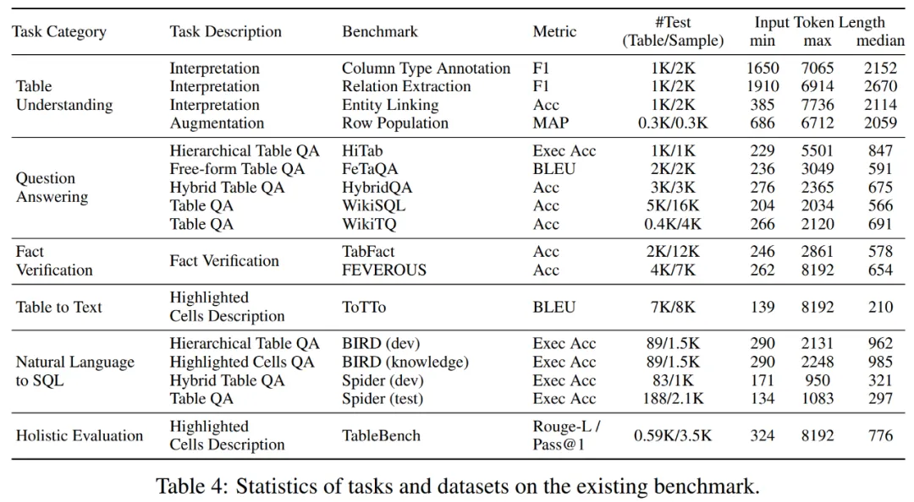

除了表 4 中已有的基准，团队构建了一个新基准 RealTabBench。现有基准大多侧重于简单的任务，不符合实际使用场景。为了克服这一局限性，团队构建了这个更具挑战性、更能反映实际应用场景的新基准，从商业智能（BI）场景中的真实表格中收集了 360 个复杂数据表格，并在此基础上制定了 6000 个真实、复杂的查询语句。

在评估模型性能时，团队采用了两个在实际应用中特别难处理的表格特征，分别是：

模糊性，表格中潜在的形似「A1」、「A2」等难以确认实际含义的匿名字段会对自动分析构成很大的挑战；

不规则性，在生产环境中，表格数据通过包含普遍的合并操作和不规则的结构，比如合并单元格和非均匀布局。

同时，针对新基准 RealTabBench，团队又从三个关键维度对生成的结果进行了评估，即一致性、信息完整性和安全性。

为了保证权威性，团队采用人工评审员与评估 LLM 结合的混合系统来生成最终的分数，并已经公开了整个评估流程中的部分样本。

项目地址：https://github.com/tablegpt/tablegpt-agent/tree/main/realtabbench

评估结果

下表 5 展示了 TableGPT2 （7B 和 72B 版本）与最先进基线模型的比较结果。值得注意的是，在没有对任何特定基准训练集进行大量训练的情况下，TableGPT2 显著优于几乎所有其他 LLM 方法。并且在某些基准上，TableGPT2 能够媲美甚至优于 GPT-4o。

另外，在涉及分层结构表格的复杂数据基准（如 HiTab）上，当前大多数 LLM 方法表现不佳。相反，TableGPT2 有了明显改进，与 Qwen2.5 系列模型相比，执行准确率实现了 60% 以上的绝对增长。

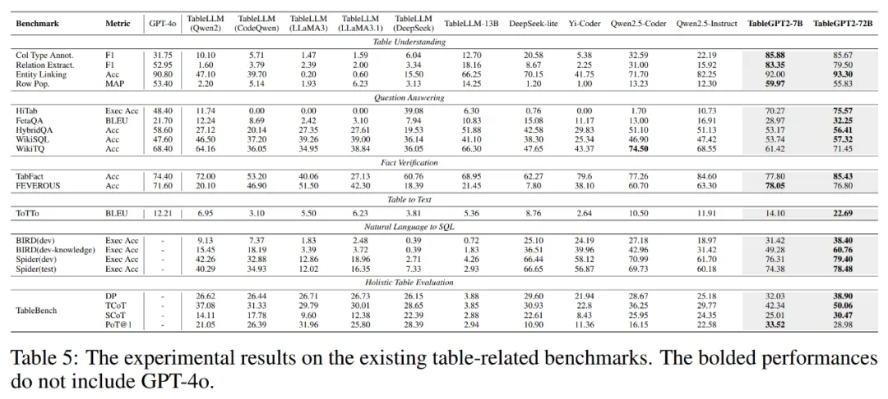

同样地，对于 RealTabBench 数据集，TableGPT2（7B）在多项任务上均达到了新 SOTA。

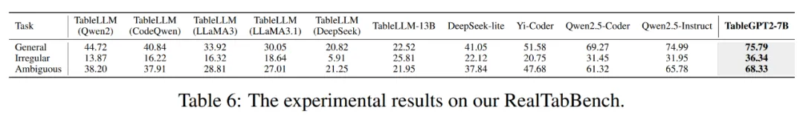

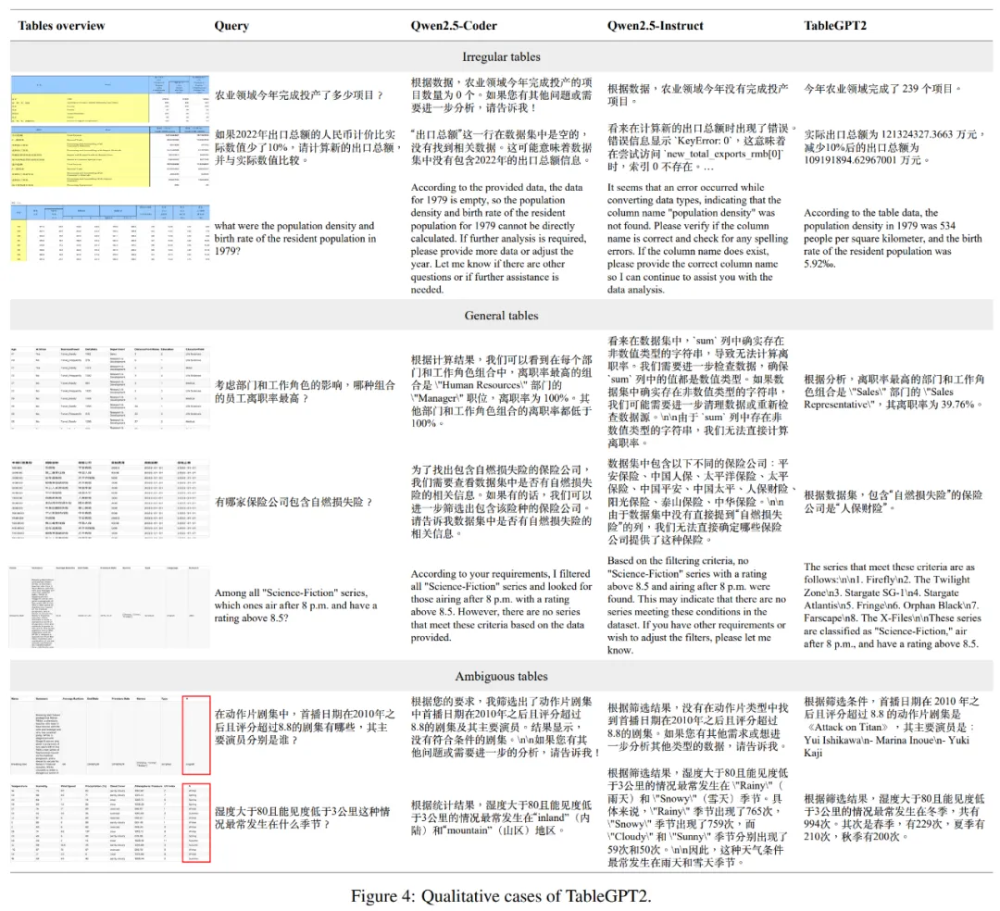

最后，针对表格相关任务对 LLM 微调不应损害其整体性能。为了验证这一观点，团队在下表 7 中对流行的基准展开评估，包括 MBPP、HumanEval、CMMLU 和 MMLU。

结果显示，TableGPT2 在这些基准上保持了强大的性能，并没有出现通用能力的下降。

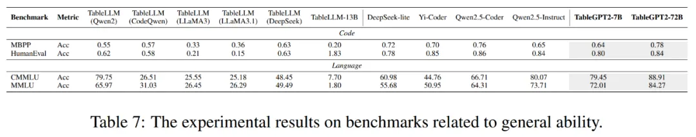

未来改进方向

不过，团队也表示，尽管 TableGPT2 在评估中实现了 SOTA，但尚未完全解决在实际 BI 环境中部署 LLM 的挑战。因此距离将该模型可靠地用于生产系统仍有一些差距。团队提出可以采用以下几种关键的技术与方法来解决。

一是针对特定领域进行编码。

团队虽然利用 Python 和 SQL 数据对 TableGPT2 进行了微调，但考虑到安全和效率等因素，特定领域通常需要专门的编码。这就面临一个关键挑战：如何使 LLM 能够快速适应企业特定的 DSL 或伪代码？拿 TableGPT2 来说，虽然它可以生成代码，但问题在于如何有效地弥合这些代码与企业数据基础设施特定需求之间的差距？

在 TableGPT2 中，团队采用了一种混合输出方法，结合使用了结构 DSL 输出和标准编程代码。这使得模型流畅地生成结构化和非结构化代码，在提供灵活性的同时可以保持领域特定应用所需的结构。

这些领域特定语言可以提供更好的可解释性，允许通过用户友好的界面更直接地与 LLM 输出进行交互。同时，这些语言可以最大限度地减少潜在的安全风险和错误，从而带来更安全、更强大的解决方案。

团队认为，生产环境中的编码不单单是简单的代码生成，需要仔细考虑领域特定的需求、基础设施兼容性以及灵活性与安全性之间的平衡，在混合使用 DSL 和通用代码时更要如此。

二是多智能体设计。

尽管 TableGPT2 在表格相关任务中取得了 SOTA 性能，但仍然不能指望单个端到端 LLM 能够独立地完全解决复杂的真实任务。因此，团队最近在密切关注一项新的研究 —— 自动化智能体系统设计，它遵循了 LLM 工作流的自动化编排原则。

其中多个 LLM 被组织成有向无环图（DAG）结构，这样输入查询可以根据图的拓扑顺序自动路由到一系列 LLM 中。每个 LLM 执行一项专门的功能。DAG 流程由系统本身决定，并根据手头任务决定要用到哪些 LLM。这种自动化流程工程创建了一个灵活的模块化工作流程，并根据问题需求动态调整，正如 AutoML 系统自动配置机器学习模型以获得最佳性能一样。

这样的例子还有很多，比如用于股票和基金推荐的小型自然语言应用，它需要将 LLM 与实时市场数据连接起来。在这种多智能体架构中，通常需要为不同的 LLM 分配不同的角色，每个 LLM 都要在针对其功能专门定制的数据上进行微调。每个 LLM 还要根据输入来配置不同的提示词模版和 RAG 设置，并在输出阶段应用不同的编码和对话逻辑。这样一来，每个阶段的定制微调可以确保整个 pipeline 提供精准和上下文感知的响应，从而解决真实应用的复杂性。

一个足够先进的单一基础模型最终能不能取代链接多个模型的需要呢？团队认为这在很大程度上仍是理论上可行。这种模型需要拥有足够的通用智能来处理统一框架内的各种任务。但从自身经验出发，团队表示通常需要两个以上的 LLM 才能解决真实应用的全部复杂性。因此，团队认为，单一模型何时能够熟练、无缝地解决跨多个领域的问题仍不确定，在生产阶段尤为如此。

三是充分利用表格的多功能性。

尽管 TableGPT2 主要关注 BI 应用 —— 在这些应用中，结构化数据的上游来源是数据库或数据仓库；不过，表格数据还有另一个非常常见的来源，即 Apple Pages 或 Microsoft Excel 等应用程序。

这些表格与数据库等基础设施中的表格往往差异巨大，因为人们日常使用的表格常常并不规则。举个例子，Pages 或 Excel 中的表格常常有合并单元格、不一致的行列结构、非标准的数据格式。这些不规则会让此类表格的处理复杂度更高。另外，不同组织机构使用的表格形式差异也很大，比如有些单元格可能会包含自由形式的文本、有些单元格没有填充等等。

在 TableGPT2 模型所在的智能体工作流程中，该团队还专门为规范不规则表格微调了一个单独的 LLM，并将其集成到一个整体系统中。然而，处理不规则表格仍有很大的改进空间，尤其是考虑到其巨大的商业生产潜力。

因此，该团队猜想，要处理这种不规范，就应该从预训练阶段开始，以确保模型能够熟练处理表格的各种格式。

当前的许多 LLM 以及 RAG 过程都无法充分地处理这些非标准表格结构。此外，许多现有的语料库也常常忽视这类数据。这一有待填补的空白是值得研究者未来探索的宝贵机会。

# 参考

[1] 结构化表格也成模态！浙大TableGPT2开源，最强表格AI问世