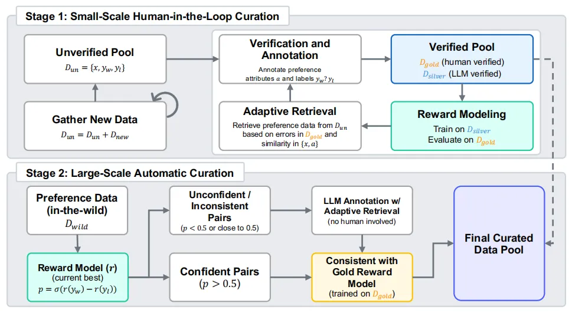

# 1. 资源
Skywork-Reward-V2 系列共包含 8 个基于不同基座模型和不同大小的奖励模型，参数规模从 6 亿到 80 亿不等，它在七大主流奖励模型评测榜单上全部获得了第一。

技术报告：https://arxiv.org/abs/2507.01352

HuggingFace 地址：https://huggingface.co/collections/Skywork/skywork-reward-v2-685cc86ce5d9c9e4be500c84

GitHub 地址：https://github.com/SkyworkAI/Skywork-Reward-V2

# 2. 原理

首先，他们构建了迄今为止规模最大的偏好混合数据集 Skywork-SynPref-40M，总计包含 4000 万对偏好样本。其核心创新在于一条「人机协同、两阶段迭代」的数据甄选流水线。

第一阶段，人类引导的小规模高质量偏好构建。此阶段研究人员针对 RLHF 可能存在的「高质量数据缺乏→模型弱→生成数据质量低」恶性循环，独创「金标准锚定质量 + 银标准扩展规模」的双轨机制，一方面利用有限人工精准突破初始瓶颈，另一方面利用模型自身能力实现规模化突破。

具体来说，人工和大模型会分别标注出「黄金」和「白银」偏好数据，奖励模型在白银数据上进行训练，并与黄金数据对比评估其不足之处。接着，系统选择当前奖励模型表现不佳的相似偏好样本进行重新标注，以训练 RM 的下一次迭代，这一过程重复多次。

第二阶段，全自动大规模偏好数据扩展。此阶段不再由人工参与审核，而是让训练完成的奖励模型独挑大梁，通过执行一致性过滤，对数据进行二次筛选。

此时，系统将第一阶段的奖励模型与一个专门基于验证的人类数据训练的「黄金」奖励模型相结合，通过一致性机制来指导数据的选择。由于这一阶段无需人工监督，因此能够扩展到数百万个偏好数据对。

从效果来看，该流程结合了人工验证的质量保证与基于人类偏好的大型语言模型（LLM）的注释，实现了高度可扩展性。

最终，原始的 4000 万样本「瘦身」为 2600 万条精选数据，不仅人工标注负担大大减轻，偏好数据在规模与质量之间也实现了很好的平衡。

# 参考

[1] https://mp.weixin.qq.com/s/I6fVTa5ltMUPDRt-Z7p14Q
