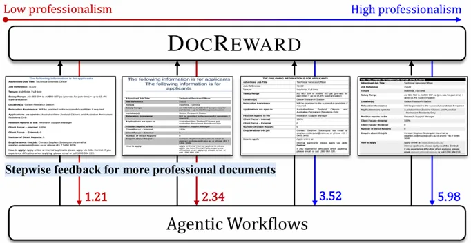

DocReward: A Document Reward Model for Structuring and Stylizing

论文链接：

https://arxiv.org/abs/2510.11391

为推动这一转型，微软亚洲研究院联合香港中文大学、中国科学院大学提出了专注于文档结构与样式专业度的奖励模型 DocReward。DocReward 可以评估文档的视觉层次、排版规范和整体可读性，为自动化文档创作提供核心支撑。通过优化结构与样式，DocReward 能够帮助由智能体生成的文档在形式上达到专业标准，确保内容呈现清晰、有序、易读。

在内容生成方面，Deep Research 通过智能体化的文献调研，可高效整合信息并输出专业报告。结合 DocReward，智能体不仅能够产出内容可靠、信息丰富的文档，还能保证文档结构清晰、风格专业，实现从信息调研到高质量文档呈现的完整闭环，为传统办公软件智能体化转型奠定坚实基础。

文档结构与样式专业性的定义如下：

结构（Structure）：文档应合理使用空白区域，保持适当的页边距；章节分隔清晰，文本对齐良好，段落间距和缩进适当，页眉页脚使用规范；整体内容逻辑清晰、条理分明。

样式（Style）：文档应选择合理的字体，包括字体类型、大小、颜色和可读性；标题样式清晰，有效使用加粗、斜体等强调手段；项目符号和编号使用得当，整体格式统一。

图片
DocReward：聚焦结构和样式的文档奖励模型

为了训练 DocReward，研究团队构造了 DocPair 数据集。该数据集包含11.7万对文档，涵盖32个领域和267种文档类型。模型通过偏好学习优化，能够准确评估文档在结构和样式的专业度。

# 参考

[1] DocReward：让智能体“写得更专业”的文档奖励模型, https://mp.weixin.qq.com/s/DndYqzd6z6ug1c-FGFgVlw