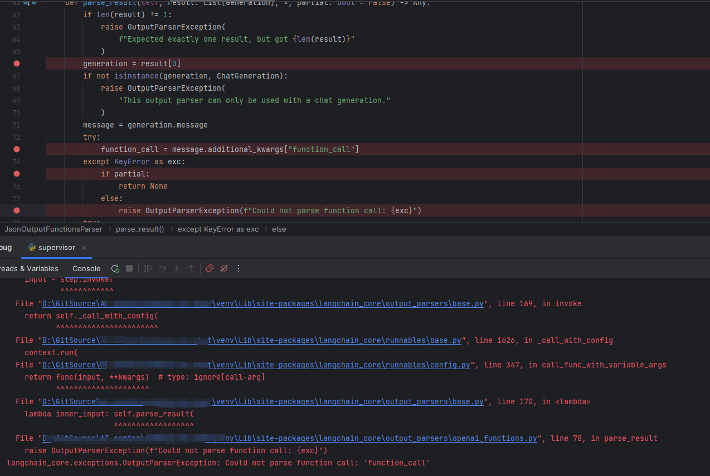
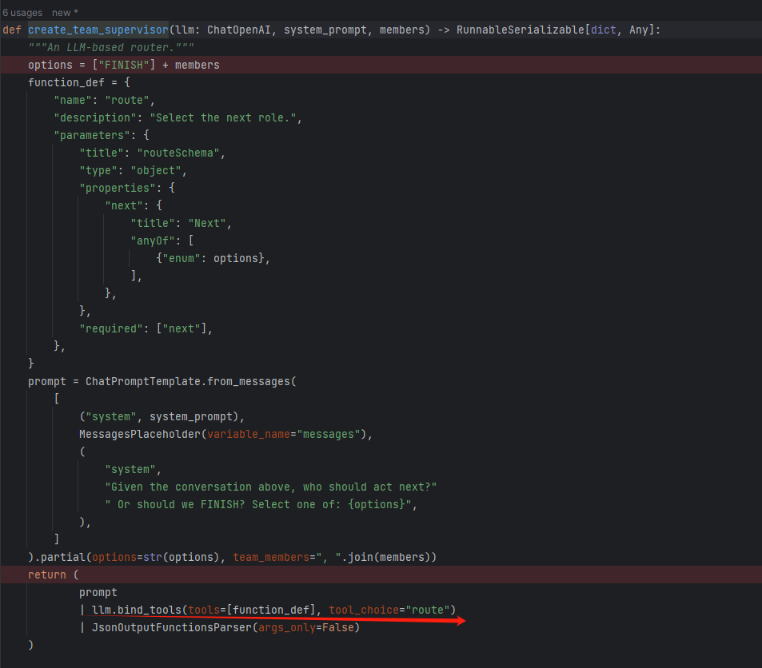

# 参考

用qwen1.5-32B-chat测试langgraph的官方例子时无法调用function，所有代码均按照langgraph的notbook写，仅仅替换了模型，模型是fschat本地服务器部署的，请问问题出在哪？ #568

https://github.com/QwenLM/Qwen2/issues/568

# 问题

调试看了模型输出的结果，没有返回function_call字段，因此报错

langgraph例子：https://github.com/langchain-ai/langgraph/blob/main/examples/multi_agent/hierarchical_agent_teams.ipynb

llm绑定tool代码：

# 问题分析

您是自己部署的模型服务吗？langgraph应该是调用了vllm等openai api服务的function call实现。但很遗憾的是，vllm等其他推理框架并没有集成qwen的function call实现。

# 解决方法

使用vllm部署时，可以用qwen，但是用不了qwen的function call功能，因为缺少相应的工程配套实现（但可以用ReAct替代function call）
