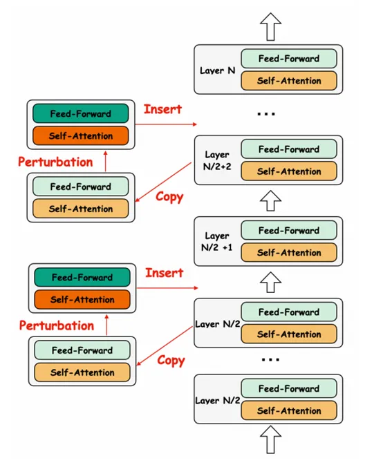
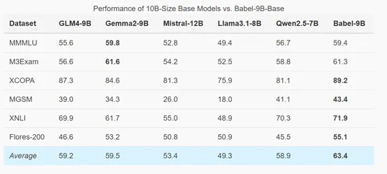

开源地址：https://github.com/babel-llm/babel-llm

笑脸：https://huggingface.co/Tower-Babel

Babel一共提供了9B和83B两个版本，9B专为高效的多语言大模型推理和微调设计，适合研究和本地部署；而83B性能更好，但消耗的资源也更多。

Babel的创新之一是其独特的层扩展技术。传统的大模型在提升性能时，通常采用持续预训练的方法，在现有模型的基础上不断增加训练数据量或调整训练策略。但这种方法往往难以突破模型的性能上限，尤其是在面对多语言任务时，模型的复杂性和多样性对性能提出了更高的要求。

为了解决这一难题，Babel采用了层扩展技术，通过在模型中插入额外的层来增加参数数量从而提升模型的性能。

层扩展技术的核心在于如何在不破坏现有模型结构和性能的前提下，增加模型的深度和复杂性。研究人员在实验中发现，模型的中间层和后层对编辑较为不敏感，因此选择在模型的后半部分插入新的层。这些新层与原模型的结构完全一致，不会影响模型的关键组件，如注意力头、隐藏嵌入或嵌入层等。

研究人员还探索了多种不同的设置，包括新层的插入位置和初始化方法。例如，尝试了在原有层之间插入新层或直接在模型末尾追加新层，并对比了不同的初始化策略，如复制原始参数、引入高斯噪声或直接初始化为零等。

实验结果显示，直接复制原始参数而不引入噪声的方法在性能上表现最佳，因为这种方式能够最大程度地保留原始模型的特征表示。

预训练方面，Babel采用了两阶段预训练策略：第一阶段是恢复阶段，目标是恢复模型在扩展过程中可能损失的性能。由于层扩展技术会对模型的参数协作产生一定的干扰，因此在这一阶段，研究人员使用了一个包含所有支持语言的大规模多样化语料库进行训练。

这种语料库的设计旨在帮助模型重新学习不同语言之间的关系，并恢复其在原始模型基础上的性能。研究人员特别强调了语料库的平衡性，尽可能地为每种语言分配相等的训练数据。然而，由于某些语言的语料库资源有限，实现完美的平衡并非易事。因此，采用了英语和中文的高质量预训练数据集（如RedPajama和YAYI 2）作为补充，以帮助模型更快地恢复性能。

第二阶段是持续训练阶段。在恢复了模型的基本性能后，将重点转向提升模型的多语言能力，尤其是那些低资源语言。在预训练语料库中增加了低资源语言的比例，并提高了教材在训练语料库中的占比。

这种策略的依据是，教材通常包含更为系统和结构化的知识，能够帮助模型更好地学习和理解不同语言的语法、词汇和语义特征。通过这种方式，Babel不仅提升了对低资源语言的支持，还增强了其在多语言任务中的整体表现。

为了验证Babel模型的性能，研究人员在MMMLU、M3Exam、MGSM、Flores-200等主流基准测试进行了评估。结果显示，Babel-9B在所有基准测试中的平均得分为63.4，超过了其他竞争对手，如Gemma2-9B和Qwen2.5-7B。尤其是在XCOPA、MGSM、XNLI和Flores-200等任务中，Babel-9B均取得了最高分，显示出在多语言推理、理解和翻译方面的强大能力。

# 参考

[1] 阿里开源多语言大模型，支持全球90%人口, https://mp.weixin.qq.com/s/02bESXWFtk3hUVq4gCpltA