# 1. 资源
论文标题：OpenCoder: The Open Cookbook for Top-Tier Code Large Language Model

论文链接：https://arxiv.org/abs/2411.04905

项目主页：https://opencoder-llm.github.io/

模型/数据集下载：https://huggingface.co/OpenCoder-LLM

代码仓库：https://github.com/OpenCoder-llm/OpenCoder-llm

# 2. 简介
## 2.1 预训练阶段

研究团队发现构建高质量 CodeLLM 的关键因素有：
1. 数据质量至关重要，代码预训练数据需要精细的启发式规则清洗与文件粒度的去重
2. 预训练数据中添加互联网网页中召回的代码相关语料
3. 在退火和监督微调阶段使用高质量的合成数据。

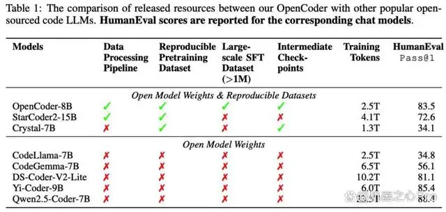

预训练数据构成了大型语言模型能力的基础。在开源社区中，The Stack v2 (Lozhkov et al., 2024a) 提供了一个有价值的代码数据集，有力地支持了代码语言模型的训练。然而，The Stack v2 的训练数据部分质量不足，无法使语言模型达到顶尖性能。

为此，研究团队提出了 RefineCode，这是一种高质量、可复现的数据集，包含了 9600 亿个标记 （token），涵盖了 607 种编程语言，并融入了 130 多条语言特定规则及其自定义权重分配。该数据集由两部分组成：原始代码和代码相关的网页数据。

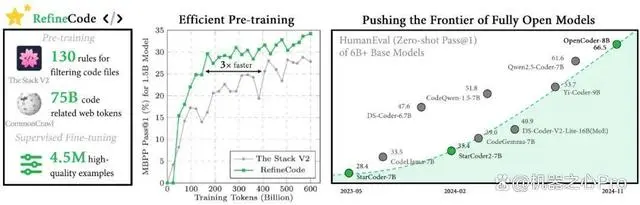

具体来说，团队主要从 GitHub 上收集原始代码（截至 2023 年 11 月），并结合了 The Stack v2 中的非 GitHub 数据。此外，代码相关的网页数据主要来源于网页语料库。研究团队设计了一个复杂的数据处理流程来生成代码预训练语料库，包含预处理、去重、转换、过滤与数据重配比。

预处理：排除超过 8MB 的文件，以避免将非文本文件纳入数据集，同时仅保留 607 种编程语言相关文件。

去重：首先通过 SHA256 哈希进行精准去重，其次通过 MinHash+LSH 进行模糊去重，优先保留 star 数更高的文件

转换：进行敏感信息识别检测

过滤：根据 130 多项启发式过滤规则，进一步筛选高质量代码文件，确保数据的高质量

数据重配比：在确认保持原始分布的情况下，对 HTML 和 Java 两类数量较为庞大的编程语言进行下采样

在以上一整套针对代码清洗流程后，RefineCode 保留了约 730B 的 token 数量。

OpenCoder 首次提出一套针对不同编程语言的详细过滤规则，并将代码、调整参数完全开源。启发式规则设计准则如下：1) 过滤掉 self-contained 程度过低的代码；2) 过滤掉逻辑结构差或结构极简的文件；3) 移除显著偏离标准代码格式的文件。

可以注意到，当使用 PCA 对比 The Stack V2 和 RefineCode 的 codebert embedding 时，观察到这两个数据集之间有明显的区别。具体而言，在图 3 中，The Stack V2 数据显示出更多的离群点，而 RefineCode 的嵌入则更为紧密地聚集。此外，通过对离群数据的分析，OpenCoder 发现这些离群点通常表现出许多低质量的特征，例如纯文本注释、仅包含十六进制数据，以及缺乏计算逻辑的极短代码，这些特征会扰乱预训练数据集的分布，最终影响预训练的效率。

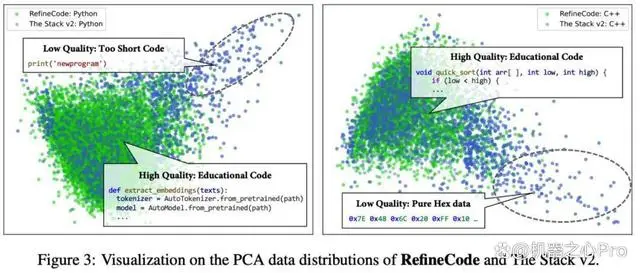

OpenCoder 同样从 Common Crawl 数据集中收集高质量代码相关数据，通过三轮 FastText 训练、召回、手工网页标注，最终成功获取了 330G 代码相关网页数据。

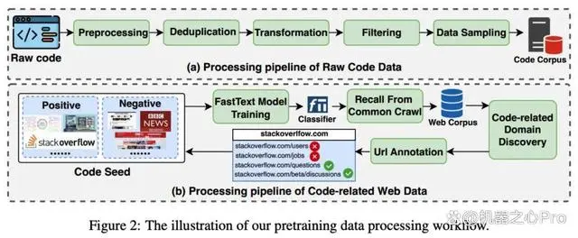

OpenCoder 采用了 WSD（Warmup, Steady, Decay）学习率调度策略，以在不同训练阶段中确保模型的稳定性与高效性。在训练初期，模型通过 2000 步的 warmup 阶段逐步提升学习率，达到峰值后进入稳定阶段，保持较长时间的固定学习率。最后，在退火阶段逐步降低学习率，实现模型的快速精细调优。在退火阶段中，除原始分布 RefineCode 外，OpenCoder 加入了算法相关语料库，同时合成了高质量代码段与代码教科书两种形式的数据，通过添加算法相关数据以及对算法知识进行反复改写来进一步增强来提高模型的代码逻辑能力。

## 2.2 SFT

1. 数据组成

    除开源代码指令数据 (Evol-Instruct, Infinity-Instruct, MCEVal) 外，OpenCoder 从 wildChat，ShareGPT 中采样了代码相关的真实用户指令数据。此外研究团队还独立合成了大规模多样指令数据、教育意义指令数据集与外部库调用指令数据集，进一步增强了指令微调数据的质量与多样性。
    
    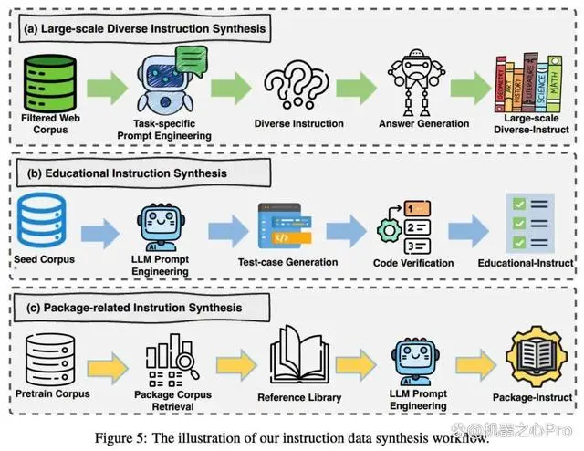

2. 两阶段训练策略

    OpenCoder 在指令微调期间使用了两阶段的训练策略。在微调过程的第一阶段，重点是广泛的真实用户指令与计算机科学理论相关知识。第一阶段的微调使 OpenCoder 能够理解和响应各种真实的用户需求。这些指令涵盖了计算机科学的各个方面，从基础编程到高级算法设计，再到复杂的数据结构操作。由于涵盖了广泛的代码相关指令，OpenCoder 在处理不同类型的编程问题时表现出卓越的适应性，能够灵活应对多种场景下的编码需求。
    
    另一个显著优势是提升了模型的泛化能力。面对用户的不同表述和习惯用语，OpenCoder 能够快速理解意图并生成适切的解决方案。这种广覆盖的训练使模型不仅在特定任务上表现出色，还能在多样化的编程需求中提供准确、高效的帮助。
    
    在指令微调的第二阶段，OpenCoder 使用高质量的下游任务相关数据进行训练，确保模型接触到现实世界中维护良好、格式规范的代码实例，且能在具体下游任务中表现出色。这种两阶段的微调方法使模型在理论知识和实际编程任务上都表现出色，避免了只关注某一方面的局限性。

# 3. 实验

## 3.1 消融分析

1. File-level 去重是代码数据去重的最优选择

    OpenCoder 在全量 Github 上 485 百万个 Python 文件上进行了 repo-level，file-level 的去重处理，并在相同参数下训练了两个 1.5B 大小的 LLM。首先 repo-level 去重保留的 token 数量近乎是 file-level 的三倍，其次从下游数据集性能表现发现 file-level 去重效果显著优于 repo-level
    
    对于 repo-level 的去重，进一步研究发现约有 52B 文件存在完全相同的另一份文件，且约 68B token（约占数据的 68.4%）可以被进一步 file-level 去重，这说明了 repo-level 去重并不充分。综上，对于大规模代码数据集，首先执行精确去重，其次进行文件层面的 MinHash 去重是一种高效且节省 CPU 的方案。

2. 高质量合成数据对于性能提升至关重要

    在退火阶段训练过程中，研究团队消融了高质量合成数据的影响。从下游 Benchmark 性能可发现，当高质量训练数据被移除后，模型性能明显下降，这表明高质量数据在退火阶段具有显著的有效性。

    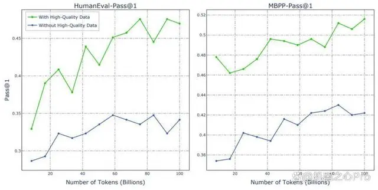

3. Github Star 数并不是好的过滤标准

   从直觉角度讲，更高 Star 的代码往往具有更清晰的注释，更优秀的代码组织方式。研究团队训练了两个 1.5B 的 LLM，其中一个使用原始数据训练，另一个则使用 GitHub 星级（星级 >=5）过滤后的数据进行训练，二者的 Benchmark 表现如下图所示：
   
   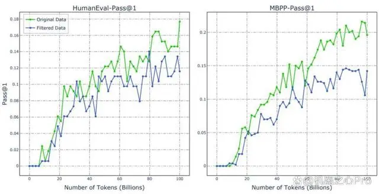

   可以发现使用原始数据训练的 LLM 优于使用过滤数据训练的 LLM，这一结果与 SantaCoder 的研究结果一致。此外，研究团队进一步展示了这两个 LLM 的训练损失，可以观察到使用过滤数据训练的 LLM 的损失低于使用原始数据训练的 LLM。对此现象，研究团队推测使用星级作为过滤信号能够提升数据质量，但相较于原始数据，数据的多样性有所限制。通过对二者数据分布的可视化分析，团队进一步验证了星级过滤显著影响了整体数据分布，削弱了数据多样性这一推断。

   此外，通过人工检查被过滤部分的数据可以发现其仍包含大量结构良好且具有算法丰富性的代码。因此，研究团队认为星级作为过滤标准并非最佳选择。

   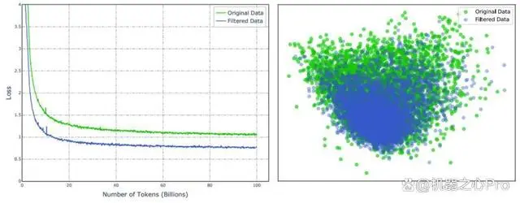

4. 两阶段 SFT 方法在 Benchmark 和实际应用中取得双重收益

   研究团队在 1.5B 模型上验证了两阶段 SFT 的收益。通过观察发现，Stage 1 的数据展现出显著的多样性，但平均质量相对较低。相比之下，Stage 2 的数据由高质量的代码特定 SFT 数据组成。该两阶段 SFT 策略使得模型在 Stage 1 中获得广泛的能力，随后在 Stage 2 中针对代码相关任务进行针对性提升。此外，类似于 Chatbot Arena，研究团队采用包含近 400 个人工创建样本的 Code Arena 测试集，以模拟真实环境中的用户代码相关提示。Code Arena 以 GPT-4 作为基准，并用 GPT-4 来判断哪个大语言模型（LLM）具有更好的响应能力，报告的结果为相对于 GPT-4 的胜率。结果展示了两阶段 SFT 训练策略在下游 Benchmark 上与体现真实应用能力的 Code Arena 上皆有收益。
   
   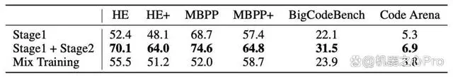
   
   评估结果

OpenCoder 模型在 HumanEval、MBPP 两主流模型评估任务上显著超过了现有开源模型，验证了其数据处理流程与合成数据的有效性。

为了检验 OpenCoder 的代码生成能力，研究团队在多个基准上将它与其他流行的开源模型（如 StarCoder2 、Qwen2.5-Coder 等）进行了比较，包括 HumanEval、MBPP、BigCodeBench 和 LiveCodeBench。结果表明，OpenCoder 在这些评估中达到了开源模型的一流水准。

此外，在多语言代码生成评估基准 MultiPL-E ，综合多语言代码评估基准 McEval 和多语言代码调试基准 MdEval 中，OpenCoder 表现也同样突出，证实了其出色的多语言性能。

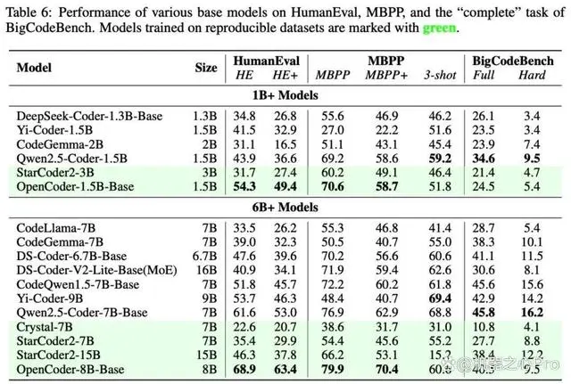

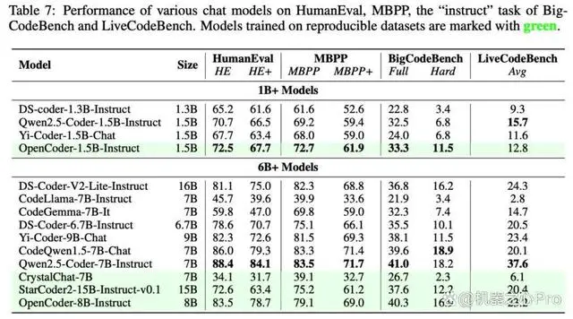

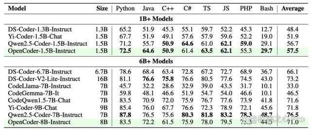

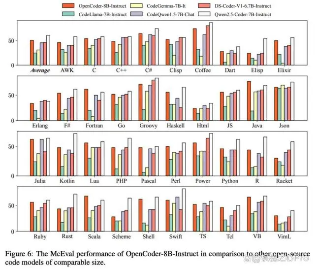

# 参考

[1] 完全开源的代码大模型OpenCoder来了，跻身性能第一梯队, https://mbd.baidu.com/newspage/data/landingsuper?rs=3129509512&ruk=h9CVHUmui2FToeZnV2s7Tw&urlext=%7B%22cuid%22%3A%22YaS-8gPjSa_j82ialaBWaguIvfj5u2fSlivG8gu22iK50qqSB%22%7D&isBdboxFrom=1&pageType=1&sid_for_share=&context=%7B%22nid%22%3A%22news_9762130277738833187%22,%22sourceFrom%22%3A%22bjh%22%7D