# 1. 资源

完全开源系列：

- Weights https://hf.co/allenai/OLMoE-1B-7B-0924
- Data：https://hf.co/datasets/allenai/OLMoE-mix-0924
- Code：https://github.com/allenai/OLMoE
- Logs：https://wandb.ai/ai2-llm/olmoe/reports/OLMoE-1B-7B-0924--Vmlldzo4OTcyMjU3
- paper: https://arxiv.org/pdf/2409.02060

# 2. 原理

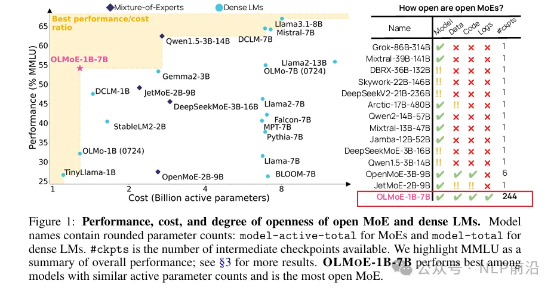

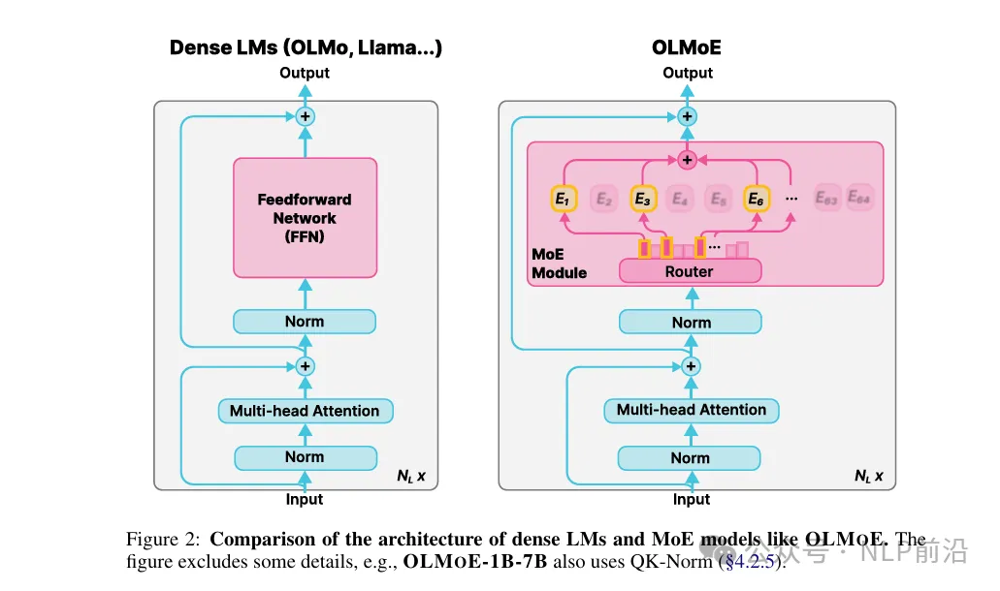

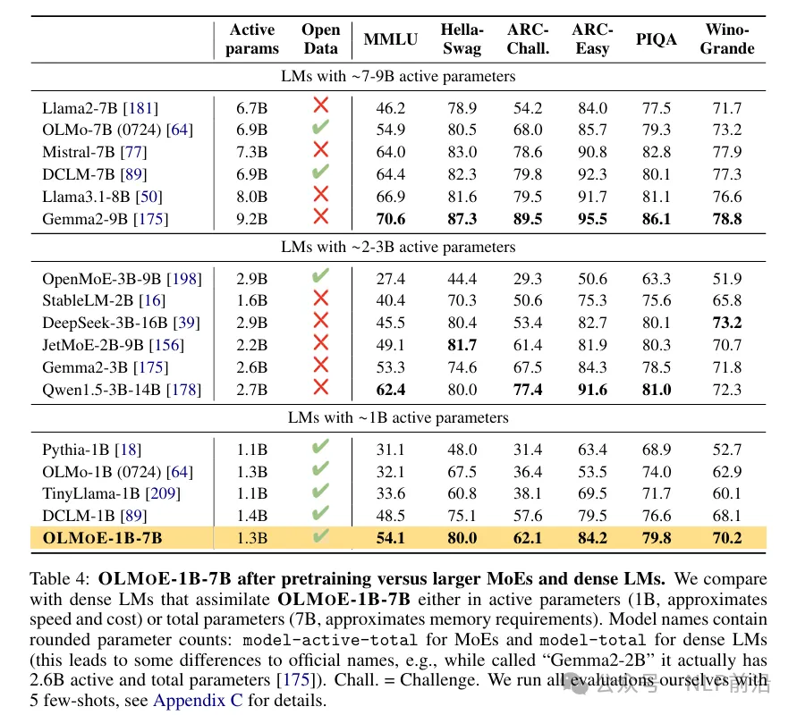

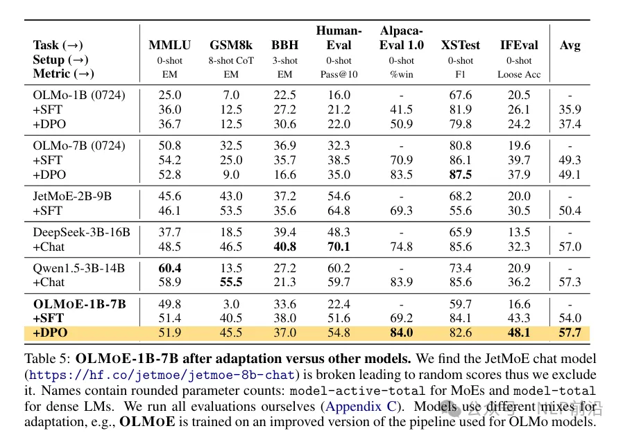

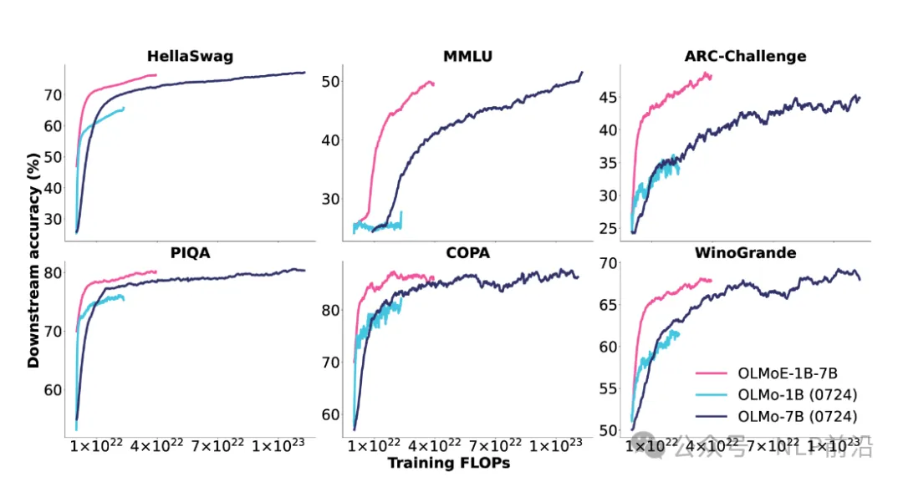

更细粒度的专家组合可以得到更好的训练损失，但是收益递减。（这里提到了很多相关的研究，去做预测最优组合）

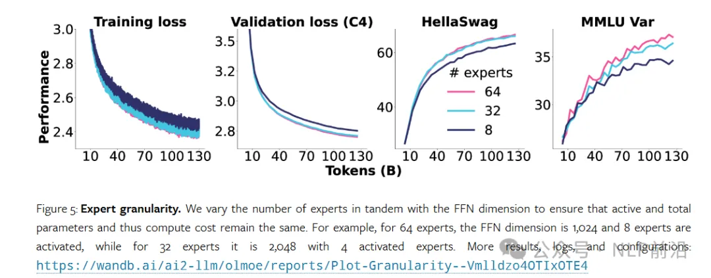

共享专家会消除模型的灵活性，让性能更差，与一些历史研究不符

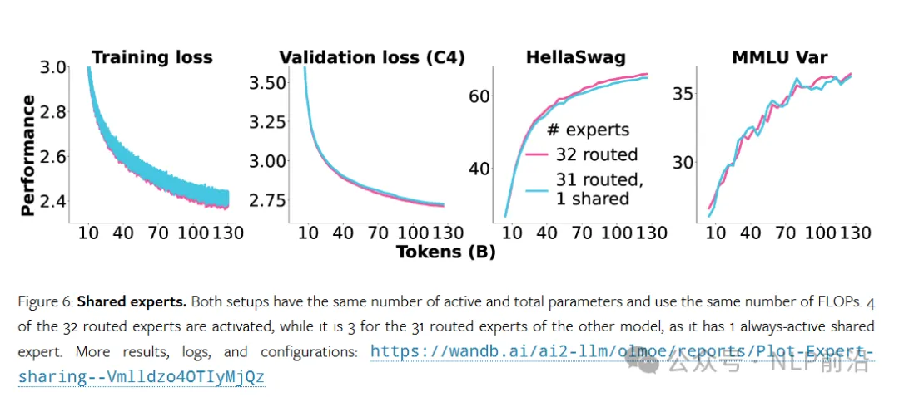

确定哪些专家处理每个输入token ，有2种类型

- EC，每个专家从输入序列中选择固定数量的token。(确保完美的负载平衡，但是不利于自回归的生成模式，也可能导致token丢失)
- TC，每个token会选择固定数量的专家。）这可能会导致许多token选择同一位专家，从而损害训练效率）

相同的预算下，TC稳定优于EC

专家是从头初始化，还是从MLP复制得到。实验发现只需要几百B的token，从头开始的模型就赶上了复制的结果，从600B token之后优于复制的结果。

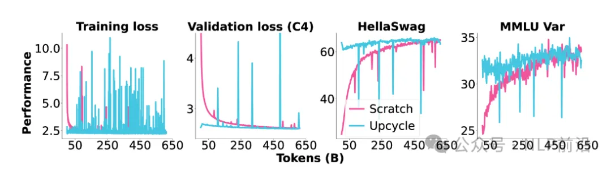

使用负载平衡损失也能带来更好的性能

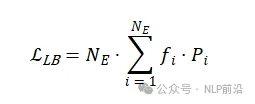

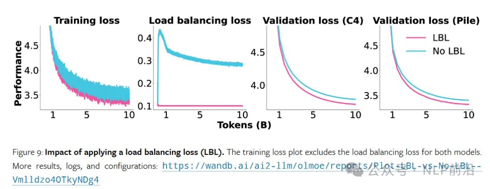

路由z-loss可以提高MoE模型的稳定性和质量。这个辅助损失会惩罚进入门控网络的大logits

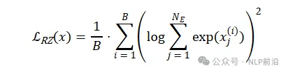

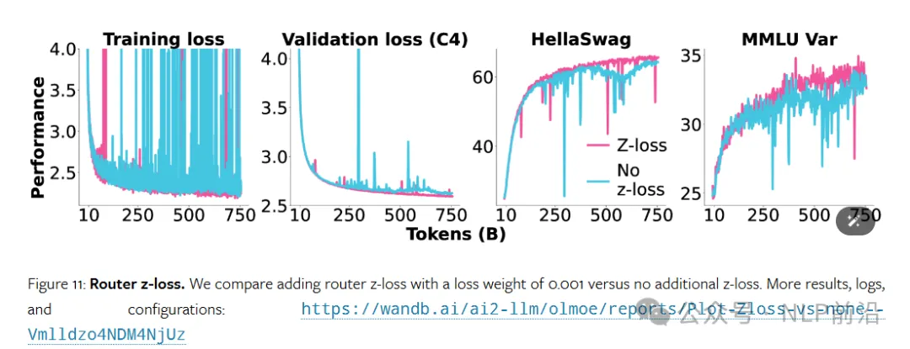

预训练的早期阶段路由就达到了饱和状态

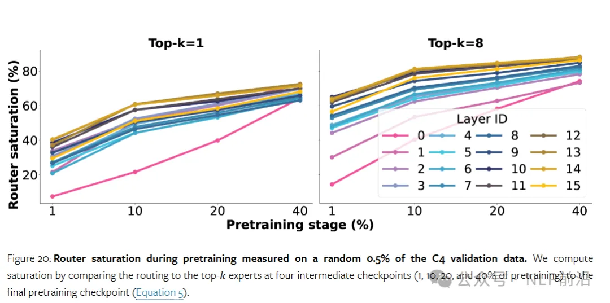

训练结束后，通一层的专家之间不存在强协同激活，也就是说不同专家之间几乎没有冗余

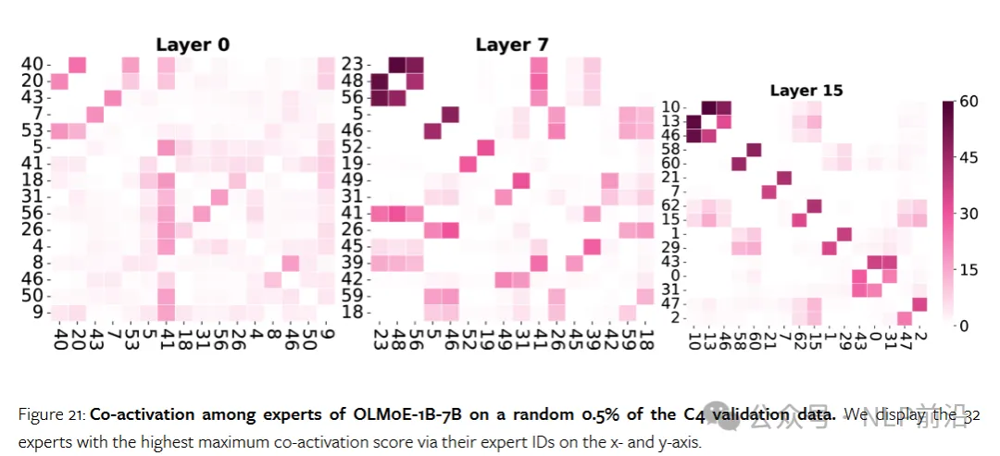

专家对于特定领域和词汇的专业化程度区分度还是比较高的。某些专家可能专门处理一些科学相关的，（如arXiv数据集），而其他专家可能更擅长处理编程语言或一般文本。

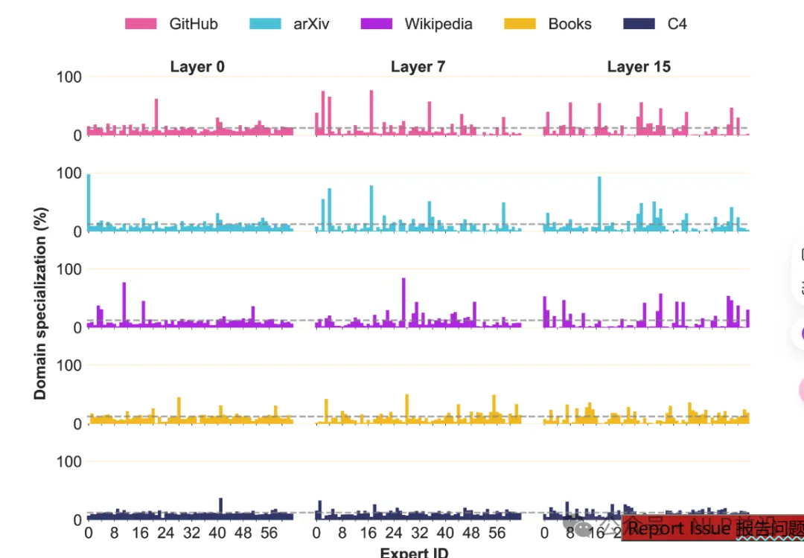

# 参考

[1] OLMoE，首个“完全开源”MOE模型，干货满满, https://mp.weixin.qq.com/s/pWU4myK6lHomi-aTxA3RKA