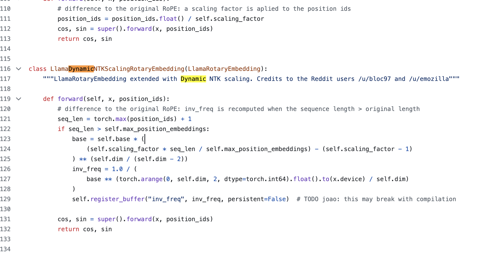

需要修改modeling 的config， 把rotary position embedding 的base 参数调高100倍，然后采用动态ntk 技术

就可以延长，如果要做的更长，比如32K，微调，实际效果就可以做200K左右的推理文本长度

https://github.com/huggingface/transformers/blob/main/src/transformers/models/llama/modeling_llama.py