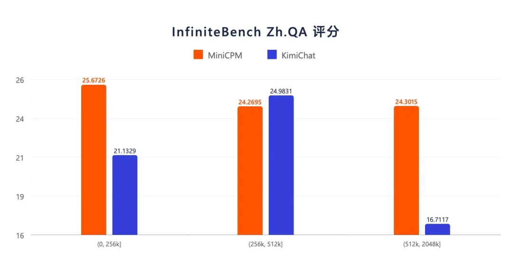
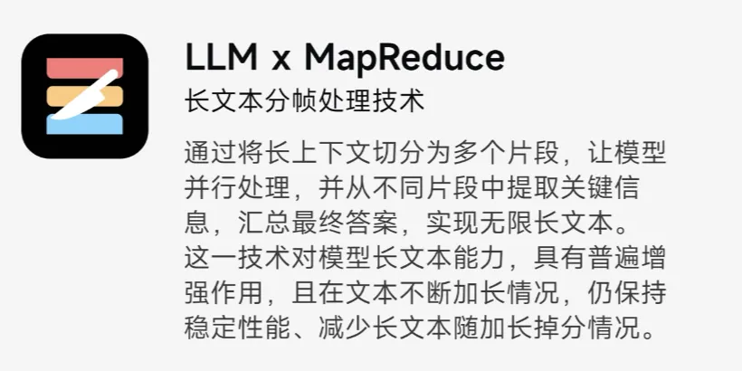
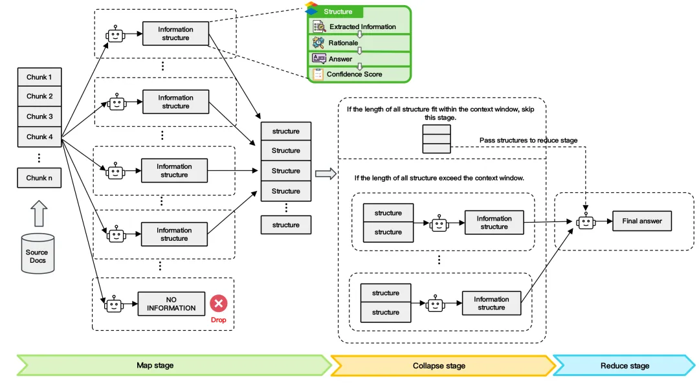

# 介绍

InfiniteBench Zh.QA 评测结果显示，4B参数的面壁小钢炮整体性能优于Kimi，在更长的文本上表现出相较更强的稳定性。

LLMxMapReduce 技术框架图
拥有无限上下文， 可以让模型一次性读取不限字数的书籍或不限量的学术论文、简历等材料，成为你身边更加强大的终端个人助手。模型还可以读取你的大众点评美食、酒店评价、微博互动内容，并牢牢记住你和AI 跨越多年的聊天记录，成为最懂你的AI陪伴者。

# 参考

[1] 4B小模型掀翻大模型牌桌！性能超GPT-3.5，无限长文本性能超Kimi...，https://mp.weixin.qq.com/s/TIm-k2AOac_2Pcj6o_z6Sw