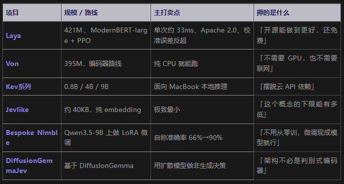

# 一、大模型常见分类按能力/用途划分

1. 大语言模型 LLM（System 2，系统二）：自回归文本生成模型，逐token输出文字，擅长长文本推理、写文案、复杂规划。代表：GPT、Claude、DeepSeek、Qwen。日常大家说的“大模型”基本都是这类。
2. 决策模型 System One（系统一）：不生成文本，直接输出结构化结果+概率，专门做快速判断、分类、打分、真假校验，适合Agent里高频原子判断。Jev就属于这一类 。
3. 多模态大模型：同时处理文本、图片、音频、视频，如Gemini、GPT-4V。
4. 嵌入模型（Embedding）：把文本转为向量，用于检索、知识库，不做推理生成。
5. 图像/音频生成模型：文生图、语音合成（Stable Diffusion、Suno）备注：卡尼曼《思考，快与慢》：系统1=直觉快判断；系统2=慢速深度推理。Agent架构流行快慢搭配：System2大模型做顶层规划，System1（Jev这类）做大量低成本小判断。

问题原语只有三种：

- Choice：从最多 255 个预定义选项里选一个
- Score：在有序量表上打一个分
- Noul：输出一个 0 到 1 的是非概率

# 二、 开源项目

