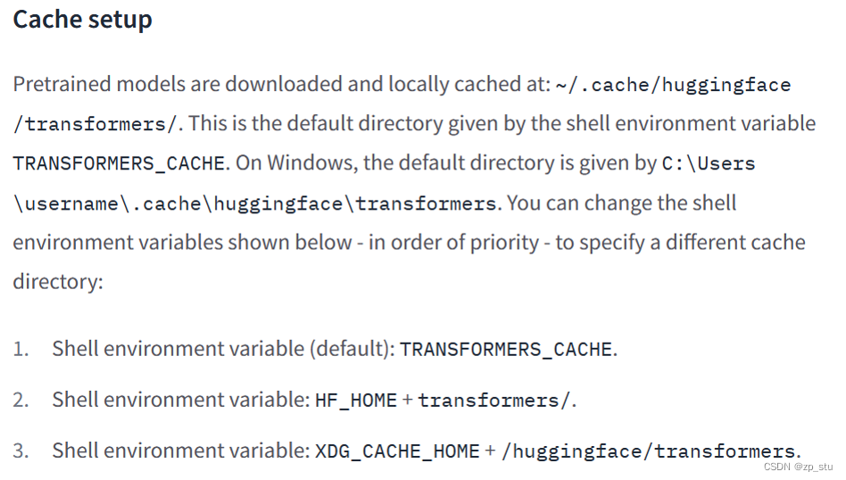

# 参数

[1] 【修改huggingface transformers默认缓存文件夹】，https://blog.csdn.net/zp_stu/article/details/126410323#:~:text=%E5%9C%A8%E7%94%A8%E6%88%B7%E7%8E%AF%E5%A2%83%E5%8F%98%E9%87%8FPath%E6%88%96%E8%80%85%E7%B3%BB%E7%BB%9F%E7%8E%AF%E5%A2%83%E5%8F%98%E9%9B%B6PATH%E4%B8%AD%E6%B7%BB%E5%8A%A0%EF%BC%9A%20%25TRANSFORMERS_CACHE%25%20%E7%AC%AC%E4%BA%8C%E7%A7%8D%E6%96%B9%E5%BC%8F%EF%BC%9A%E5%9C%A8%E8%B0%83%E7%94%A8from_pretrained%E5%87%BD%E6%95%B0%E6%97%B6%E4%BD%BF%E7%94%A8cache_dir%E5%85%A5%E5%8F%82%EF%BC%8C%E6%8C%87%E5%AE%9A%E7%BC%93%E5%AD%98%E6%96%87%E4%BB%B6%E5%A4%B9%E5%90%8D,%E5%A6%82%E6%8C%87%E5%AE%9A%E7%BC%93%E5%AD%98%E4%BD%8D%E7%BD%AE%E4%B8%BA%E5%BD%93%E5%89%8D%E7%9B%AE%E5%BD%95%EF%BC%9A%20AutoModel.from_pretrained%28%27bert-base-chinese%27%2C%20cache_dir%3D%27.%2F%27%29%201