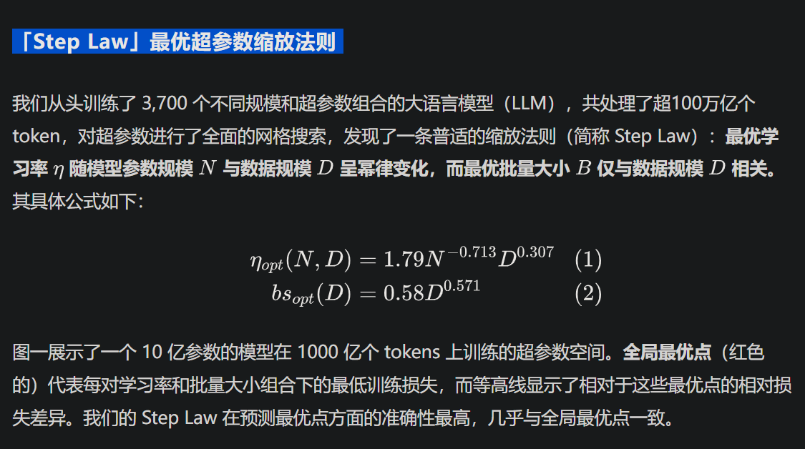
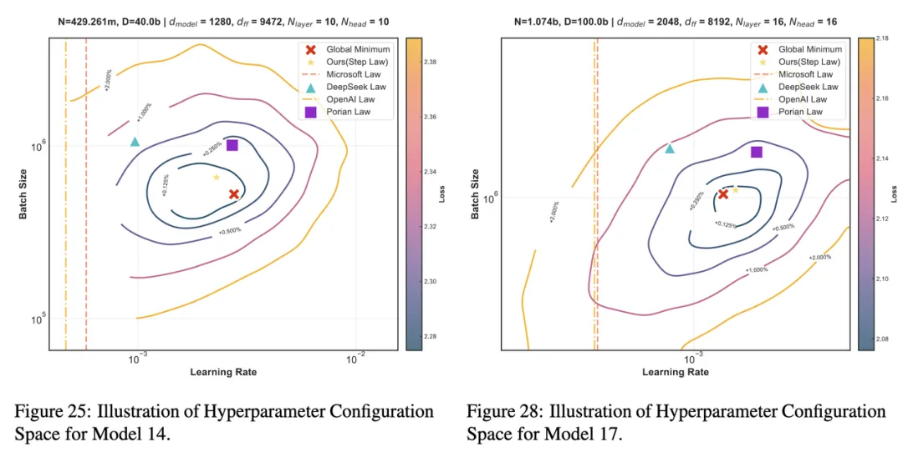
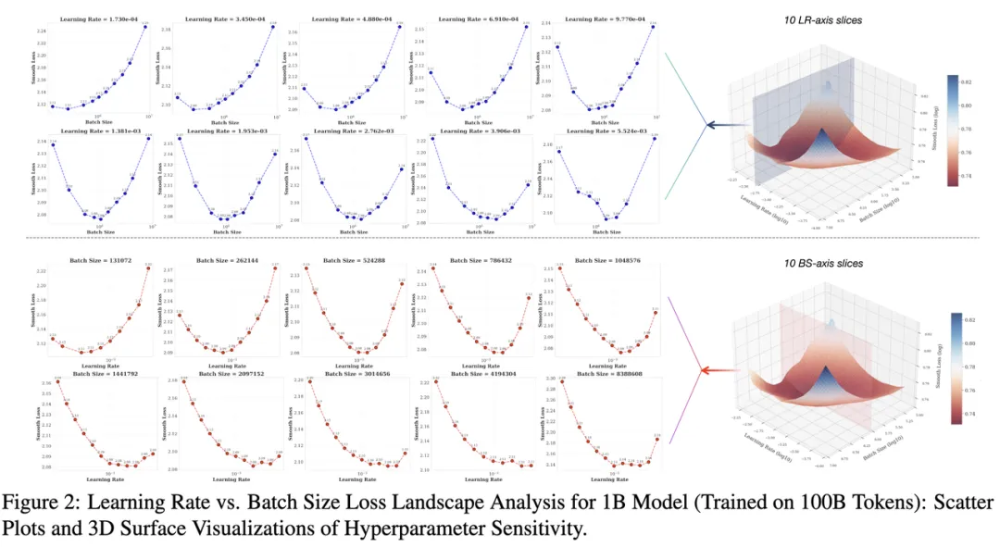
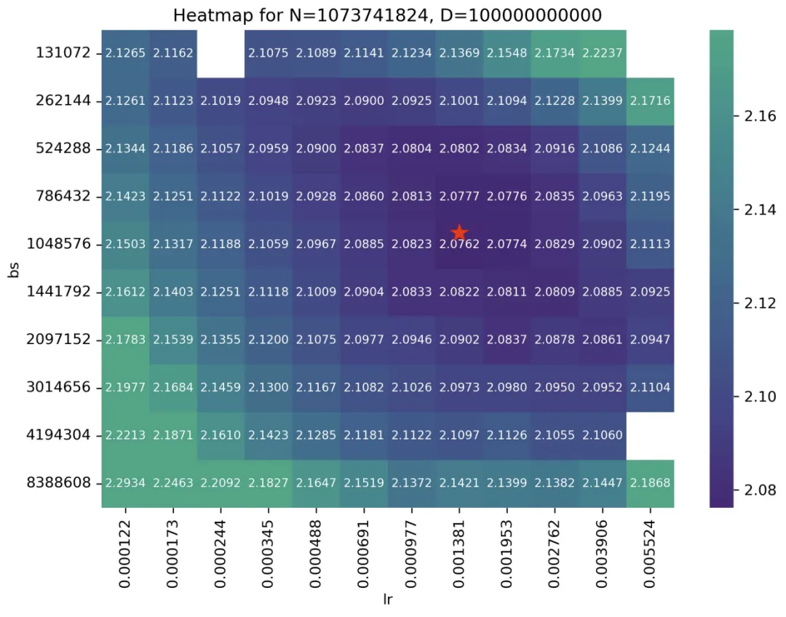
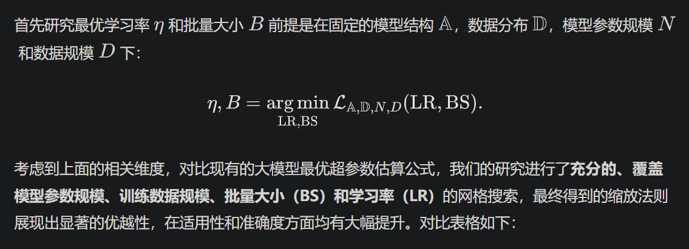
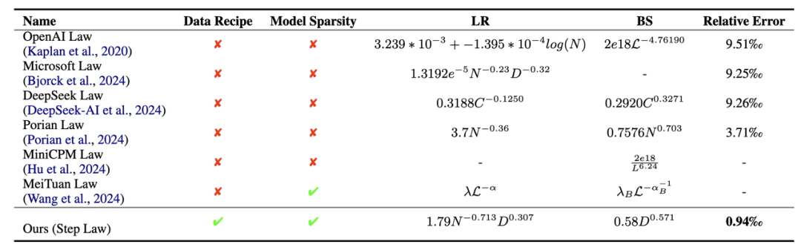

# 1. 资源

- 论文链接：https://arxiv.org/abs/2503.04715
- 工具链接：https://step-law.github.io/
- 开源地址：https://github.com/step-law/steplaw
- 训练过程：https://wandb.ai/billzid/predictable-scale

# 2. 介绍

我们的研究发现，最优学习率与模型参数规模及数据规模呈幂律关系，而最优批量大小则主要随数据规模变化。在固定模型参数和数据规模的条件下，我们进一步分析了超参数的损失函数曲面，揭示了其凸性特征。这一凸优化特性意味着存在一个稳定的超参数最优区间，使得在合理范围内调整超参数时性能仍能保持接近最佳水平。
基于这一研究，我们为社区贡献了一套通用的即插即用超参数优化工具。在测试集上的实验表明，该工具估算的超参数配置与全局最优 LLM 性能（通过穷举搜索得到）之间的误差仅为 0.09%，展现出了极高的可靠性和有效性。更重要的是，这些规律在不同模型稀疏度、训练数据分布以及模型结构变化下均表现出惊人的鲁棒性。
据我们所知，这是首个同时适用于不同模型结构（如专家混合模型 Mixture-of-Experts 和稠密 Transformer 结构）以及不同数据分布的最优超参数缩放定律的研究。这项研究的实验规模空前，消耗了近百万小时的 NVIDIA H800 GPU 计算资源，从零开始训练了 3,700 个不同模型尺寸和超参数配置的 LLM，总计处理了约 100 万亿个 tokens。

图一：在 400M 的 Dense LLM 上训练 40B Token（左）和在 1B 的 Dense LLM 上训练100B Token（右）的超参-损失等高线图

图二：Learning Rate 与 Batch Size 在 1B 模型训练 100B Token 上的损失分布。散点图（左）与 3D 曲面（右）图中的每一个实心点都是真实值，是 120 个从头训练的一个小模型，在训练结束之后的收敛 Loss

为了展示这样的凸性，研究员们构造了如右图一样的 3 维空间，空间的横轴为 Learning Rate，纵轴为 Batch-size，高度轴为 Loss。对于这个三维空间我们进行横面和竖面的切割，如左上图得到固定不同的 Learning Rate 情况下，最终收敛的 Train Smoothed Loss随着 Batchsize 的变化。而左下图是固定不同的 Batchsize 情况下，最终收敛的 Train Smoothed Loss 随着 Learning Rate 的变化。可以显著的观测到一种凸性，且在凸性的底端，是一个相对平坦的区域。这意味着 Optimal Learning Rate 和 Batchsize 很可能是一个比较大区域。

为了便于学界和业界应用，我们推出了一款通用的最优超参数估算工具——（https://step-law.github.io），其预测结果与穷举搜索的全局最优超参数相比，性能仅有 0.09% 的差距。同时，我们还在该网站上公开了所有超参数组合的 loss 热力图，以进一步推动相关研究。

图三：1B 模型、100B Token 训练上的 LR 与 BS 热力图

在这张图中，每一个点上的数字都是从头训练的一个小模型（共训练了 120 个小模型），在训练结束之后的收敛真实 Train Smoothed Loss。红点是上述公式的预估值所对应的 BS、LR 位置。其中空白的部分，是因为种种原因训练失败的点位。
所有热力图见：https://step-law.github.io/

# 3. 原理

表一：不同方法的最佳超参数缩放定律比较，其中 Data Recipe 是指是否有在不同的预训练语料的配比下的最优超参进行研究

Model Sparsity 是指是否同时支持 MoE Model 和Dense Model，以及不同的稀疏度下的 MoE 模型。LR 指的是 learning Schedule 中的峰值 Learning Rate，其中 BS 值得是 Token Wise 的 Batch Size。

传统学习率衰减方案将最小学习率设为最大值的十分之一 (max_lr/10)，而我们提出的方案则采用恒定的绝对最小值 (10^-5)。从等高线图可以看出，传统衰减方法使得最优学习率区域出现明显的左偏分布——即损失最小区域向较低学习率区间显著偏移。
我们揭示了传统学习率调度方案的局限性：采用较高初始峰值学习率时，其退火机制会同步抬升最低学习率阈值。这种耦合设计在训练末期会使学习率超出理想区间，过大的参数更新幅度引发损失函数在收敛阶段持续振荡。相比之下，固定最小学习率策略通过解耦初始学习率与终值学习率的关联，在训练后期始终维持符合梯度下降动态特性的更新步长。
此外，这种固定最终较小最终学习率的策略也与业界的训练经验相匹配，更有实际应用价值。

退火机制：随着训练的进行，学习率通常会逐渐降低（即“退火”），以便在训练后期进行更精细的参数更新。然而，这种调度通常是耦合的，即高初始学习率也提高了最低学习率的阈值。

公式拟合：

曲线表示超参数缩放定律的预测结果，阴影区域表示基于采样拟合策略得到参数不确定性范围。图上的每一个点，背后都代表着 45~120 个采用了不同的超参的从头训练的模型。图上的每一个点位都在不同的 Model Size、Data Size 下通过 Grid Search 得到的最优的超参 (Optimal Learning Rate，Optimal Batch Size)。这张图总共涉及了 1912 个从头训练的 LLM。
真值和拟合方法开源在 https://github.com/step-law/steplaw。

# 参考

[1] 3700次预训练总结超参规律，开源海量实验，告别盲猜, https://mp.weixin.qq.com/s/sgNsFy1zFvN7BNBB0aSTZQ