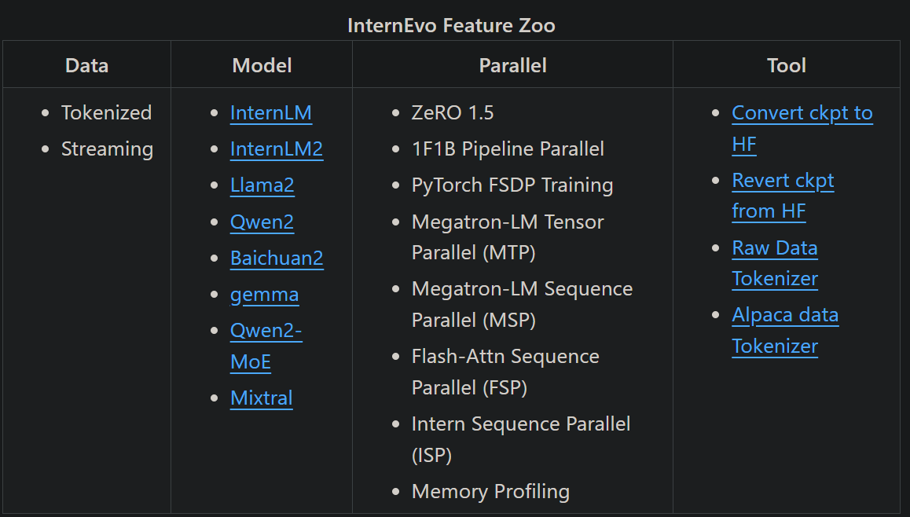

InternEvo
- 做了多节点和数据packing的加速
- Github (257 stars): https://github.com/InternLM/InternEvo
- 文档：https://internevo.readthedocs.io/zh-cn/latest/?badge=latest
- 
- InternEvo 支持张量并行、流水线并行、序列并行、数据并行和 ZeRO1.5 等并行化训练策略。在初始化分布式环境时，我们需要指定张量并行大小、流水线并行大小、数据并行大小以及 ZeRO1.5 策略。