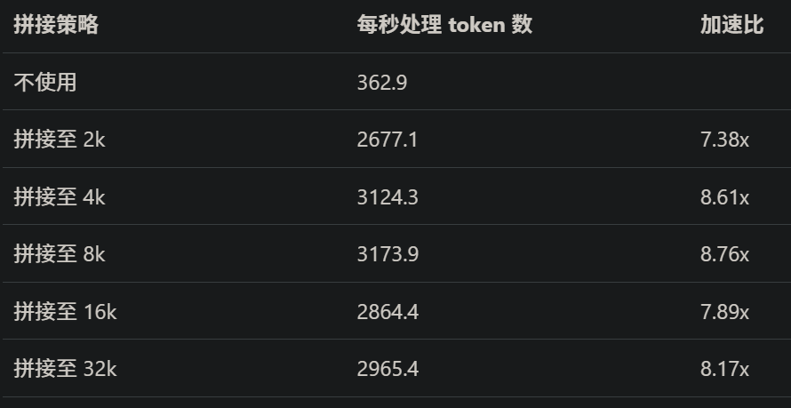

对于大型语言模型（LLM）的输入而言，“数据集拼接” 这一概念指的是将多个 token 序列拼接成一个单独的输入。大量的数据集都存在一个特点，即其长度分布严重偏向较短的序列，而 Transformers 模型接收固定长度的输入。因此，在模型训练过程中，通常需要将每条数据 “Pad” 至当前 batch 最长序列的长度，而 “Pad Token” 往往是某个特定的无意义的 token。

将多条数据打包在一起可以不再需要使用 “Pad Token” 进行无意义的填充，减少计算资源的浪费，同时还可以保持模型作为具有固定大小输入的静态图表示的优点。

下表展示了 InternLM2 7B 模型在 Alpaca 数据集上使用不同数据集拼接策略进行训练的速度对比，如表所示，“数据集拼接”会大幅度提升训练效率：

