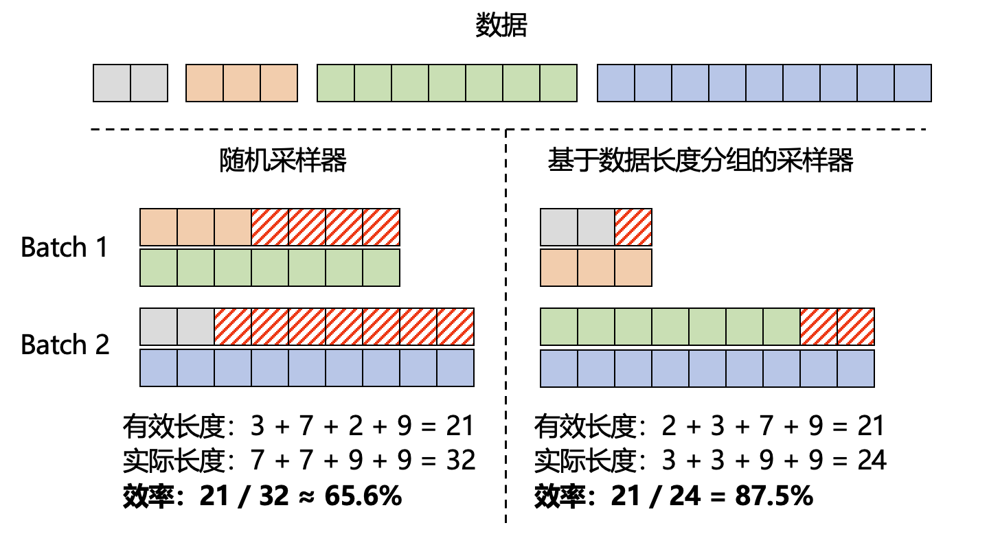

生成式大模型（例如LLM）的训练数据往往是不定长的，这就导致同一批次（batch）内的数据长短不一。为实现并行化训练，一种常见的做法是将同一批次的数据填充到最长长度。然而，这一填充（Pad）操作会导致训练的低效。如上图，假设数据内各样本的长度分别为 2、3、7、9，期望分为2个批次进行训练，那么如果使用默认的随机采样器（左侧），数据处理阶段会引入过多的填充数据，实际效率只有65.6%。

现阶段有两种技术方案可以解决 / 缓解这一问题（两者选其一即可，优先考虑 数据拼接技术）：

1. 利用 数据拼接技术，将多条数据拼接至训练支持的最大长度。这一做法可以确保同一批次内的数据长度完全一致，进而避免了填充数据所导致的训练效率降低。具体可参考 数据拼接文档 。

   - 优点: 可以合并多个数据样本，显著降低训练 iter 数，加速效果好。
   - 缺点: 随机合并的多个数据样本间会互相影响，进而影响训练效果（实际影响程度未知）；数据进行了合并，丢失了一定数据随机性。

2. （本文）利用 基于数据长度分组的采样器，在构建批次数据时，基于实际长度进行排序，确保同一批次内的数据长度尽可能相近，进而尽可能减少填充的长度。如上图右侧，利用该采样器后，同样的数据效率将提升至87.5%。

    - 优点: 每条数据依然独立存在（独立计算 attention），避免数据拼接技术导致的数据样本间的互相影响；数据进行了分组，丢失了一定数据随机性。
    - 缺点: 在数据样本长度比较一致的情况下，加速效果一般。