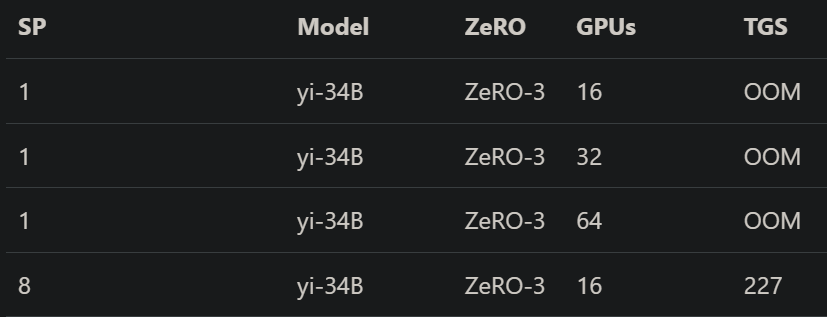
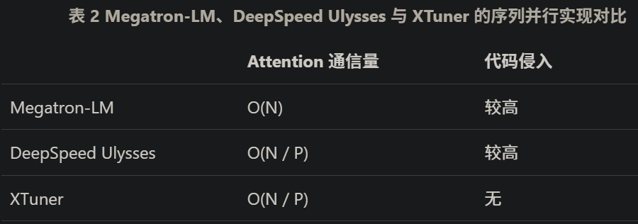
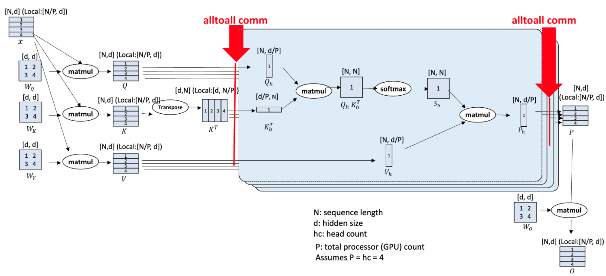

# 1. 简介

在生成式 AI 领域，长文档摘要和视频生成等任务都需要模型具有超长上下文的能力。 如何训练超长上下文的模型，既是生成式 AI 算法领域的研究热点，也是 AI Infra 领域的难点 随着 AI 模型参数量的不断增大，为了能够训练超长上下文，通常需要使用一些复杂的并行策略，如 Nvidia Megatron, DeepSpeed Ulysses 等工作。这些工作虽然解决了超长上下文的训练问题，但需要开发者具有一定的 AI Infra 的知识，对生成式 AI 的研究人员很不友好。 为了让研究人员能够更加便捷地训练超长上下文模型，促进生成式 AI 领域的发展，XTuner 开发了一套超长上下文训练解决方案：

- 支持全量训练 超过百万个 tokens 的超长序列
- 支持 百 B 级 模型训练：XTuner 的序列并行不仅支持长序列训练，还可结合 ZeRO3 显存优化策略训练大尺寸模型
- 开箱即用：可直接训练 Transformers 算法库内和 HF Hub 上的模型
- 完全通用的序列并行 API 抽象

优化目标

尽管开源模型支持的序列长度不断被刷新，但主流的显存优化策略（如 ZeRO 系列）却不足以解决大模型、长序列训练问题。 如表 1 所示，使用 ZeRO-3 显存优化策略训练超长序列时，单纯增加 GPU 数量无法解决超长序列带来的 OOM 问题； 这是因为，ZeRO-3 只能优化模型参数和优化器状态占用的显存， 超长训列训练过程中的显存开销主要来自激活值，而非模型参数和优化器状态。

表 1 不同序列长度时，使用 ZeRO-3 训练 128k 上下文 yi-34B 模型的训练情况



为解决长序列训练过程中的显存问题，Megatron-LM 团队和 DeepSpeed 团队分别提出了两种序列并行算法，通过对长序列进行切分的方法来降低单 GPU 上计算的序列长度。XTuner 中的序列并行设计思路参考了 DeepSpeed 的工作 DeepSpeed Ulysses，并加以优化， 以实现一键开启序列并行策略 。三者的对比如下：



# 2. 原理

XTuner 中的序列并行设计思路参考了 DeepSpeed 的工作 [DeepSpeed Ulysses](https://arxiv.org/abs/2309.14509)，并加以优化，以达到直接基于 transformers 算法库或 Huggingface Hub 上的开源模型训练 1M 以上超长序列的目标。



图 1 序列并行实现方案

图 1 展示了序列并行策略的实现方案。由于 Transformer 结构较为规整，除 attention 计算外，其他计算过程中 token 之间不会互相影响（即每个 token 的计算是独立的），这一条件为序列并行提供了有利条件。上图展示了序列并行的核心设计。设由 P 个 GPUs 共同计算一个长度为 N 的长序列，在 Attention 计算的第一阶段，长度为 N / P 的子序列会通过线性层投影为 Query、Key、Value。接下来， QKV Tensor 会在参与序列并行计算的多个 GPUs 之间通过高度优化的 all-to-all 通信算子汇聚，得到序列长度为 N ，但更少注意力头的子序列。注意力计算后，通过另一个 all-to-all 通信算子将其转换为长度为 N / P 的子序列，进行后续计算。伪代码如下所示。

```python
# Pseudo code for an Attention Layer
# Input: hidden_states with shape (bs, seq_len, dim)
# Output: attn_out with shape (bs, seq_len, dim)
def attn_forward(hidden_states):
    q, k, v = qkv_proj(hidden_states)
    q, k, v = reshape(q, k, v)  # (bs, q_len, dim) -> (bs, q_len, nhead, hdim)
    q, k = apply_rotary_pos_emb(q, k, cos, sin)
    sp_size = get_sequence_parallel_world_size()
    # (bs, q_len, nhead, hdim) -> (bs, q_len * sp_size, nhead / sp_size, hdim)
    q, k, v = all_to_all(q, k, v, sp_size)
    attn_out = local_attn(q, k, v)
    # (bs, q_len * sp_size, nhead / sp_size, hdim) -> (bs, q_len, nhead, hdim)
    attn_out = all_to_all(attn_out)
    attn_out = reshape(attn_out)  # (bs, q_len, nhead, hdim) -> (bs, q_len, dim)
    attn_out = o_proj(attn_out)
    return attn_out
```

