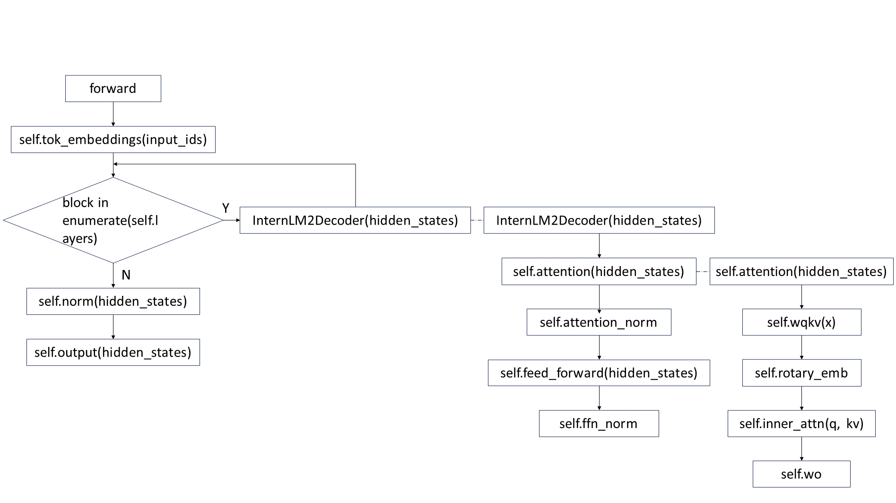

数据加载与流程
==================

.. Introduction to how data is constructed in dataloader and how data changes in forward procedure

Dataloader加载数据
----------------------------

数据的准备过程参考 `使用教程 <https://github.com/InternLM/InternEvo/blob/develop/doc/usage.md>`_ 

这里详细介绍一下在Dataloader中对数据进行pack的过程。

当 ``config.py`` 中设置 ``use_packed_dataset`` 为 ``True`` 时，通过 ``build_pack`` 函数构建pack data，构建逻辑举例如下：

假设 ``micro_bsz`` 为2， ``SEQ_LEN`` 为8，输入数据格式如下：

.. code-block:: python

    [2323, 442,  252, 341]
    [233,  3442, 322, 31, 2514, 49731, 51]
    [4326, 427,  465, 22, 314,  9725,  346, 1343]
    [24,   2562, 5,   25, 356]

``packed_length`` 的值为 ``micro_bsz * SEQ_LEN`` ，即16，对于上述输入数据，将每一条输入pack为长度为16的数据，其中，单个子句拼接超出 ``packed_length`` 的部分，截断处理，后半部分作为下一条输入的开始。全部文本pack完成之后，对于最后不足 ``packed_length`` 的部分，用 ``0`` 填充。pack之后的数据格式如下：

.. code-block:: python

    [2323, 442, 252,  341, 233,  3442, 322, 31,  2514, 49731, 51, 4326, 427,  465, 22, 314]
    [9725, 346, 1343, 24,  2562, 5,    25,  356, 0,    0,     0,  0,    0,    0,   0,  0]

``label`` 的值取data每条输入的第二个值到最后一个值，并在最后一位填充 ``-100`` 。上述数据pack之后，对应的 ``label`` 值如下：

.. code-block:: python

    [442, 252,  341,  -100, 3442, 322, 31,  2514, 49731, 51,   -100, 427,  465,  22,   314,  9725]
    [346, 1343, -100, 2562, 5,    25,  356, -100, -100,  -100, -100, -100, -100, -100, -100, -100]

当 ``config.py`` 中设置 ``use_packed_dataset`` 为 ``False`` 时，通过 ``build_unpack`` 函数构建pack data，构建逻辑举例如下：

假设 ``micro_bsz`` 为2， ``SEQ_LEN`` 为8，输入数据格式如下：

.. code-block:: python

    [2323, 442,  252, 341]
    [233,  3442, 322, 31, 2514, 49731, 51]
    [4326, 427,  465, 22, 314,  9725,  346, 1343]
    [24,   2562, 5,   25, 356,  3145,  246, 25,  1451,  67,  73, 541, 265]
    [4524, 2465, 562, 67, 26,   265,   21,  256, 145,   1345]
    [34,   14]

这里pack的过程遵循三个条件：

- pack子句的个数不能超过 ``micro_bsz`` ，即便pack之后的总长度小于 ``micro_bsz * SEQ_LEN`` ，也不能将下一个子句的内容进行pack，长度不够的部分补 ``0`` 。
- 单条子句的长度不能超过 ``SEQ_LEN`` ，超过部分直接截断丢弃，之后再与下一个子句进行pack。
- 如果子句pack之后的长度超过了 ``micro_bsz * SEQ_LEN`` ，超过部分截断丢弃。

按照上述规则，pack之后的数据格式如下：

.. code-block:: python

    [2323, 442,  252, 341, 233,  3442, 322, 31,   2514, 49731, 51,  0,  0,   0,    0,   0]
    [4326, 427,  465, 22, 314,  9725,  346, 1343, 24,   2562,  5,   25, 356, 3145, 246, 25]
    [4524, 2465, 562, 67, 26,   265,   21,  256,  34,   14,    0,   0,  0,   0,    0,   0]

``label`` 的值如下：

.. code-block:: python

    [442,  252, 341, -100, 3442, 322, 31,   2514, 49731, 51,   -100, -100, -100, -100, -100,  -100]
    [427,  465, 22,  314,  9725, 346, 1343, -100, 2562,  5,    25,   356,  3145, 246,  25,    -100]
    [2465, 562, 67,  26,   265,  21,  256,  -100, 14,    -100, -100, -100, -100, -100, -100,  -100]

注： ``use_packed_dataset`` 不设置时，默认为 ``True`` 。一般使用 ``use_packed_dataset`` 为 ``True`` 的模式训练，以提升训练效率和精度。


获取Dataloader数据
-----------------------------

通过上述方法，在Dataloader中将数据构建完成之后，在每次forward过程中，会依次从dataloader中取出数据，下面详细介绍一下数据的获取以及处理过程。

从Dataloader中取出数据
~~~~~~~~~~~~~~~~~~~~~~~~~~~~~~
.. code-block:: python

    batch_data, actual_batch_size = engine.load_batch(data_iter)

这里 ``batch_data`` 的类型为 ``list`` ，其中包含两个元素，第一个元素为 ``dict`` 类型的数据 ``data`` ，第二个元素为 ``torch.Tensor`` 类型的标签 ``label`` 。

其中，第一个元素 ``data`` 包含 ``input_ids`` 、 ``cu_seqlens`` 、 ``indexes`` 三个字段，其类型及形状分别为：

.. code-block:: python

    batch_data[0]['input_ids'] -> torch.Size([micro_num, micro_bsz * SEQ_LEN]), 保存输入语句经过tokenize之后的id值
    batch_data[0]['cu_seqlens'] -> list类型, 大小为micro_num, 其中每个元素类型为torch.Tensor, 保存pack到micro_bsz * SEQ_LEN长度的每个拼接字句的索引
    batch_data[0]['indexes'] -> torch.Size([micro_num, micro_bsz * SEQ_LEN]), 保存每个input_ids的索引值, 从0开始递增

第二个元素 ``label`` 的形状为：

.. code-block:: python

    batch_data[1] -> torch.Size([micro_num, micro_bsz * SEQ_LEN])

``micro_num`` 在 ``config.py`` 配置文件中设置，为梯度累计的大小，即经过 ``micro_num`` 次 ``forward`` + ``backward`` 之后，进行梯度更新。
``micro_bsz * SEQ_LEN`` 为 ``pack data`` 的长度，即将多条输入拼接为 ``micro_bsz * SEQ_LEN`` 长度的单条输入，以提高训练效率。

举例：
假设 ``micro_num`` 为2， ``micro_bsz`` 为2， ``SEQ_LEN`` 为8

.. code-block:: python

    batch_data[0]['input_ids']:
    tensor([[  2323, 442, 252,  341, 233,  3442, 322, 31,  2514, 49731, 51, 4326, 427,  465, 22, 314],
            [  9725, 346, 1343, 24,  2562, 5,    25,  356, 0,    0,     0,  0,    0,    0,   0,  0]])

其中第一个batch由长度分别为4,7,5的子句拼接而成，第二个batch由长度分别为3,5的子句拼接而成，则：

.. code-block:: python

    batch_data[0]['cu_seqlens']:
    tensor([[  0,  4,  11,  16],
            [  0,  3,  8,   16]])

其中，每相邻两个数字的差值，为当前子句的长度。

.. code-block:: python

    batch_data[0]['indexes']:
    tensor([[  0,  1,  2,  3,  0,  1,  2,  3,  4,  5,  6,  0,  1,  2,  3,  4],
            [  0,  1,  2,  0,  1,  2,  3,  4,  0,  1,  2,  3,  4,  5,  6,  7]])

其中，每一个数字表示了token在当前子句中的位置。如果最后一句存在padding，则indexes依然按照从0递增的方式直至padding结束。

.. code-block:: python

    batch_data[1]:
    tensor([[  442, 252,  341,  -100, 3442, 322, 31,  2514, 49731, 51,   -100, 427,  465,  22,   314,  9725],
            [  346, 1343, -100, 2562, 5,    25,  356, -100, -100,  -100, -100, -100, -100, -100, -100, -100]])

这里为对应的label的数值。


处理数据
~~~~~~~~~~~~~~~~~~~~~~~~~~~~~~~~
.. code-block:: python

    _data, _label = self._load_accum_batch(data, label)

首先，通过 ``_load_micro_batch`` 函数，将 ``data`` 和 ``label`` 中数据的第一个维度 ``micro_num`` 转化为1，并通过更新 ``offset`` 的值，依次获取每个微批次的数据。

其次，通过注册 ``data_process_func`` 对数据做进一步处理。

当 ``config.py`` 中设置 ``use_packed_dataset`` 为 ``True`` 时， ``data_process_func`` 中的流程如下:

通过 ``packed_data_normalizer`` 函数，对 ``data['indexes']`` 和 ``data['cu_seqlens']`` 做降维处理，去掉size为1的第一维，并通过 ``data['cu_seqlens']`` 中的值，计算出单个字句的最大长度，记录在 ``data['max_seqlen']`` 中。

按照上述举例，假设加载第一个批次的数据，经过 ``_load_accum_batch`` 处理后的 ``data`` 和 ``label`` 如下：

.. code-block:: python

    data['input_ids']:
    tensor([[ 2323, 442, 252,  341, 233,  3442, 322, 31,  2514, 49731, 51, 4326, 427,  465, 22, 314]])
    data['cu_seqlens']:
    tensor([  0,  4,  11,  16])
    data['indexes']:
    tensor([  0,  1,  2,  3,  0,  1,  2,  3,  4,  5,  6,  0,  1,  2,  3,  4])
    data['max_seqlen']:
    7

    label:
    tensor([[ 442, 252,  341,  -100, 3442, 322, 31,  2514, 49731, 51,   -100, 427,  465,  22,   314,  9725]])

如果张量并行模式为 ``isp`` ，且tp size（即序列化并行大小）大于1，则会在 ``data_process_func`` 中注册 ``split_data_sequence_parallel`` 函数，对数据的 ``sequence`` 维度进行切分。

假设tp size为2，则对上述数据 ``data['input_ids']`` 、 ``data['indexes']`` 和 ``label`` 切分之后的结果如下：

tp rank0 中的数据：

.. code-block:: python

    data['input_ids']:
    tensor([[ 2323, 442, 252,  341, 233,  3442, 322, 31]])
    data['indexes']:
    tensor([  0,  1,  2,  3,  0,  1,  2,  3])
    label:
    tensor([[ 442, 252,  341,  -100, 3442, 322, 31,  2514]])

tp rank1 中的数据：

.. code-block:: python

    data['input_ids']:
    tensor([[ 2514, 49731, 51, 4326, 427,  465, 22, 314]])
    data['indexes']:
    tensor([  4,  5,  6,  0,  1,  2,  3,  4])
    label:
    tensor([[ 49731, 51,   -100, 427,  465,  22,   314,  9725]])

当 ``config.py`` 中设置 ``use_packed_dataset`` 为 ``False`` 时， ``data_process_func`` 中的流程如下:

通过 ``unpack_data`` 函数对数据做unpack处理，将 ``data["input_ids"]`` 和 ``label`` 的数据恢复到unpack的格式，并从data中去除掉"cu_seqlens"和"indexes"字段。

unpack之后 ``data["input_ids"]`` 和 ``label`` 的形状为 ``torch.Size([micro_bsz, SEQ_LEN])`` 。

按照上述数据举例：

假设 ``micro_bsz`` 为2， ``SEQ_LEN`` 为8，输入数据格式如下：

.. code-block:: python

    [2323, 442,  252, 341]
    [233,  3442, 322, 31, 2514, 49731, 51]

pack之后的数据格式如下：

.. code-block:: python

    [2323, 442,  252, 341, 233,  3442, 322, 31,   2514, 49731, 51,  0,  0,   0,    0,   0]

``label`` 的值如下：

.. code-block:: python

    [442,  252, 341, -100, 3442, 322, 31,   2514, 49731, 51,   -100, -100, -100, -100, -100,  -100]

经过 ``unpack_data`` 处理之后， ``data["input_ids"]`` 和 ``label`` 分别如下：

.. code-block:: python

    data["input_ids"]:
    tensor([[2323,  442,  252,  341,  0,    0,     0,   0],
            [233,   3442, 322,  31,   2514, 49731, 51,  0]])

    label:
    tensor([[442,  252,  341,  -100, -100,  -100,  -100,  -100],
            [3442, 322,  31,   2514, 49731, 51,    -100,  -100]])

如果 ``tp`` 并行模式为 ``isp`` ，且tp size（即序列化并行大小）大于1，则会在 ``data_process_func`` 中注册 ``split_data_sequence_parallel`` 函数，对数据的 ``sequence`` 维度进行切分。

假设tp size为2，则对上述数据 ``data['input_ids']`` 和 ``label`` 切分之后的结果如下：

tp rank0 中的数据：

.. code-block:: python

    data["input_ids"]:
    tensor([[2323,  442,  252,  341],
            [233,   3442, 322,  31]])

    label:
    tensor([[442,  252,  341,  -100],
            [3442, 322,  31,   2514]])

tp rank1 中的数据：

.. code-block:: python

    data["input_ids"]:
    tensor([[0,    0,     0,   0],
            [2514, 49731, 51,  0]])

    label:
    tensor([[-100,  -100,  -100,  -100],
            [49731, 51,    -100,  -100]])


Forward过程数据格式
-------------------------------------

以internlm2模型为例，详细介绍一下整个模型在不同并行模式下的权重情况，以及在运行过程中数据的流动过程。

首先，介绍模型在不同并行模式下，权重切分的过程。

ISP并行模式下权重切分
~~~~~~~~~~~~~~~~~~~~~~~~~~~~~~~~~~~~~~~
ISP并行的具体原理请参见： `并行训练 <https://internevo.readthedocs.io/zh-cn/latest/parallel.html#internlm-tensor-parallel>`_ 

internlm2模型中，涉及weight切分的参数为："wqkv"、"wo"、"w1"、"w2"、"w3"、"output"，通过new_linear函数进行切分。

假设配置文件中设置的weight并行大小为 ``wp_size`` ，初始化之后的模型结构及权重如下：

.. code-block:: python

    InternLM2(
      (tok_embeddings): Embedding1D()
      (layers): ModuleList(
        (0): InternLM2Decoder(
          (attention): GQA(
            (rotary_emb): RotaryEmbedding()
            (wqkv): ColumnParallelLinear(in_features=hidden_size, out_features=(hidden_size + 2 * hidden_size // num_attention_heads * num_kv_attention_heads) // wp_size, bias=True)
            (inner_attn): DistributedAttention(
              (local_attn): SelfAttention(
                (dropout): Dropout(p=0.0, inplace=False)
              )
            )
            (inner_cross_attn): DistributedAttention(
              (local_attn): CrossAttention(
                (dropout): Dropout(p=0.0, inplace=False)
              )
            )
            (wo): ColumnParallelLinear(in_features=hidden_size, out_features=hidden_size // wp_size, bias=True)
          )
          (dropout1): Dropout(p=0.0, inplace=False)
          (dropout2): Dropout(p=0.0, inplace=False)
          (attention_norm): _RMSNorm(torch.Size([hidden_size]), eps=1e-05, )
          (ffn_norm): _RMSNorm(torch.Size([hidden_size]), eps=1e-05, )
          (feed_forward): FeedForward(
            (w1): ColumnParallelLinear(in_features=hidden_size, out_features=(multiple_of * ((int(hidden_size * mlp_ratio) + multiple_of - 1) // multiple_of)) // wp_size, bias=False)
            (w2): ColumnParallelLinear(in_features=multiple_of * ((int(hidden_size * mlp_ratio) + multiple_of - 1) // multiple_of), out_features=hidden_size // wp_size, bias=False)
            (w3): ColumnParallelLinear(in_features=hidden_size, out_features=(multiple_of * ((int(hidden_size * mlp_ratio) + multiple_of - 1) // multiple_of)) // wp_size, bias=False)
          )
        )
      )
      (norm): _RMSNorm(torch.Size([hidden_size]), eps=1e-05, )
      (output): ScaleColumnParallelLinear(in_features=hidden_size, out_features=vocab_size // wp_size, bias=False)
    )

MTP/MSP/FSP并行模式下权重切分
~~~~~~~~~~~~~~~~~~~~~~~~~~~~~~~~~~~~~~~~~~~~
``MTP/MSP/FSP`` 并行的具体原理请参见： `并行训练 <https://internevo.readthedocs.io/zh-cn/latest/parallel.html#internlm-tensor-parallel>`_

与 ``ISP`` 并行模式相比， ``MSP`` 并行切分权重的参数是一样的，但是切分的方式不同，在 ``ISP`` 并行模式中，所有切分参数采用列切方式，而 ``MSP`` 并行模式中，"wo"和"w2"参数采用行切方式进行切分。

假设配置文件中设置的tensor并行大小为 ``tp_size`` ，初始化之后的模型结构及权重与ISP中列出的权重结果基本一致，ISP模式中的 ``wp_size`` 对应MSP模式下的 ``tp_size`` ，有差异的"wo"和"w2"参数如下：

.. code-block:: python

    (Pdb) InternLM2(
      (tok_embeddings): Embedding1D()
      (layers): ModuleList(
        (0): InternLM2Decoder(
          (attention): GQA(

            ......

            (wo): RowParallelLinear(in_features=hidden_size // tp_size, out_features=hidden_size, bias=False)
          )

            ......

          (feed_forward): FeedForward(
            ......
            (w2): RowParallelLinear(in_features=(multiple_of * ((int(hidden_size * mlp_ratio) + multiple_of - 1) // multiple_of)) // tp_size, out_features=hidden_size, bias=False)
            ......
          )
        )
      )

      ......

    )


Forward整体流程
~~~~~~~~~~~~~~~~~~~~~~~~~~~~
internlm2模型中，forward整体流程如下图所示：



下面介绍不同并行模式下，数据在上图forward流程过程中的变化过程。

ISP并行模式下数据流程
~~~~~~~~~~~~~~~~~~~~~~~~~~~~~~~~~
假设配置文件中设置的tensor并行大小为 ``sp_size`` （在ISP模式下，张量并行大小即为序列化并行大小）

展开介绍每一步计算过程中，数据维度的变化情况。


tok_embeddings计算过程
````````````````````````````````````````
在embedding的计算过程中，对数据的seq_len维度做了切分。

输入参数及权重：

.. code-block:: python

    input_ids:
    torch.Size([1, (micro_bsz * seq_len) // sp_size])

    self.tok_embeddings.weight:
    torch.Size([vocab_size, hidden_size // wp_size])

输出结果：

.. code-block:: python

    hidden_states:
    torch.Size([1, (micro_bsz * seq_len) // sp_size, hidden_size])


attention计算过程
```````````````````````````````````````
qkv准备
^^^^^^^^^^^^^^^^^^^^^^^^^^^^^^^^^
.. code-block:: python

    qkv = self.wqkv(x)

这里计算过程，会通过 ``weight_hook`` 对之前被权重并行切分的权重做 ``All-Gather`` 操作，最终输出结果 ``qkv`` 的最后一个维度为 ``self.wqkv`` 中 ``out_features`` 经过 ``All-Gather`` 之后的维度。

注：后续所有通过new_linear函数创建的被切分过weight的权重，在forward过程中计算都会通过 ``weight_hook`` 做 ``All-Gather`` 操作。

.. code-block:: python

    qkv:
    torch.Size([1, (micro_bsz * seq_len) // sp_size, hidden_size + 2 * hidden_size // num_attention_heads * num_kv_attention_heads])

之后将qkv拆分为 ``[batch_size, seq_len, num_head, group_size, head_dim]`` 维度，并分别计算q、k、v的值：

.. code-block:: python

    qkv:
    torch.Size([1, (micro_bsz * seq_len) // sp_size, num_kv_attention_heads, num_attention_heads // num_kv_attention_heads + 2, hidden_size // num_attention_heads])
    q:
    torch.Size([1, (micro_bsz * seq_len) // sp_size, num_attention_heads, hidden_size // num_attention_heads])  # 取qkv中第四个维度前num_attention_heads // num_kv_attention_heads位对应的数值，并将第三维度与第四维度的值组合在一起
    k:
    torch.Size([1, (micro_bsz * seq_len) // sp_size, num_kv_attention_heads, hidden_size // num_attention_heads])  # 取qkv中第四个维度倒数第二位对应的数值
    v:
    torch.Size([1, (micro_bsz * seq_len) // sp_size, num_kv_attention_heads, hidden_size // num_attention_heads])  # 取qkv中第四个维度倒数第一位对应的数值

之后，将kv的值组合在一起，以便进行后续的attention计算：

.. code-block:: python

    kv:
    torch.Size([1, (micro_bsz * seq_len) // sp_size, 2, num_kv_attention_heads, hidden_size // num_attention_heads])

计算attention
^^^^^^^^^^^^^^^^^^^^^^^^^^
attention计算的过程如下：

.. code-block:: python

    context = self.inner_attn(q, kv)

这里通过dispatch的形式，根据q、k、v是分离还是组合在一起的状态，找到对应的forward函数进行attention计算。

在计算attention之前，通过 ``AllToAll`` 通信，对q和kv的 ``num_head`` 维度做 ``scatter`` ， ``seq_len`` 维度做 ``gather`` 。

.. code-block:: python

    q:
    torch.Size([1, micro_bsz * seq_len, num_attention_heads // sp_size, hidden_size // num_attention_heads]) 
    kv:
    torch.Size([1, micro_bsz * seq_len, 2, num_kv_attention_heads // sp_size, hidden_size // num_attention_heads])

调用 ``context = self.local_attn(q, kv)`` 函数进行attention计算，计算结果的维度为：

.. code-block:: python

    context:
    torch.Size([1, micro_bsz * seq_len, num_attention_heads // sp_size, hidden_size // num_attention_heads])  

在计算attention之后，再通过 ``AllToAll`` 通信，对q和kv的 ``num_head`` 维度做 ``gather`` ， ``seq_len`` 维度做 ``scatter`` 。

.. code-block:: python

    context:
    torch.Size([1, (micro_bsz * seq_len) // sp_size, num_attention_heads, hidden_size // num_attention_heads])

输出变换
^^^^^^^^^^^^^^^^^^^^^^^^^^^^^^^^^^^
通过调用 "wo" 对attention计算的输出结果做变换，输出结果的维度如下：

.. code-block:: python

    torch.Size([1, (micro_bsz * seq_len) // sp_size, hidden_size])

feed_forward计算过程
``````````````````````````````````````
在feed_forward前馈网络层，通过"w1"、"w2"、"w3"对输出结果做线性变换。变换之后的结果如下：

.. code-block:: python

    w1_o = self.w1(x)
    w3_o = self.w3(x)
    out = self.w2(Silu(w1_o, w3_o))

    w1_o:
    torch.Size([1, (micro_bsz * seq_len) // sp_size, multiple_of * ((int(hidden_size * mlp_ratio) + multiple_of - 1) // multiple_of)])
    w3_o:
    torch.Size([1, (micro_bsz * seq_len) // sp_size, multiple_of * ((int(hidden_size * mlp_ratio) + multiple_of - 1) // multiple_of)])
    out:
    torch.Size([1, (micro_bsz * seq_len) // sp_size, hidden_size])

norm计算过程
`````````````````````````
经过norm层计算之后的结果维度保持不变，为：

.. code-block:: python

    hidden_states:
    torch.Size([1, (micro_bsz * seq_len) // sp_size, hidden_size])

output计算过程
`````````````````````````
最后，经过output层将模型的最后一层输出转换为适合最终任务的格式，结果如下：

.. code-block:: python

    hidden_states:
    torch.Size([1, (micro_bsz * seq_len) // sp_size, vocab_size])


MTP/MSP/FSP并行模式下数据流程
~~~~~~~~~~~~~~~~~~~~~~~~~~~~~~~~~~~~~~~~
在 ``MTP`` 并行模式中，只有张量并行对模型权重进行切分，不涉及对数据的seq_len维度进行切分。而 ``MSP`` 和 ``FSP`` 并行模式中，均会涉及对数据进行序列化并行切分，且序列化并行与张量并行大小相同，两者共用通信组。

tok_embeddings计算过程
````````````````````````````````
在embedding的计算过程中，embedding的权重会进行切分：

.. code-block:: python

    self.tok_embeddings.weight:
    torch.Size([vocab_size, hidden_size // tp_size])

``MTP`` 张量并行模式的输入输出结果如下：

.. code-block:: python

    input_ids:
    torch.Size([1, micro_bsz * seq_len])
    hidden_states:
    torch.Size([1, micro_bsz * seq_len, hidden_size])

``MSP/FSP`` 的输入输出结果如下：

.. code-block:: python

    input_ids:
    torch.Size([1, micro_bsz * seq_len])
    hidden_states:
    torch.Size([1, (micro_bsz * seq_len) // tp_size, hidden_size])

attention计算过程
``````````````````````````````````````
在进入attention计算之前，如果是 ``MSP/FSP`` 并行模式，会通过 ``All-Gather`` 通信，将经过序列化并行切分后的数据聚集起来。因此，整个attention计算过程中， ``MTP/MSP/FSP`` 三种并行模式的参数维度一致。

在attention计算完成之后， ``wo`` 层中做线性变换时，如果是 ``MSP/FSP`` 并行模式，会通过 ``Reduce-Scatter`` 通信，将linear变换行切的结果整合，同时做序列化并行操作。

qkv准备
^^^^^^^^^^^^^^^^^^
.. code-block:: python

    qkv = self.wqkv(x)

计算后的qkv维度如下：

.. code-block:: python

    qkv:
    torch.Size([1, micro_bsz * seq_len, (hidden_size + 2 * hidden_size // num_attention_heads * num_kv_attention_heads) // tp_size])

之后将qkv拆分为 ``[batch_size, seq_len, num_head, group_size, head_dim]`` 维度，并分别计算q、k、v的值，这里会对 ``num_head`` 维度做张量并行切分：

.. code-block:: python

    qkv:
    torch.Size([1, micro_bsz * seq_len, num_kv_attention_heads // tp_size, num_attention_heads // num_kv_attention_heads + 2, hidden_size // num_attention_heads])
    q:
    torch.Size([1, micro_bsz * seq_len, num_attention_heads // tp_size, hidden_size // num_attention_heads])  # 取qkv中第四个维度前num_attention_heads // num_kv_attention_heads位对应的数值，并将第三维度与第四维度的值组合在一起
    k:
    torch.Size([1, micro_bsz * seq_len, num_kv_attention_heads // tp_size, hidden_size // num_attention_heads])  # 取qkv中第四个维度倒数第二位对应的数值
    v:
    torch.Size([1, micro_bsz * seq_len, num_kv_attention_heads // tp_size, hidden_size // num_attention_heads])  # 取qkv中第四个维度倒数第一位对应的数值

之后，将kv的值组合在一起，以便进行后续的attention计算：

.. code-block:: python

    kv:
    torch.Size([1, micro_bsz * seq_len, 2, num_kv_attention_heads // tp_size, hidden_size // num_attention_heads])

计算attention
^^^^^^^^^^^^^^^^^^^^^^^^^^
attention计算的过程如下：

.. code-block:: python

    context = self.inner_attn(q, kv)

这里直接进行attention计算，不需要像 ``ISP`` 模式中做 ``AllToAll`` 通信。

计算结果的维度为：

.. code-block:: python

    context:
    torch.Size([1, micro_bsz * seq_len, num_attention_heads // tp_size, hidden_size // num_attention_heads])  

输出变换
^^^^^^^^^^^^^^^^^^^^^^^^^^^^^^^^^^^
通过调用 "wo" 对attention计算的输出结果做变换

``MTP`` 并行模式，输出结果的维度如下：

.. code-block:: python

    torch.Size([1, micro_bsz * seq_len, hidden_size])

``MSP/FSP`` 并行模式，输出结果的维度如下：

.. code-block:: python

    torch.Size([1, (micro_bsz * seq_len) // tp_size, hidden_size])

feed_forward计算过程
``````````````````````````````````````
在feed_forward前馈网络层，通过"w1"、"w2"、"w3"对输出结果做线性变换。

``MSP/FSP`` 并行模式下，在 ``w1`` 和 ``w3`` 线性变换层之前，需要进行 ``All-Gather`` 通信。因此， ``MTP/MSP/FSP`` :w
并行模式下的输出维度相同：

.. code-block:: python

    w1_o:
    torch.Size([1, micro_bsz * seq_len, (multiple_of * ((int(hidden_size * mlp_ratio) + multiple_of - 1) // multiple_of)) // tp_size])
    w3_o:
    torch.Size([1, micro_bsz * seq_len, (multiple_of * ((int(hidden_size * mlp_ratio) + multiple_of - 1) // multiple_of)) // tp_size])

在经过"w2"层做线性变换之后，如果是 ``MSP/FSP`` 并行模式，需要进行 ``Reduce-Scatter`` 通信。

``MTP`` 并行模式，输出结果的维度如下：

.. code-block:: python

    out = self.w2(Silu(w1_o, w3_o))
    out:
    torch.Size([1, micro_bsz * seq_len, hidden_size])

``MSP/FSP`` 并行模式，输出结果的维度如下：

.. code-block:: python

    out = self.w2(Silu(w1_o, w3_o))
    out:
    torch.Size([1, (micro_bsz * seq_len) // tp_size, hidden_size])

norm计算过程
`````````````````````````
经过norm层计算之后的结果维度保持不变。

``MTP`` 并行模式，输出结果的维度如下：

.. code-block:: python

    hidden_states:
    torch.Size([1, micro_bsz * seq_len, hidden_size])

``MSP/FSP`` 并行模式，输出结果的维度如下：

.. code-block:: python

    hidden_states:
    torch.Size([1, (micro_bsz * seq_len) // tp_size, hidden_size])

output计算过程
`````````````````````````
最后，经过output层将模型的最后一层输出转换为适合最终任务的格式，结果如下：

.. code-block:: python

    hidden_states:
    torch.Size([1, micro_bsz * seq_len, vocab_size])

