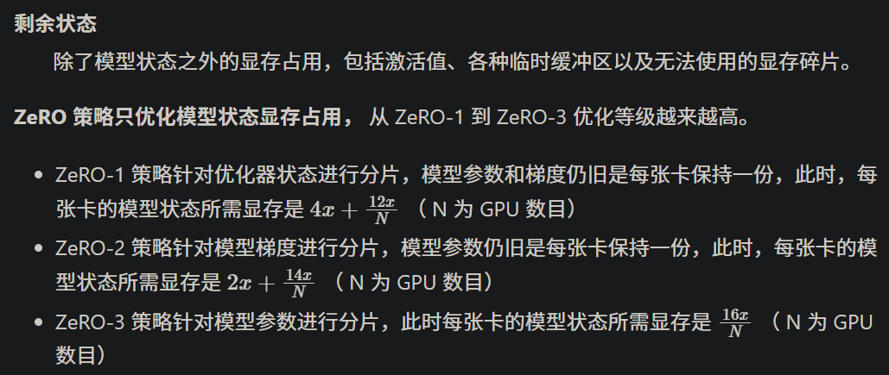

借助 DeepSpeed 中的 ZeRO 技术（零冗余优化器），可以大幅降低 LLM 训练所消耗的显存

如何选择 ZeRO 策略
模型训练阶段，每张卡中显存占用可以分为两类：

模型状态
模型参数（fp16）、模型梯度（fp16）和 Adam 优化器状态（fp32 的模型参数备份，fp32 的 momentum 和 fp32 的 variance ）。 假设模型参数量 
 x，则共需要 2x+2x+(4x+4x+4x)=16x 字节存储。

```text
小技巧

全量微调时，每增加 1B 参数，需要增加 16GB 的显存来存储模型状态
```




# 参考

[1] DeepSpeed, https://xtuner.readthedocs.io/zh-cn/latest/acceleration/deepspeed.html
