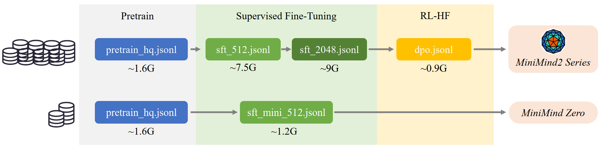
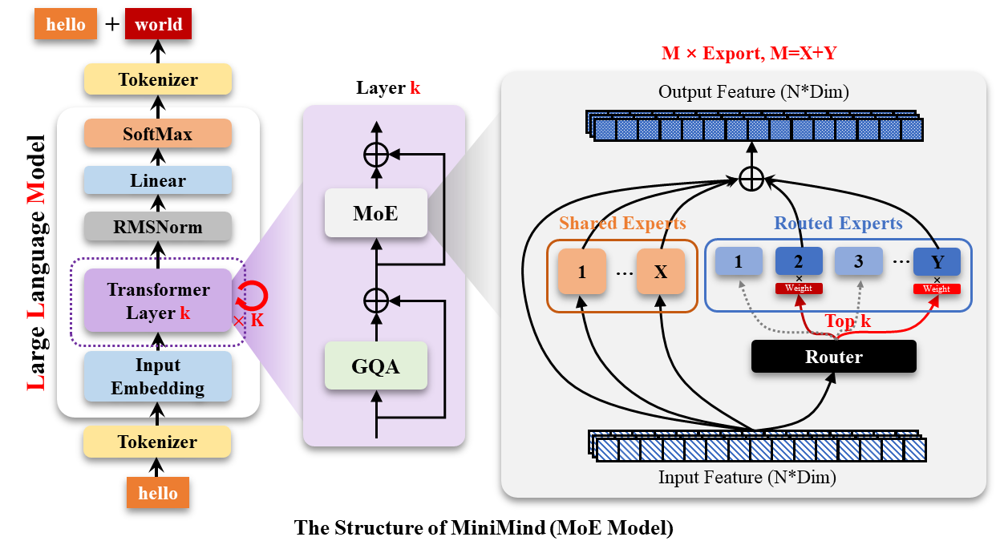

# 1. 资源
- Github(17.1k stars) LLM: https://github.com/jingyaogong/minimind
- Github(1.8k stars) VLM: https://github.com/jingyaogong/minimind-v
- 数据： https://www.modelscope.cn/datasets/gongjy/minimind_dataset/files
- 模型： https://huggingface.co/jingyaogong/MiniMind2

# 2. 特点

MiniMind是由开发者Jingyao Gong打造的开源轻量级大模型训练框架，其核心突破在于：

- 极速训练：在RTX 3090上仅需2小时完成26M参数模型的完整训练
- 超低门槛：支持消费级显卡运行，显存需求最低仅需4GB
- 中文优化：专门针对中文语料进行训练优化
- 灵活架构：提供标准Transformer和MoE（专家混合）两种模型架构

📌 项目亮点速览：

- 完整实现GPT训练全流程：数据预处理→模型训练→推理部署
- 提供HuggingFace模型转换工具
- 支持OpenAI API标准接口
- 包含详细的中文训练教程 

项目包含

- MiniMind-LLM结构的全部代码（Dense+MoE模型）。
- 包含Tokenizer分词器详细训练代码。
- 包含Pretrain、SFT、LoRA、RLHF-DPO、模型蒸馏的全过程训练代码。
- 收集、蒸馏、整理并清洗去重所有阶段的高质量数据集，且全部开源。
- 从0实现预训练、指令微调、LoRA、DPO强化学习，白盒模型蒸馏。关键算法几乎不依赖第三方封装的框架，且全部开源。
- 同时兼容transformers、trl、peft等第三方主流框架。
- 训练支持单机单卡、单机多卡(DDP、DeepSpeed)训练，支持wandb可视化训练流程。支持动态启停训练。
- 在第三方测评榜（C-Eval、C-MMLU、OpenBookQA等）进行模型测试。
- 实现Openai-Api协议的极简服务端，便于集成到第三方ChatUI使用（FastGPT、Open-WebUI等）。
- 基于streamlit实现最简聊天WebUI前端。
- 复现(蒸馏/RL)大型推理模型DeepSeek-R1的MiniMind-Reason模型，数据+模型全部开源！

# 3. 数据介绍

https://www.modelscope.cn/datasets/gongjy/minimind_dataset/files

```text
./dataset/
├── dpo.jsonl (909MB)
├── lora_identity.jsonl (22.8KB)
├── lora_medical.jsonl (34MB)
├── pretrain_hq.jsonl (1.6GB, ✨)
├── r1_mix_1024.jsonl (340MB)
├── sft_1024.jsonl (5.6GB)
├── sft_2048.jsonl (9GB)
├── sft_512.jsonl (7.5GB)
├── sft_mini_512.jsonl (1.2GB, ✨)
└── tokenizer_train.jsonl (1GB)
```

## 3.1 Tokenizer

分词器将单词从自然语言通过“词典”映射到0, 1, 36这样的数字，可以理解为数字就代表了单词在“词典”中的页码。 可以选择自己构造词表训练一个“词典”，代码可见./scripts/train_tokenizer.py（仅供学习参考，若非必要无需再自行训练，MiniMind已自带tokenizer）。 或者选择比较出名的开源大模型分词器， 正如同直接用新华/牛津词典的优点是token编码压缩率很好，缺点是页数太多，动辄数十万个词汇短语； 自己训练的分词器，优点是词表长度和内容随意控制，缺点是压缩率很低（例如"hello"也许会被拆分为"h e l l o" 五个独立的token），且生僻词难以覆盖。 “词典”的选择固然很重要，LLM的输出本质上是SoftMax到词典N个词的多分类问题，然后通过“词典”解码到自然语言。 因为MiniMind体积需要严格控制，为了避免模型头重脚轻（词嵌入embedding层参数在LLM占比太高），所以词表长度短短益善。

## 3.2 Pretrain数据

经历了MiniMind-V1的低质量预训练数据，导致模型胡言乱语的教训，2025-02-05 之后决定不再采用大规模无监督的数据集做预训练。 进而尝试把匠数大模型数据集的中文部分提取出来， 清洗出字符<512长度的大约1.6GB的语料直接拼接成预训练数据 pretrain_hq.jsonl，hq即为high quality（当然也还不算high，提升数据质量无止尽）。

## 3.3 SFT数据

匠数大模型SFT数据集 “是一个完整、格式统一、安全的大模型训练和研究资源。 从网络上的公开数据源收集并整理了大量开源数据集，对其进行了格式统一，数据清洗， 包含10M条数据的中文数据集和包含2M条数据的英文数据集。” 以上是官方介绍，下载文件后的数据总量大约在4B tokens，肯定是适合作为中文大语言模型的SFT数据的。 但是官方提供的数据格式很乱，全部用来sft代价太大。 我将把官方数据集进行了二次清洗，把含有符号污染和噪声的条目去除；另外依然只保留了总长度<512 的内容，此阶段希望通过大量对话补充预训练阶段欠缺的知识。 导出文件为sft_512.jsonl(~7.5GB)。

Magpie-SFT数据集 收集了~1M条来自Qwen2/2.5的高质量对话，我将这部分数据进一步清洗，把总长度<2048的部分导出为sft_2048.jsonl(~9GB)。 长度<1024的部分导出为sft_1024.jsonl(~5.5GB)，用大模型对话数据直接进行sft就属于“黑盒蒸馏”的范畴。

进一步清洗前两步sft的数据（只保留中文字符占比高的内容），筛选长度<512的对话，得到sft_mini_512.jsonl(~1.2GB)。

## 3.4 RLHF数据

来自Magpie-DPO数据集 大约200k条偏好数据（均是英文）生成自Llama3.1-70B/8B，可以用于训练奖励模型，优化模型回复质量，使其更加符合人类偏好。 这里将数据总长度<3000的内容重组为dpo.jsonl(~0.9GB)，包含chosen和rejected两个字段，chosen 为偏好的回复，rejected为拒绝的回复。

## 3.5 Reason数据集：
不得不说2025年2月谁能火的过DeepSeek... 也激发了我对RL引导的推理模型的浓厚兴趣，目前已经用Qwen2.5复现了R1-Zero。 如果有时间+效果work（但99%基模能力不足）我会在之后更新MiniMind基于RL训练的推理模型而不是蒸馏模型。 时间有限，最快的低成本方案依然是直接蒸馏（黑盒方式）。 耐不住R1太火，短短几天就已经存在一些R1的蒸馏数据集R1-Llama-70B、R1-Distill-SFT、 Alpaca-Distill-R1、 deepseek_r1_zh等等，纯中文的数据可能比较少。 最终整合它们，导出文件为r1_mix_1024.jsonl，数据格式和sft_X.jsonl一致。

## 3.6 更多数据集
目前已经有HqWu-HITCS/Awesome-Chinese-LLM 在收集和梳理中文LLM相关的开源模型、应用、数据集及教程等资料，并持续更新这方面的最新进展。全面且专业，Respect！

# 4. 训练



## 4.1 模型结构

MiniMind-Dense（和Llama3.1一样）使用了Transformer的Decoder-Only结构，跟GPT-3的区别在于：

- 采用了GPT-3的预标准化方法，也就是在每个Transformer子层的输入上进行归一化，而不是在输出上。具体来说，使用的是RMSNorm归一化函数。
- 用SwiGLU激活函数替代了ReLU，这样做是为了提高性能。
- 像GPT-Neo一样，去掉了绝对位置嵌入，改用了旋转位置嵌入（RoPE），这样在处理超出训练长度的推理时效果更好。

MiniMind-MoE模型，它的结构基于Llama3和Deepseek-V2/3中的MixFFN混合专家模块。
- DeepSeek-V2在前馈网络（FFN）方面，采用了更细粒度的专家分割和共享的专家隔离技术，以提高Experts的效果。

MiniMind的整体结构一致，只是在RoPE计算、推理函数和FFN层的代码上做了一些小调整。 其结构如下图（重绘版）：



# 参考

[1] 17.1K star！两小时就能训练出专属于自己的个性化小模型，这个开源项目让AI触手可及！https://mp.weixin.qq.com/s/_P_upkRuHoQfhWEqvGaQYQ