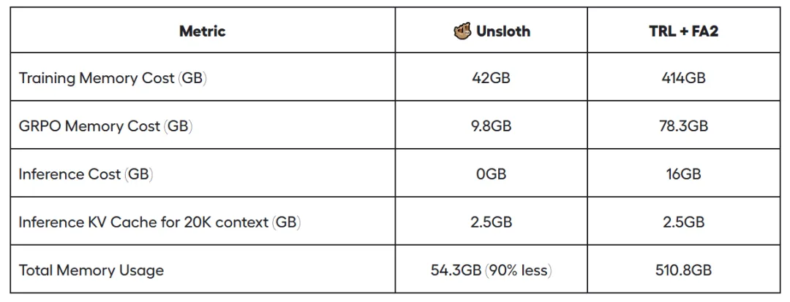
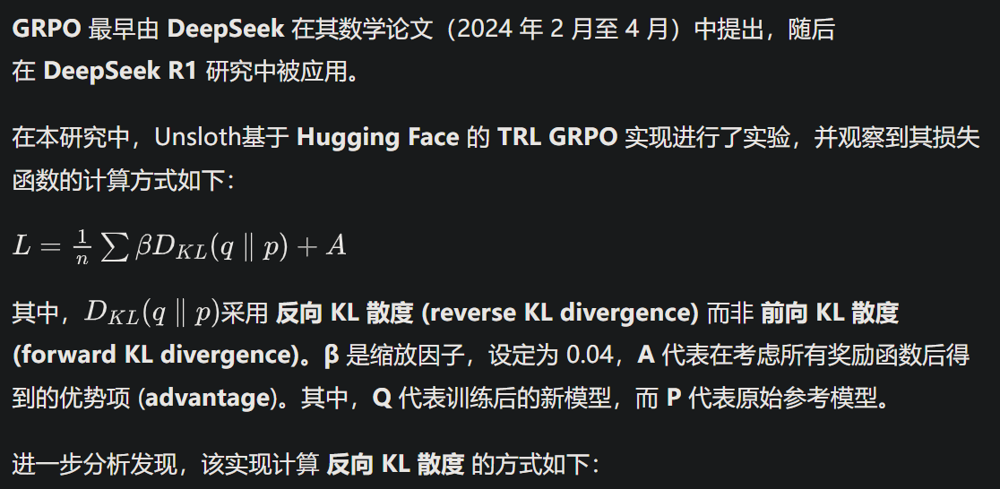
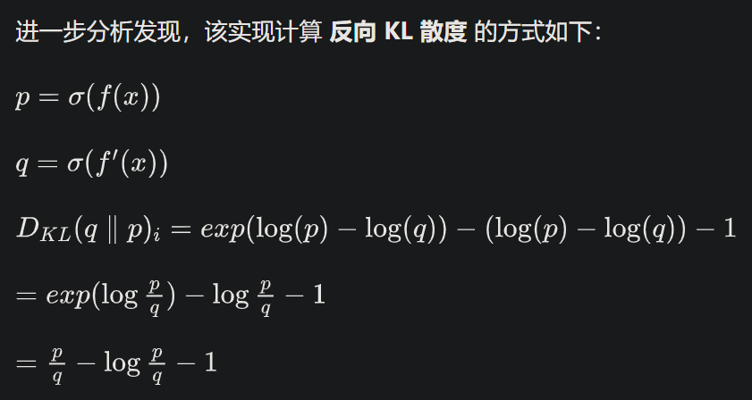
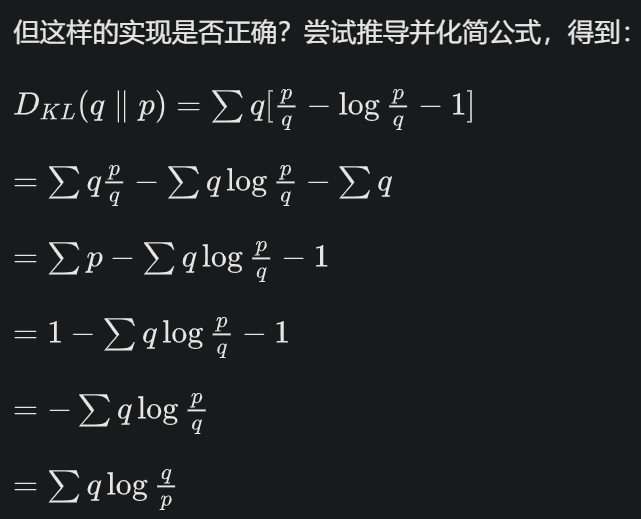
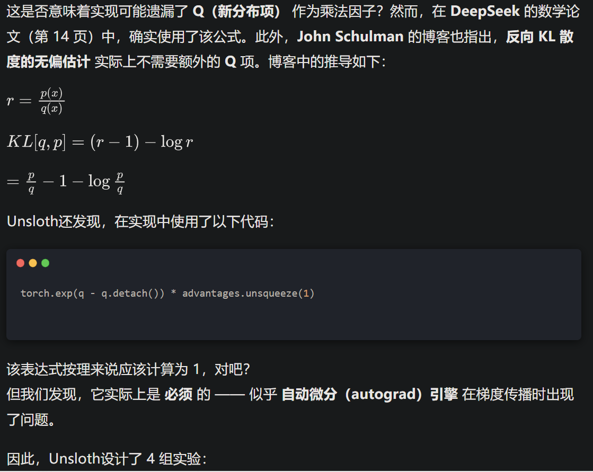

# 1. 简介

你现在可以使用 仅 5GB 的显存 训练自己的推理模型，适用于 Qwen2.5 (1.5B)。

目前，实现更长的上下文长度是 GRPO 面临的主要挑战之一。Unsloth新开发的 Unsloth Efficient GRPO 算法，在显存占用 减少 90% 的情况下，实现了 10 倍更长的上下文长度，相比所有其他 GRPO LoRA/QLoRA 实现，包括使用 Flash Attention 2 (FA2) 的版本，都更加高效。

在 TRL + FA2 组合的 GRPO 训练设置下，Llama 3.1 (8B) 在 20K 上下文长度 下训练需要 510.8GB 显存。然而，Unsloth 通过 90% 的显存优化，将同样设置下的显存需求降至 仅 54.3GB。

免费试用Unsloth的 GRPO notebook，体验 10 倍更长的上下文：  Llama 3.1 (8B)

https://colab.research.google.com/github/unslothai/notebooks/blob/main/nb/Llama3.1_(8B)-GRPO.ipynb

# 2. 原理

## 2.1 长上下文下减少 90% 显存

使用 Unsloth 进行 GRPO 训练时，通过多个优化策略，将 显存占用减少超过 90%，相比标准的 Flash Attention 2 实现显著降低。  例如，在 20K 上下文长度，每个提示生成 8 个答案 的情况下，Unsloth 仅需 54.3GB 显存（Llama 3.1 8B），而标准实现需要 510.8GB（减少 90%）。

全新的 高效线性 GRPO 训练算法 使显存消耗减少 8 倍 以上，同时借助 torch.compile 加速，使 num_generations = 8 和 20K 上下文长度 时的计算速度更快，减少 68.5GB 显存占用。

采用了 Unsloth 智能梯度检查点算法。该算法能够 异步将中间激活值卸载到系统 RAM，仅损失 1% 的计算速度，但可以 节省高达 372GB 显存（针对 num_generations = 8）。通过进一步的 梯度累积，还能进一步降低显存需求。

Unsloth 还可以 与底层推理引擎（vLLM）共享相同的 GPU/CUDA 显存空间，不同于其他实现方式。这一优化进一步减少 16GB 显存 需求。

在标准的 GRPO 实现中，需要创建两个 (8, 20K) 大小的 logits 来计算 GRPO 损失。这将占用：2 * 2 字节 * 8（生成数量）* 20K（上下文长度）* 128256（词汇表大小）= 78.3GB 显存。

Unsloth 通过显存优化，使长上下文 GRPO 训练的显存消耗减少至 1/8，因此 在 20K 上下文长度下，仅需额外 9.8GB 显存！

此外，需要将 KV 缓存 (KV Cache) 存储为 16 位 精度。在Llama 3.1 (8B) 具有 32 层，且 K 和 V 维度均为 1024。在 20K 上下文长度 下，KV 缓存的显存占用计算如下：  2 * 2 字节 * 32 层 * 20K 上下文长度 * 1024 = 2.5GB/批次。通常情况下，将 vLLM 的批量大小 (batch size) 设为 8，但为了节省显存，计算时默认批量大小设为 1。否则，KV 缓存将占用 20GB 显存。

## 2.2 Unsloth Efficient GRPO 算法

Unsloth的灵感来源于 Horace He 的 线性交叉熵 (linear cross entropy) 实现，并成功在 GRPO 中应用了这一方法！在此过程中，发现了一些意外的现象：

参考 GRPO 实现采用的是 反向 KL 散度 (reverse KL divergence)，而非前向 KL 散度 (forward KL divergence)。

在 float16 混合精度 (mixed precision)（以及 float8）下，若直接实现线性交叉熵，并使用自动混合精度缩放机制 (automatic mixed precision scaling mechanisms)，可能会导致计算失败或数值不稳定，除非经过特殊处理。

在 GRPO 损失 (GRPO loss) 的实现过程中，发现一些额外的异常，主要与 反向 KL 散度 的计算公式有关。

## 2.3 GRPO 的数学原理及发现的问题

因此，Unsloth设计了 4 组实验：

- 红色曲线：使用参考实现进行标准 GRPO
- 蓝色曲线：去掉 detach 代码
- 黄色曲线：完整的反向 KL，并添加额外项
- 绿色曲线：使用前向 KL 散度

通常情况下，移除 detach 会导致训练完全失效，因此必须保留它——这可能需要进一步研究。此外，其他实现似乎都相差无几？或许需要运行模型更长时间，以观察是否会产生不同的效果。

在所有实现中，我们都使用了 logsumexp 技巧

# 参考

[1] 仅54GB训练20K上下文！Unsloth GRPO算法暴降90%显存, https://mp.weixin.qq.com/s/uJQoyNAUj9f2iLbp0PABRw
[2] 原文链接：https://unsloth.ai/blog/grpo