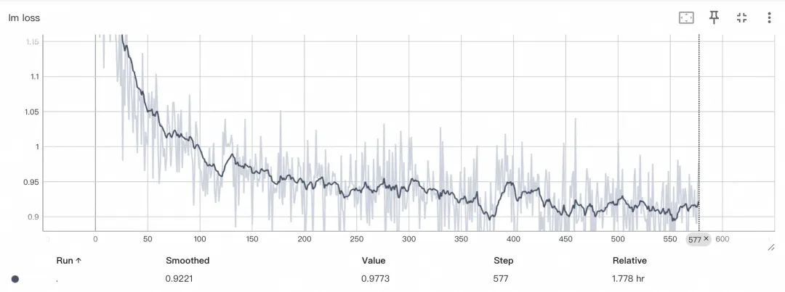

# MoE训练（Megatron-SWIFT）
ms-swift引入了Megatron的并行技术来加速大模型的训练，包括数据并行、张量并行、流水线并行、序列并行，上下文并行，专家并行。支持Qwen3、Qwen3-MoE、Qwen2.5、Llama3、Deepseek-R1蒸馏系等模型的预训练和微调。

对于环境准备（镜像）和HF与MCore模型权重的转换，可以参考Megatron-SWIFT训练文档，这里不详细展开：https://swift.readthedocs.io/zh-cn/latest/Instruction/Megatron-SWIFT%E8%AE%AD%E7%BB%83.html

我们使用DLC启动训练命令，训练环境是2机8 * 80GiB A800：

```bash
# https://help.aliyun.com/zh/pai/user-guide/general-environment-variables
# 请确保两个节点的保存权重路径相同
NNODES=$WORLD_SIZE \
NODE_RANK=$RANK \
megatron sft \
    --load Qwen3-30B-A3B-Base-mcore \
    --dataset 'liucong/Chinese-DeepSeek-R1-Distill-data-110k-SFT' \
    --tensor_model_parallel_size 2 \
    --expert_model_parallel_size 8 \
    --moe_grouped_gemm true \
    --moe_shared_expert_overlap true \
    --moe_aux_loss_coeff 0.01 \
    --micro_batch_size 1 \
    --global_batch_size 16 \
    --packing true \
    --recompute_granularity full \
    --recompute_method uniform \
    --recompute_num_layers 1 \
    --train_iters 2000 \
    --eval_iters 50 \
    --finetune true \
    --cross_entropy_loss_fusion true \
    --lr 1e-5 \
    --lr_warmup_iters 100 \
    --min_lr 1e-6 \
    --save megatron_output/Qwen3-30B-A3B-Base \
    --eval_interval 200 \
    --save_interval 200 \
    --max_length 8192 \
    --num_workers 8 \
    --dataset_num_proc 8 \
    --no_save_optim true \
    --no_save_rng true \
    --sequence_parallel true \
    --use_flash_attn true
```



使用`megatron sft`和`swift sft`进行Qwen3-30B-A3B模型全参数训练速度/显存占用对比如下：

| 项目         | Megatron-LM | DeepSpeed-ZeRO2 | DeepSpeed-ZeRO3 |
|--------------|-------------|------------------|------------------|
| 训练速度     | 9.6s/it     | -                | 91.2s/it         |
| 显存占用     | 16×60GiB    | OOM              | 16×80GiB         |


# 参考

[1] https://mp.weixin.qq.com/s/nfSfGjDBmzvgnk2AzMxFrQ