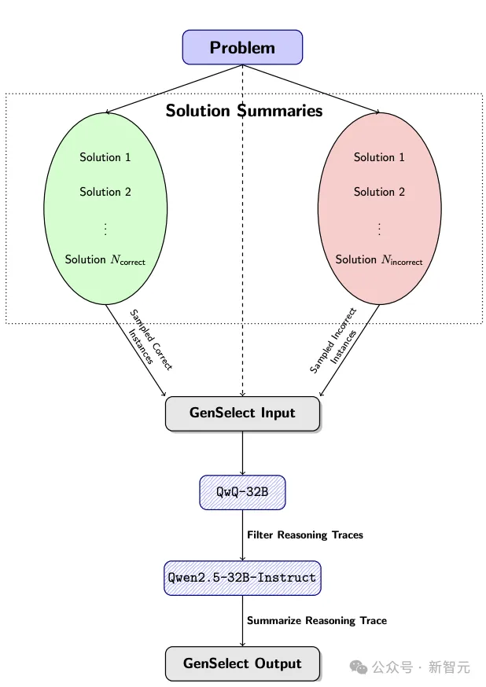
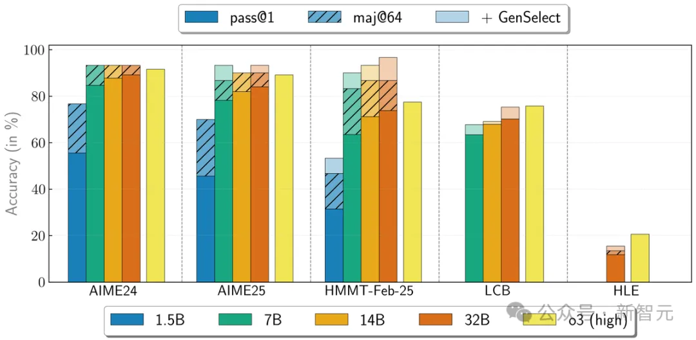
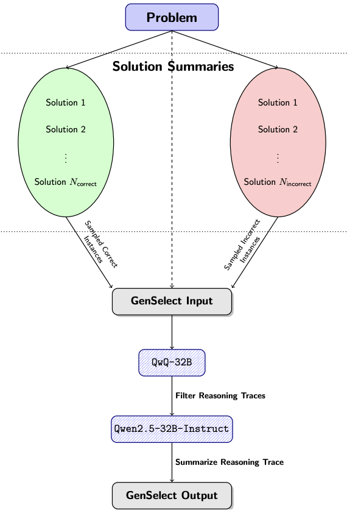
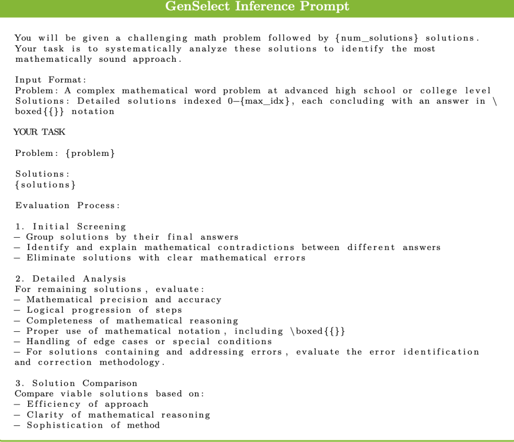

# 资源

https://x.com/NVIDIAAIDev/status/1946281437935567011
https://huggingface.co/blog/nvidia/openreasoning-nemotron 
https://x.com/josephpollack/status/1946486918696313257
https://x.com/igtmn/status/1946585046552658358

论文地址：https://arxiv.org/abs/2504.16891

# 方法
基于Qwen2.5架构，采用DeepSeek-R1-0528生成数据，英伟达推出的OpenReasoning-Nemotron模型，以超强推理能力突破数学、科学、代码任务，在多个基准测试中创下新纪录！数学上，更是超越了o3!

而且这次没有进行任何在线强化学习，只进行了有监督微调（SFT）。

使用GenSelect@64，在多个数学基准测试中超越了OpenAI o3（高算力版）。

有另一个令人惊讶的结果：这些模型只是针对数学问题训练了GenSelect算法，但它竟然也泛化到了代码任务上！

32B模型的LCB得分从70.2（pass@1）提升到75.3（GenSelect@16）。

需要注意的是，这里没有使用强化学习（RL），但仍然观察到从数学到代码的强大泛化能力！

意外的现象
首先澄清一点，这是一次「研究性质」模型发布，主要目标是验证生成的新数据的价值，并探索仅通过监督微调（SFT）能将性能推到何种程度。

这次仅针对数学、代码和科学推理任务训练了模型，没有进行指令微调或强化学习人类反馈（RLHF）。

虽然这些模型在解决推理任务时表现优异，但未经进一步训练，它们可能无法胜任多轮对话或作为通用助手。

在一系列具有挑战性的推理基准测试中，模型表现出色。

7B、14B和32B模型在各自规模类别下的创下了多项最先进纪录。

---

# 数据处理方法

数据采集后，他们建立系统化流程提取问题和对应答案，使用Qwen2.5-32B-Instruct模型进行处理，具体流程如下：

问题提取：通过大语言模型识别初始帖文中的数学问题。

问题分类：采用大语言模型对每个问题进行多维度分类，并剔除所有选择题、二元判断题及无效问题。

问题转化：将证明题转化为需要相似解题技巧的答案导向型问题。

答案提取：针对非证明题，从论坛讨论中提取最终答案。

基准去污：使用基于LLM的相似度比对，剔除与主流数学基准测试高度相似的问题。

基于LLM的问题提取和精炼流程，最终超过构建了包含54万个问题的数据集，生成了320万个长推理CoT解决方案。

DeepSeek-R1和QwQ-32B等模型为每个问题生成多个解决方案候选。而较难的问题会获得更多的候选方案。

错误的解决方案通过Qwen2.5-32B-Instruct验证答案等效性来过滤。如果没有找到答案，则使用最频繁的候选答案。

在提交的本次解决方案中，他们使用了由DeepSeek-R1生成的220万个问题的子集。

1. 生成摘要

对于OpenMathReasoning数据集中的每个问题，随机抽取2到16个候选解答摘要，确保每个样本组中至少包含一个正确解答和一个错误解答。

这个过程会重复进行，直到为每个问题获得8个不同的比较组。

2. 选择并过滤答案

然后，使用GenSelect提示词，将任务交给QwQ-32B，让它从每个组中选择最有可能的解答。

GenSelect推理提示词

这个过程生成了100万个选择项，随后删除选择了错误解答的实例，将数据量过滤到565K。

3. 总结推理过程（reasoning traces）并输出

通过Qwen2.5-32B-Instruct总结上一布筛选的正确解答的推理过程，从而形成GenSelect的输出。

---

# 性能分析

现在，在开发这些模型时,还发现了两点有趣的事情。

（1）参数规模影响巨大。

1.5B模型，实际上并没有特别出色。例如，OpenMath-Nemotron-1.5B（我们之前的数学模型发布）在 AIME25 上得分为 49.5，而这个新模型得分为 45.6。

但是，7B（或更大的模型）进步就非常显著。OpenMath-7B 模型的得分为 61.2，而 OpenReasoning-7B 的得分则达到了 78.2！

因此，1.5B 模型的表现稍微下滑了，但 7B 模型在使用相同数据进行训练后提高了近 20%。

研究人员猜测可能是因为在处理较长上下文生成时，1.5B模型可能不太一致。

之前的数据集仅包含16K输出token，但这次扩展到了32K，而1.5B模型无法保持推理的一致性。

（2）模型学会了两种不同的行为。

在之前的 OpenMath 发布中，英伟达研究团队也使用了TIR数据来帮助模型学习使用Python。

由于没有时间用新的R1重新生成这些数据，他们决定将一些旧的 TIR 数据混入当前的训练集中，看看会发生什么。

他们原本期望：在训练过程中，模型仍然能够学习如何使用 Python，同时保留来自新 CoT 样本的更好推理。

然而，事实并非如此——如果你使用TIR模式来评估OpenReasoning模型，你会发现它们与OpenMath模型基本相同，这比带有CoT的新模型要差得多。

从某种角度来看，模型学会了两种不同的行为：一种是使用工具，但推理较差；另一种是不使用工具，但推理很强，两者之间没有有效的过渡。非常有趣的是，是否可以通过在TIR模式下应用在线强化学习（RL）来解决这个问题？

# 参考

[1] 「DeepSeek二代」来袭！数学暴击o3，英伟达开源LLM登顶, https://mp.weixin.qq.com/s/OeW16b_3oC39A53eH8UXtQ
[2] 英伟达AI奥赛夺冠，1.5B数学碾压DeepSeek-R1！代码全系开源，陶哲轩点赞, https://mp.weixin.qq.com/s?__biz=MzI3MTA0MTk1MA==&mid=2652589425&idx=1&sn=069a9c9e6e578c187bfacd52224f90a2&scene=21&poc_token=HDS-iWijhfkh_omlEpJm1A6zcJX5-0aw3wgZ7Ska