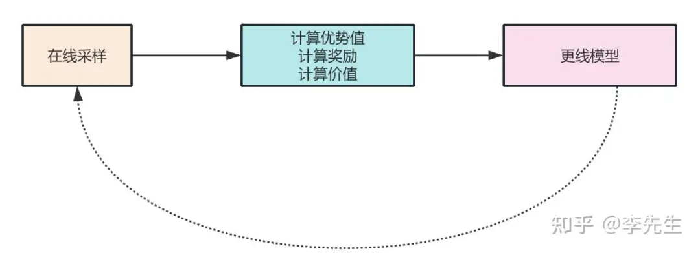
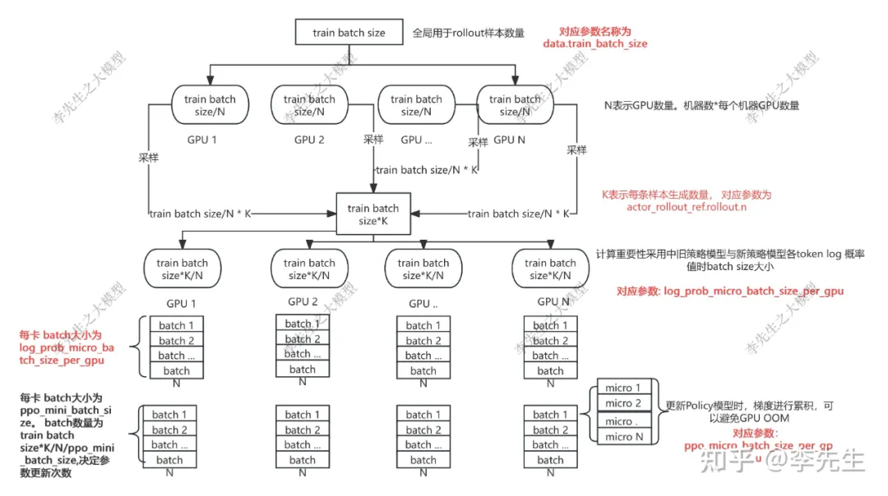
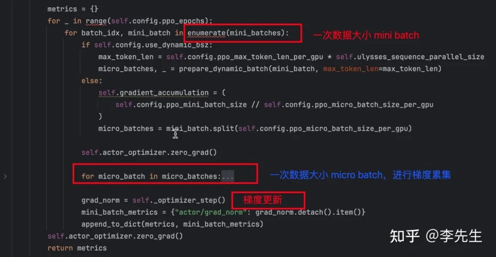
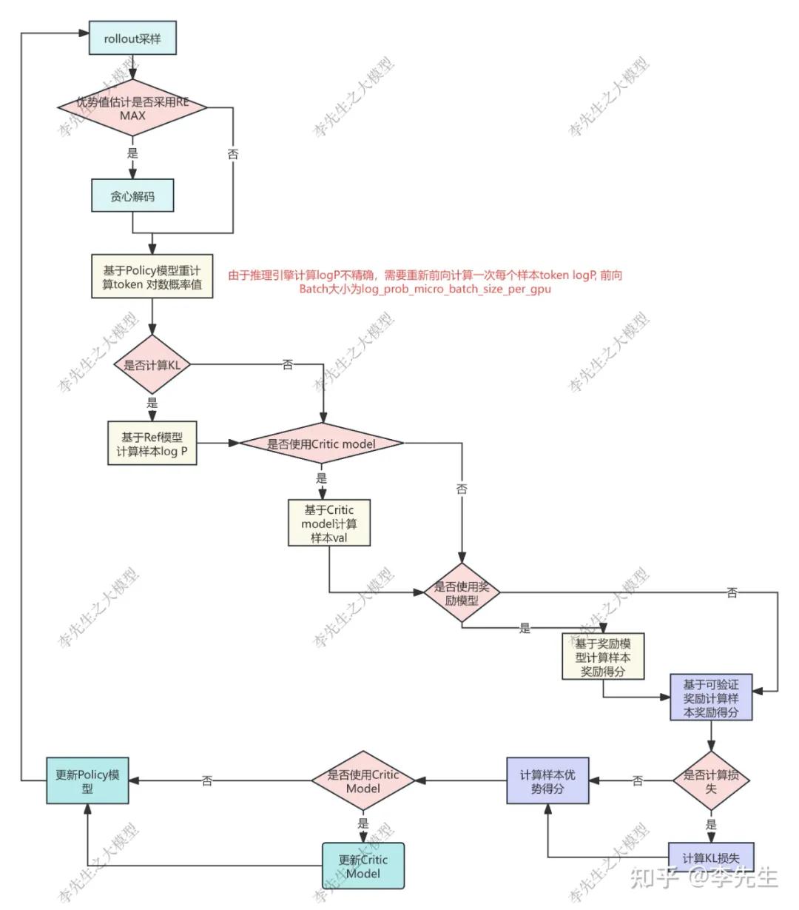

VeRL 框架中针对强化学习，整体流程简洁如下图所示：

在整体流程会涉及多种 Batch Size 的大小，主要涉及有：

全局每次迭代采样 Prompt 数量，也就是一次让策略模型针对多大的 Batch size 的 Prompt 进行采样生成，verl 框架可采用 vllm

前向重新计算每个采样生成 token 对应的概率值

更新 Policy Model 参数每次使用数据大小 Batch Size

在 3 中每次计算梯度值所使用的 Batch Size 大小，决定了梯度累积的次数

具体如下图所示：

verl 强化学习中那些 Batch Size

1. 图中 train batch size：表示了全局一次强化所使用的 Prompt 数量，假如设置为 512，总计有 8 张卡，则每张卡负责针对 64 条 Prompt 进行采样生成。

2. rollout.n：则决定了 1 条 Prompt 在线（on policy）生成的样本数量。因此全局一次生成的样本数量为 512*8=4096 条。

3. log_prob_micro_batc_size_per_gpu：则表示单卡每次前向计算 token 生成的概率所输入的样本数量。

接上面的数据来说，全局总计生成 4096 条样本，8 张卡每张负责为 512 条样本计算 token 生成的概率值。

如果 log_prob_micro_batc_size_per_gpu 设置为 64，则每张卡都需要进行 8 次（512/64）前向计算完成对应样本 token 概率计算，该大小会平衡 GPU 卡显存与训练速度，值越大显存依赖高，训练速度越快。

4. ppo_mini_batch_size：则表示 Policy model 进行参数更新所使用的总的样本 batch size 数量，全局的话是 ppo_mini_batch_size*GPU 卡的数量。

5. ppo_micro_batch_size_per_gpu：则是为了解决如果要将 ppo_mini_batch_size 的样本数量一次给到 GPU 显存不够的问题。

因此会将 ppo_mini_batch_size 拆分成多个含有 ppo_micro_batch_size_per_gpu 大小的小 batch 让模型进行梯度计算，然后进行梯度累积后再对模型参数进行更新。

为了方便理解这里关于 mini batch size 与 micro batch size 的关系，以下是对应代码实现。

梯度更新流程

以上代码会在 FSDP 分布式之下在多卡并行执行，以下是单卡执行的逻辑。

最上层循环的 ppo_epochs 是指一次采样生成的数据进行多少轮参数迭代。

第二层循环里每次参数更新所用的数据量，为 mini batch，每次执行完之后会执行梯度更新操作 self._optimizer_step()。

第三层循环里进行梯度累加，每次只执行梯度累加操作具体代码执行的是 loss.backward() 不会执行 self._optimizer_step() 操作。

下图是 verl 框架在线强化学习过程整体流程图：

# 参考

[1] verl训练老卡死？可能是Batch Size选错了, https://mp.weixin.qq.com/s/C7ecLkmHnt96rlHtMTZBWQ