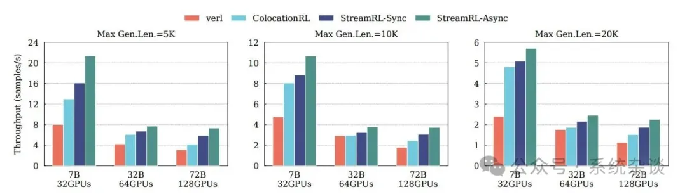
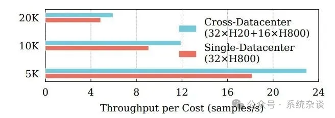
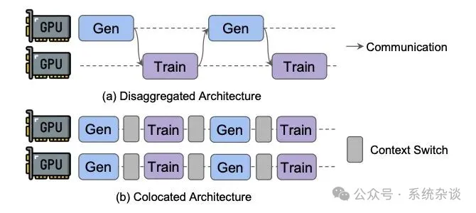
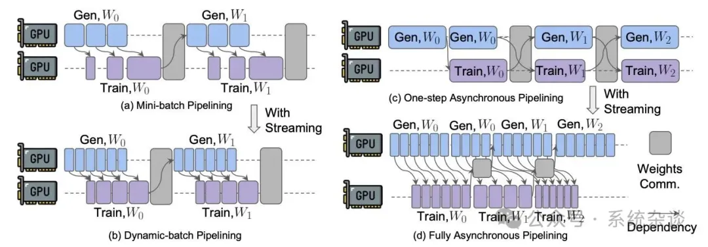

# 1. 资源

StreamRL: Scalable, Heterogeneous, and Elastic RL for LLMs with Disaggregated Stream Generation, https://arxiv.org/abs/2505.24298

# 2. 介绍

StreamRL 充分释放了分离架构的潜力，并针对现有分离式 RL 框架中的两类性能瓶颈进行了优化：流水线气泡 (pipeline bubbles)  和偏斜气泡 (skewness bubbles) 。

为了解决流水线气泡问题，StreamRL 打破了同步 RL 算法中的传统阶段边界，通过流式生成实现阶段间的完全重叠，在异步 RL 中实现了完全的并行。

为了解决偏斜气泡问题，StreamRL 引入了一个输出长度排序模型以识别长尾样本，并通过偏斜感知调度与分派机制减少生成时间。

典型的强化学习流程通常分为两个串行阶段：

- 生成阶段：LLM 根据给定的 prompt 批量生成样本；
- 训练阶段：模型根据生成样本得到的奖励信号进行参数更新。

在大规模部署中发现，共置架构在扩展训练时会出现资源耦合问题。根本原因在于两个阶段的计算特征截然不同：生成阶段通常受限于内存带宽，训练阶段则受限于算力。这种差异导致了性能冲突，具体而言：

生成阶段在资源扩展时的性能提升很快进入瓶颈，而训练阶段仍可继续扩展；

共置架构要求两阶段资源数量相同，限制了整体资源利用率；

它无法分别选择对各阶段最合适、最具性价比的硬件类型。

此外，现实中企业通常运营多个中型数据中心，其 GPU 设备代际和类型各异，形成了跨数据中心的异构资源池。但由于训练阶段需要全互联通信，在跨数据中心环境下通信开销巨大，使得共置架构难以高效利用整个资源池。

在此背景下，分离式架构重新展现出优势：

生成与训练阶段的资源数量可独立配置，实现更灵活高效的资源分配；

每个阶段可选择最合适的硬件类型；

两阶段之间仅需点对点数据传输，即便跨数据中心通信开销仍可接受。

通过将两个阶段分布在不同数据中心，RL 训练能够突破单一数据中心的限制，充分利用跨中心、异构的资源池。

然而，现有分离式 RL 框架仍面临两大瓶颈，限制了其潜力发挥：

流水线空洞（pipeline bubbles）：由于两阶段串行执行，GPU 资源仍会出现空转。

长尾输出问题（long-tail output length distribution）：在生成阶段后期，系统中仅剩少量长样本任务，导致 GPU 利用率急剧下降；随着推理模型采用更长的“思维链”生成，这一问题愈发严重。

为解决上述问题，北京大学和节约科技联合提出了 StreamRL —— 一个专为分离式架构设计的 RL 训练框架。其核心思想是将生成与训练阶段分别抽象为：流式生成服务 (stream generation service, SGS) 和 Trainer。工作流程如下：

Trainer 向 SGS 提交生成请求；

SGS 接收 prompt 后开始生成，并以流式方式返回每个已完成的样本；

Trainer 可立即对收到的样本执行后续操作，从而显著减少资源空闲。

这种流式执行机制可进一步优化现有的简单双缓冲或 minibatch pipelining 方案，实现 SGS 与 Trainer 更灵活、高效的并发执行。在异步 RL 场景下，更可实现完全重叠的执行过程。此外，为避免流水线失衡，StreamRL 设计了基于 profiler 的资源分配算法，在训练前确定最佳资源比例。同时，它还支持动态资源调整机制，在训练过程中根据模型输出长度变化自动调整分配，保持平衡执行。

为应对长尾问题，StreamRL 采用输出长度排序模型识别长尾样本，并通过偏斜感知调度机制选择性地为其分配资源与调整批量大小，从而降低整体生成延迟。

原始方案 1：Mini-batch Pipelining. 在同步型 RL 中，模型权重更新发生在所有样本处理完毕之后。如图 5(a) 所示，样本可被均匀划分为若 mini-batches，类似于流水线并行。一旦生成的样本数量达到一个 mini-batch 的大小，就将其传递给训练阶段处理。

这种方法需要人工设置 mini-batch 大小：若设置过大，则重叠效果差；若设置过小，则训练效率下降。在实践中，mini-batch 大小通常通过经验设定为一个常数。然而，由于长尾效应，后期 mini-batch 的序列长度会逐渐增加，导致最后几个 mini-batch 的训练时间溢出到生成阶段之后，形成明显的流水线空泡。此外，不同 mini-batch 之间的不平衡使得很难选取一个理想大小来避免训练阶段的空闲时间。

解决方案：Dynamic-batch Pipelining。提出以流式生成替代现有的批量生成。即样本一旦生成完成，就立即发送到训练阶段。这样可以让参考模型推理、KL 损失计算、以及奖励计算等样本级操作立即开始。如图 5(b) 所示，训练阶段在收到足够样本以填满 GPU 后即可开始，根据生成速度动态形成 batch，从而实现 dynamic batching。这种设计除了首个 mini-batch 外，几乎消除了训练阶段的空闲时间，并有效减少了后期 mini-batch 导致的空泡。

原始方案 2：一步异步流水线 (One-step Asynchronous Pipelining). 从本质上看，同步 RL 的两个阶段仍在处理同一批样本，因此每次迭代内部仍存在串行依赖，无法实现完全重叠。最近的一些研究探索了 off-policy asynchronous RL，即训练所用样本不一定由最新权重生成，允许一定程度的权重滞后 (staleness)。研究表明：在大语言模型中采用一步异步 RL 并不会影响模型性能或收敛性。

如图 5(c) 所示，在这种方案中，当训练阶段处理上一次迭代的样本时，可以提前生成下一批样本，从而将依赖关系转移到跨迭代层面，以获得更好的重叠效果。然而，这种基于批次的流水线仍存在问题：每次迭代结束时都需要一次全局同步来传输权重，在此期间两个阶段都处于空闲状态；由于在线生成的动态特性，生成和训练时间在不同迭代间存在波动，难以通过资源调整精确匹配，从而引入新的空泡。

解决方案：完全异步流水线 (Fully Asynchronous Pipelining). 如图 5(d) 所示，上述问题可以通过流式机制彻底解决。首先，权重传输可以与下一次迭代的训练阶段并行进行，因为上一次迭代生成的样本已经被流式传输并缓存在训练端。同时，当前迭代的生成过程并不依赖最新权重，因此可以并行执行。这使得权重传输完全脱离关键路径。此外，即使不同迭代间生成与训练时间存在波动，只要两者的平均速度匹配且波动范围有限，就不会出现新的空泡。需要注意的是，并未引入超出 one-step asynchronous 之外的样本异步性，因此其训练语义与原始方案保持一致。

为了在 SGS 和 Trainer 之间实现更好的重叠，需要仔细平衡这两个阶段的执行时间。因此，确定每个阶段的并行策略和 GPU 数量就成为了最小化整体迭代时间的关键。

并行配置 (Parallel Configuration). 在决定如何为每个阶段分配资源之前，首先要解决一个子问题：在给定的工作负载和 GPU 预算下，确定 SGS或 Trainer 的最优执行时间。这实际上归结为优化并行策略——一个在 LLM 训练和生成中都被深入研究的问题。Trainer 采用一种基于 profiler 的方式。由于 DNN 的执行时间具有确定性，可以在固定 GPU 预算下通过最小化性能采样，准确建模训练时间。SGS 生成时间取决于推理过程中的调度策略。幸运的是，在倾斜感知调度策略下，给定工作负载的生成时间同样是确定的，因此也可以采用类似的建模方法。需要注意的是，假设可以访问 RL 工作负载。实际中，这些工作负载可以来源于：最近几轮训练迭代生成的样本，或在训练前由 LLM 生成的启动样本。

资源分配 (Resource Allocation). 基于上述建模方法，可以进一步确定各阶段的资源分配方案。StreamRL 支持两种强化学习训练的部署模式：单数据中心部署中 SGS 与 Trainer 位于同一数据中心，并使用相同类型的硬件资源，这是以往 LLM 训练系统的标准设置；跨数据中心部署借助 RL 工作流中 SGS 与 Trainer 的解耦特性，将它们分别部署在不同数据中心中，可使用异构硬件。

单数据中心部署。定义分配给 SGS 和 Trainer 的 GPU 数量分别为 x 和 y，总资源约束为 x + y ≤ n，其中 n 是总 GPU 数量。为了确定最优分配策略，枚举所有可能的分配配置。对于每种配置：通过上述性能分析建模可分别得到生成和训练时间；取两者中较大的作为整体迭代的估计延迟；最后选取能最小化迭代时间的最优 (x, y) 组合。

跨数据中心部署。对于跨数据中心部署，设 m 和 n 分别为 SGS 与 Trainer 所在数据中心可用的 GPU 数量。资源约束因此为 x ≤ m, y ≤ n，即 x 和 y 是独立变量。一种朴素方案是取 (x, y) = (m, n)，即充分利用两侧的所有 GPU。但由于迭代时间由 SGS 与 Trainer 中较慢的一方决定，这种“满配”策略可能导致资源浪费。因此，本文的策略是：识别在满配下更快的阶段；逐步减少该阶段的 GPU 数量；直到两阶段的执行时间接近。这种方法避免了不必要的 GPU 占用，使得多余的资源可以分配给数据中心内的其他任务。

Dynamic Adjustment. 上述方法仅能在训练初期确保两个阶段的平衡。然而，正如 DeepSeek-R1 技术报告所指出的，随着 RL 训练的进行，LLM 的生成长度会逐渐增加，从而导致 SGS 和 Trainer 两阶段在计算与内存需求上不断变化。更重要的是，这两个阶段在面对工作负载变化时，其延迟敏感度不同。为此，提出了一种动态调整机制，用于监测生成与训练之间的执行时间差，记为 a。

