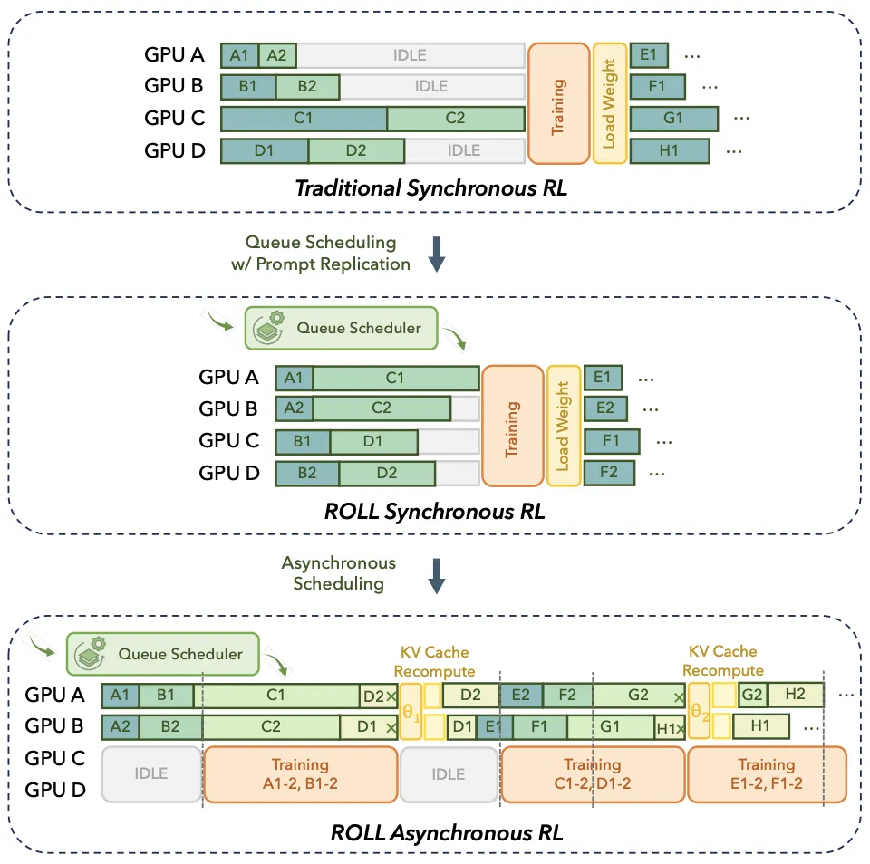
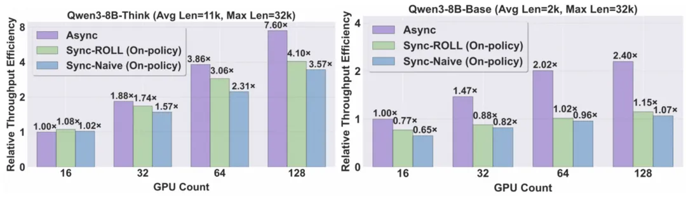
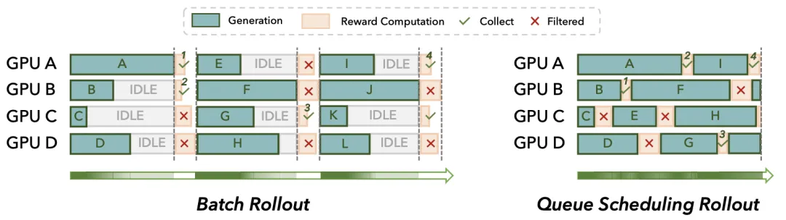
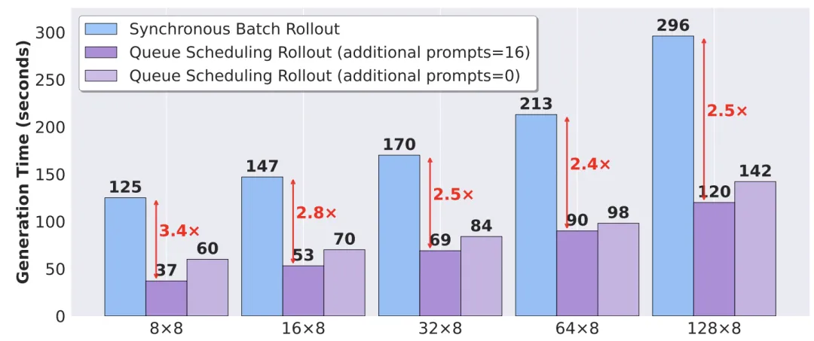

近期，阿里巴巴 ROLL 团队（淘天未来生活实验室与阿里巴巴智能引擎团队）联合上海交通大学、香港科技大学推出「3A」协同优化框架 ——Async 架构（Asynchronous Training）、Asymmetric PPO（AsyPPO）与 Attention 机制（Attention-based Reasoning Rhythm），「3A」彼此间并非孤立的技术堆砌，而是深度耦合，致力于共同推动「强化学习用于大语言模型（RL4LLM）」迈向高效、精细与可解释的新范式。

具体来看，ROLL Flash 以解耦为核心，通过「细粒度并行」与「采样 - 训练解耦」两大原则，将生成、环境交互、奖励计算与模型训练彻底流水线化，实现全链路异步执行，显著提升 GPU 利用率，同时通过「异步比」机制保障训练稳定性，集成主流 Off-policy 算法等，使得异步训练效果能与同步训练相媲美。

算法架构层面，AsyPPO 首次系统论证了评论家的参数规模与其价值估计能力并无必然关联，仅需两个小型评论家，即可在显著降低计算资源消耗的同时，提升推理性能与训练鲁棒性。

更进一步，团队创新性地对 Attention 进行重新定义 —— 它不仅是语言模型前向计算中的中间产物，更是揭示模型推理过程内在逻辑的「结构化蓝图」，并基于此设计了一种推理结构感知的动态奖励分配机制，使强化学习的优化目标与模型内生的推理节奏精准对齐，显著提升了训练效率与策略可解释性。

开源地址： https://github.com/alibaba/ROLL

论文链接： https://arxiv.org/abs/2510.11345

传统的同步 RL 训练遵循一个严格的「生成 - 评估 - 学习」流程，要求批处理中的所有任务同步进行。在 LLM 的应用场景下，响应长度呈现明显的「长尾分布」，最长响应的生成时间可能是中位数的 20 倍以上。这种模式的局限性愈发凸显：

长尾延迟（Long-tail Latency）：仅因一个样本生成速度过慢，整个批次的 GPU 都必须停下等待，即「木桶效应」。

环境交互阻塞（Environment Blocking）：当模型需要与外部环境（如执行代码、与游戏 API 交互）互动时，GPU 只能空等，无法处理其他计算任务。

扩展性瓶颈（Scalability Bottleneck）：随着 GPU 规模扩大，同步点带来的通信和等待开销呈指数级增长，导致增加更多资源也无法有效提升训练速度。

主要实验结果：

ROLL Flash 在多个主流 RL 任务上取得了显著的性能提升，并在百卡规模下展示了近乎线性的扩展能力。

最高 2.72 倍加速：在 Agentic 任务（如 ALFWorld）中获得最高 2.72× 的端到端吞吐提升，在 RLVR 任务（如数学推理）中提速 2.24×。

近乎线性的扩展性：系统在百卡规模下仍保持高吞吐扩展能力，使用 8 倍的 GPU 资源可带来 7.6 倍的效率提升（如图 3 所示）。

与同步训练相当的性能：通过集成多种 off-policy 算法（如 Decoupled PPO、TOPR），团队验证了异步训练能够在大幅提速的同时，取得与同步训练相媲美的最终模型性能。

灵活的资源调度：引入的异步比（Asynchronous Ratio 机制，允许在样本新鲜度与资源利用率之间进行权衡，在多数场景下以极小的异步代价获得接近完整的性能提升。

1. 队列调度（Queue Scheduling）

为每个独立的采样任务（Prompt）建立专属队列。任务完成后，其占用的 GPU 资源立即被释放并分配给新任务，从而消除批处理中的「长尾」效应。该设计在需要动态过滤样本的场景下，能极大加速高质量样本的收集效率。

实验证明，队列调度在不同批大小配置下均能稳定减少生成时间，在 128 * 8 的配置下，带来了 2.5 倍的加速。

# 参考

[1] 3A大作！阿里ROLL团队从基建->算法->机理，推动RL4LLM全栈协同优化, https://mp.weixin.qq.com/s/czc2vbj2VI43Chh0YxZoxA