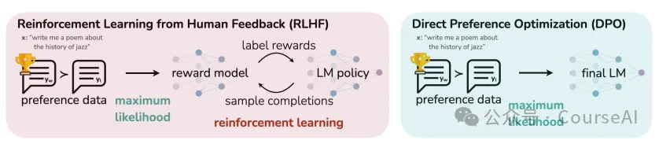
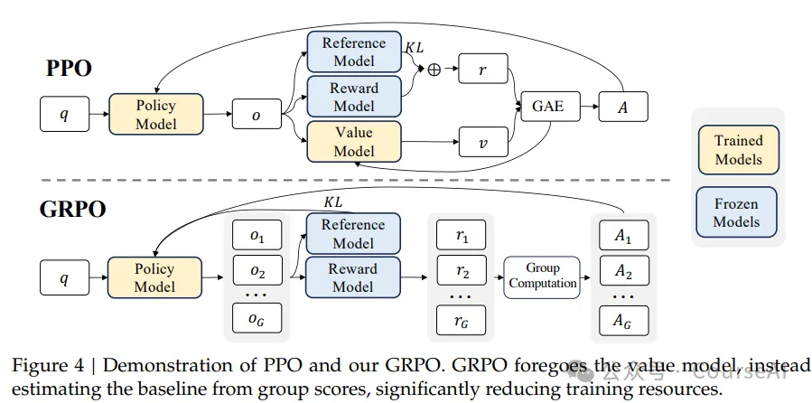
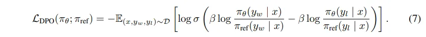
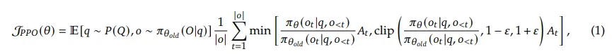
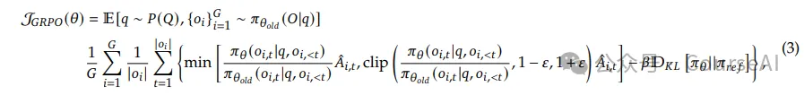
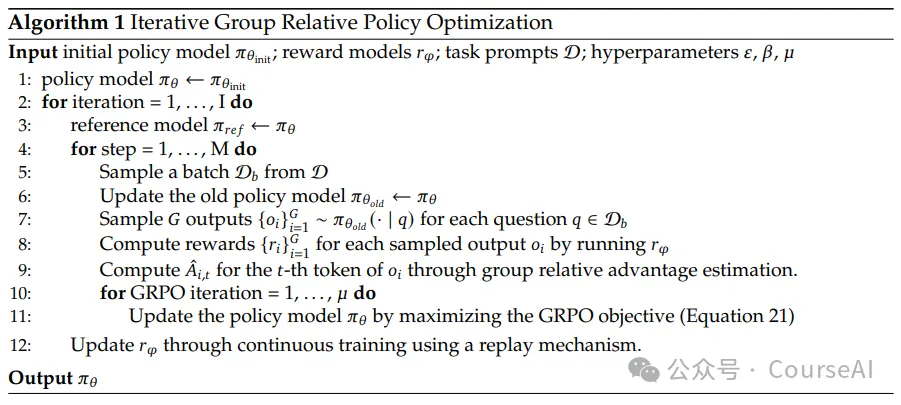

# 资源

- https://arxiv.org/pdf/2305.18290 
- https://arxiv.org/pdf/1707.06347 
- https://arxiv.org/pdf/2402.03300

# 1. 简介

三者均属于策略优化方法相同：通过调整策略参数（如神经网络权重）来最大化累积奖励或偏好数据匹配度。

DPO(Direct Preference Optimization)和PPO（Proximal Policy Optimization）梯度更新方式相同：均采用梯度下降法优化目标函数，例如PPO的替代目标函数、DPO的偏好对数损失函数。

PPO和GRPO（Group Relative Policy Optimization）有共同架构：PPO和GRPO均包含策略模型（Actor）与价值模型（Critic），涉及奖励或偏好建模

都是通过熵正则化或其他机制（如KL散度约束）鼓励策略探索，避免过早收敛到次优解

# 2. DPO PPO GRPO之间的主要区别

1. 强化学习的核心思想
    - DPO:离线优化，直接利用偏好数据训练策略，无需显式奖励模型
    - PPO:在线强化学习，基于奖励模型进行策略优化（Actor-Critic框架）
    - GRPO:PPO的扩展，引入组计算模块处理多观测值，提升多源信息利用
2. 模型结构不同
   - DPO:直接微调策略模型，依赖偏好数据中的对比样本（选择 vs 拒绝）
   - 
   - PPO：依赖价值模型（Critic）来估计优势函数（Advantage），即通过额外训练一个神经网络来预测长期收益的基线值。
   - 
   - GROP：移除了价值模型，改用群体归一化奖励作为基线。具体来说，对同一输入生成多个响应，计算组内奖励的均值和标准差，以此动态调整优势值，无需额外训练模型。
   - 
3. KL正则化（KL Regularization）
   - PPO：在奖励函数中直接加入KL散度（Kullback-Leibler Divergence）惩罚项，以防止策略更新幅度过大。
   - GROP：将KL散度作为正则化项直接引入损失函数中，从而更直接地控制策略更新的稳定性。
4. 奖励粒度（Reward Granularity）
   - DPD：无需奖励模型，训练更简单，但易受分布偏移影响，稳定性较差。
   - PPO：基于令牌级（Token-Level） 的奖励计算，直接评估每个生成标记的收益。通过剪辑目标函数和信任区域约束策略更新，稳定性较高。
   - GROP：采用群体相对奖励机制，对同一提示（Prompt）生成多个响应，通过组内样本的奖励对比进行归一化。这种设计类似于“班级排名”，模型只需在组内表现更好即可，而非依赖绝对阈值。但是，可能因组计算引入复杂性而影响稳定性
5. 计算效率
   - GROP由于移除了价值模型并简化了优势估计，其计算效率更高。实验显示，相比PPO，GROP的内存占用减少约40%，训练速度更快
   - 

# 3. 各自的优缺点

## DPO
**优点：**  
- **简化流程**：直接利用偏好数据，省去奖励模型训练，计算成本更低。  
- **适合离线场景**：在语言模型对齐等任务中表现优异。  

**缺点：**  
- **分布偏移敏感**：策略可能偏离偏好数据分布，导致性能下降。  
- **KL 约束弱化**：偏好确定性增强时，KL 正则化效果减弱，易过拟合。  

---

## PPO
**优点：**  
- **稳定性强**：通过剪辑目标函数限制策略更新幅度，避免训练崩溃。  
- **通用性高**：适用于连续 / 离散动作空间，广泛用于机器人、游戏等领域。  

**缺点：**  
- **计算开销大**：需频繁环境交互和奖励模型调用，样本效率较低。  
- **依赖奖励模型质量**：若奖励模型设计不佳，策略可能过优化。  

---

## GRPO
**优点：**  
- **多源信息整合**：通过组计算模块处理多观测值，提升决策质量。  
- **继承 PPO 优势**：保留剪辑目标函数和稳定更新机制。  

**缺点：**  
- **复杂度高**：组计算模块增加模型参量和训练难度。  
- **应用场景有限**：目前主要见于特定扩展任务，通用性验证不足。  

---

## 总结
- **DPO** 在离线偏好对齐任务中更高效，但需解决分布偏移和稳定性问题。  
- **PPO** 是通用性强、稳定性高的在线 RL 基准方法，但依赖奖励模型和大量交互数据。  
- **GRPO** 作为 PPO 的扩展，在复杂多观测任务中潜力大，但需进一步验证其普适性。

# 参考

[1] 一文读懂DPO PPO GRPO三者强化学习适用场景, https://mp.weixin.qq.com/s/xgIwLEtTiLW0iMtGOfOiPg